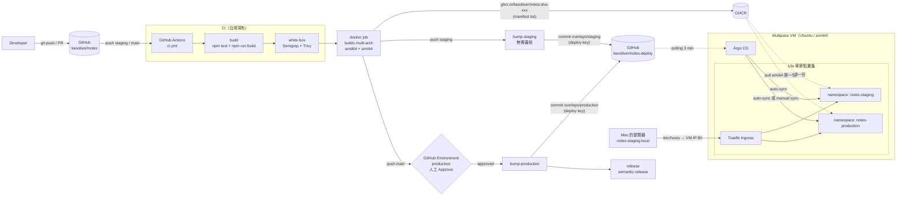

# GitOps Roadmap：從「加密產物 + 人工核准」延伸到「Docker image + Argo CD + k3s」

> **狀態：Phase 0 ~ 9 已實作並上線**，staging 與 production 兩個 namespace 都在跑 `notes` + `notes-api` 兩個服務；Phase 10 是選配。
> Phase 0 ~ 9 的標題都標了「（已完成）」，裡面的 YAML / shell 就是實際 ship 的版本；標題括號裡若補了「後來改成……」，表示那一節保留的是當時的寫法，最終版本在它指到的 Phase。只有 Phase 10（選配）還沒做。
> 執行環境已確定為 **Apple Silicon（M4 / 16GB）+ Multipass VM + k3s**，第 0 節說明這個決定帶來的限制。
> **manifest 放在另一個 repo `liaooliver/notes-deploy`**（2026-09-19 定案，理由與推導見第 2.2 節）。
> 互動版：[GitOps Roadmap Artifact](https://claude.ai/artifact/9EbPRiqXcJY8ZrqcJXputd)（可逐步播放的架構流程圖）

```
git commit / git push
  → GitHub Actions CI
  → test / build
  → Docker build
  → push image 到 GHCR
  → GitHub Environment Approval
  → 更新 notes-deploy 裡的 k8s manifest image tag
  → Argo CD 偵測 Git 變更
  → sync 到 k3s
  → staging / production 流程
```

---

## 0. 執行環境與學習範圍

這一節是整份 roadmap 的前提。硬體確定之後，有些 Phase 的寫法必須改，有些原本列進來的東西應該砍掉。

### 0.1 硬體與架構限制

| 項目 | 值 |
| --- | --- |
| 主機 | MacBook（Apple Silicon M4）、16 GB RAM |
| 虛擬化 | [Multipass](https://multipass.run/)（Ubuntu 官方的 VM 工具） |
| Kubernetes | k3s，**單節點**，跑在一台 VM 裡 |
| 環境隔離 | 同一個叢集，`notes-staging` / `notes-production` 兩個 namespace |
| 對外存取 | Traefik Ingress + Mac 的 `/etc/hosts` |

**最重要的一條限制：CPU 架構不一致。**

| 誰 | 架構 |
| --- | --- |
| GitHub Actions `ubuntu-latest` runner | `linux/amd64`（x86_64） |
| Apple Silicon 上的 Multipass VM | `linux/arm64`（aarch64） |

CI 產出的 image 如果只有 amd64，k3s 拉下去會直接失敗：

```
Failed to pull image "ghcr.io/liaooliver/notes:sha-abc1234":
  no matching manifest for linux/arm64/v8 in the manifest list entries
```

或是 manifest 硬湊上了、容器起來才死：

```
standard_init_linux.go:228: exec user process caused: exec format error
```

**這個錯誤訊息完全不會提示你是架構問題**，而且它發生在 Phase 5（最後才會跑到 k3s），等於前面四個 Phase 做完才會爆。所以 Phase 2 就要直接做成 multi-arch，不要留到出事再改。

好消息是這個 image 只是「把靜態檔複製進 nginx」，**沒有任何編譯動作**，用 QEMU 模擬 arm64 幾乎不花時間（實測增加不到 30 秒）。

### 0.2 記憶體預算

16 GB 要同時養 macOS、瀏覽器、編輯器跟 VM，先把帳算清楚：

```
┌──────────────── Mac M4 / 16 GB ─────────────────┐
│ macOS 本身                            ~5 GB     │
│                                                 │
│ ┌────────── Multipass VM（6 GB）──────────────┐ │
│ │ k3s 本體（含 Traefik、CoreDNS）  ~600 MB    │ │
│ │ Argo CD（7 個元件，最肥的一塊）  ~1.5 GB    │ │
│ │ notes-staging                     ~30 MB    │ │
│ │ notes-production                  ~60 MB    │ │
│ │ 餘裕                             ~3.8 GB    │ │
│ └─────────────────────────────────────────────┘ │
│                                                 │
│ 剩 ~5 GB 給 Chrome / VS Code / npm              │
└─────────────────────────────────────────────────┘
```

結論：**單節點、一台 6 GB 的 VM**。

不做多節點（1 server + N agent）的原因不是跑不動，是**投報率不對**：多節點練到的是 `nodeSelector`、`affinity`、`taint/toleration`、`drain` 這些排程與維運技能，屬於 SRE / 平台工程的守備範圍。省下來的 8 GB 拿去跑 `vite dev` 跟瀏覽器實際得多。

k3s 之後要加節點只要在另一台 VM 跑一行 `K3S_URL=... K3S_TOKEN=... sh -`，不是不可逆的決定。

### 0.3 學習深度的界線

這份 roadmap 的目的是**讓一個前端工程師有能力參與容器化與 CI/CD**，不是把人訓練成叢集管理員。兩者的分界線：

**值得做（前端在團隊裡真的會遇到）**

| 主題 | 為什麼 |
| --- | --- |
| 自己寫 Dockerfile 把前端專案容器化 | 最常見的第一個任務 |
| multi-stage build（node build → nginx serve） | image 從 ~1 GB 降到 ~55 MB，而且 `docker build` 能獨立重現 |
| nginx 的 SPA fallback（`try_files`） | Vue Router history 模式沒這行，**重整頁面就 404** |
| Ingress 怎麼把多個服務拼成同一個網域 | 前端要知道自己的靜態資源跟 `/api` 是怎麼被路由的 |
| Service DNS（`http://notes-api:3000`） | 容器之間怎麼找到彼此 |
| `kubectl get` / `describe` / `logs` 三件套 | 「我的頁面 500 了」第一時間要能自己看 |
| GitOps 的兩句話：Git 是唯一真實來源、rollback = `git revert` | 講得清楚就夠了 |

**不值得優先做（SRE / 平台工程的範圍）**

- 多節點排程：`nodeSelector`、affinity、`taint`/`toleration`、`drain`
- 有狀態應用：StatefulSet、PV / PVC / StorageClass、資料庫備份與遷移
- CNI 網路外掛、Service Mesh
- Helm chart 開發、Operator
- 叢集層級安全：cosign 簽章、Kyverno 驗簽（本文 Phase 10 有列，但排在最後）

### 0.4 兩輪推進

因為「GitOps 鏈路」跟「被部署的應用程式」是兩件獨立的事，拆成兩輪做，每一輪出錯的原因都能被限縮：

```
第一輪：用現有的靜態檔跑通整條鏈路（Phase 1 ~ 6）
   目標：merge → image → Argo CD 自動換版，看到綠燈
   出錯範圍：k8s / CI 設定
        │
        ▼
第二輪：把 image 的內容物換成真的前端應用（Phase 7 ~ 9）
   目標：Vue 3 + Express 兩個服務，Ingress 分流
   出錯範圍：前端 / Dockerfile
   manifest 幾乎不用動 ← 這正是容器化的賣點
```

第一輪刻意用現在那個 863 bytes 的靜態頁。它沒有 build 步驟、沒有相依套件、沒有路由，**所以第一輪任何一次失敗都不可能是應用程式的錯**，除錯範圍小很多。

第二輪換內容物時，`notes-deploy` 裡的 manifest 幾乎一行都不用改 —— k8s 只認 image tag，不管盒子裡裝的是靜態 HTML、Vue 還是 Java。

### 0.5 刻意不做的事

| 不做 | 原因 |
| --- | --- |
| Postgres / Redis 進 k8s | 有狀態應用是 k8s 最難的一塊（StatefulSet + PV + PVC + StorageClass），且單節點的 `local-path` 儲存跟真實環境差很遠。需要真資料庫時直接 `apt install` 在 VM 上，k8s 裡只跑無狀態的東西 —— 這也是很多公司的實際做法（叢集跑應用，資料庫用雲端託管）。 |
| 兩個叢集做環境隔離 | 多一套 k3s + 跨 VM 的 kubeconfig 與網路，成本高。真要練隔離，單叢集裡的 RBAC / ResourceQuota / NetworkPolicy 就夠。 |
| Jenkins | 要再開一台 VM、學 Groovy。CI 的核心概念（stage、artifact、環境變數、人工審核閘）跟 GitHub Actions 相通，換工具是熟悉語法的問題。 |
| NodePort 取代 Ingress | 設定比較簡單，但會跳過「網址怎麼被路由到我的服務」這段 —— 而那正是前端該懂的部分。 |

---

## 1. 現況對照：現有 5 個 job 在新架構裡的去向

| 現有 job（`ci.yml`） | 現在做的事 | 對應目標流程 | 處置 |
| --- | --- | --- | --- |
| `build` | `npm ci` → `npm test` → `npm run build` → 上傳 `dist/` artifact | **test / build** | **沿用**。`build` script 原本是 placeholder（只 echo 一個 `<h1>`），Phase 0 已修成複製 `src/`。第二輪改成 Vue 之後這個 job **一行都不用改**，因為 `npm run build` 這個介面沒變（見 Phase 7）。 |
| `white-box` | Semgrep SAST + Trivy `fs` 掃描 | **CI 安全閘** | **沿用**。掃的是 repo 裡的套件。base image 那一層由 `docker` job 裡的 Trivy `image` 掃描負責（Phase 10-a，已完成）。 |
| `encryption` | `tar` + `openssl aes-256-cbc` 加密 `dist/`，上傳 `dist.tar.gz.enc` | 無直接對應 | **重新定位或拿掉**。在 image 世界裡，「保護交付產物」的做法是 registry 權限控管 + image 簽章（cosign），不是把 tarball 加密。建議：Phase 2 加了 `docker` job 之後把 `encryption` 移除；想保留「產物完整性」這個學習點就改成 cosign keyless 簽章（Phase 10）。 |
| `ops-handoff` | `environment: production` 等人工核准 → `echo` 一句話 | **GitHub Environment Approval → 更新 manifest image tag** | **沿用審核機制、替換執行內容**。把 `echo` 換成 `kustomize edit set image` + commit 進 `notes-deploy`（Phase 4）。這就是「人按下 Approve」到「Argo CD 開始部署」之間唯一的橋。 |
| `release` | `semantic-release` 算版號、打 tag、發 GitHub Release | 版本號 / Release notes | **沿用**。順序調整為在 manifest bump 之後跑，讓 image 也能順便打上 `notes-vX.Y.Z` tag（Phase 10）。 |
| （無） | — | **Dockerfile / docker build / push GHCR** | **新增**（Phase 1、2） |
| （無） | — | **k8s manifest（kustomize base + overlays）** | **新增**，但放在另一個 repo `liaooliver/notes-deploy`（Phase 3、第 2.2 節） |
| （無） | — | **Argo CD + k3s** | **新增**（Phase 5、6） |
| （無） | — | **`manifest-check`（`kustomize build` 驗證）** | **新增**，放在 `notes-deploy` 自己的 workflow（Phase 4） |
| （無） | — | **Vue 3 SPA + Express API（第二輪）** | **新增**（Phase 7、8、9） |

一句話總結：**CI 這一半（test / build / scan / approval）幾乎原封不動，CD 這一半從「加密 tarball 交給不存在的運維」變成「改 Git 裡的 manifest，讓 Argo CD 去部署」。**

> **有一個既有設定必須改：** `ci.yml` 現在 `on.push.branches` 只有 `main`（PR #14 刻意拿掉 `staging`）。GitOps 需要「merge 進 staging = 部署到 staging」，而 image 必須從合併後的程式碼 build，所以 **Phase 2 的第一步就是把 `staging` 加回 push 觸發**，等於把 PR #14 的決定改回來。取捨與影響範圍見 Phase 2-a。

---

## 2. 目標架構

### 2.1 元件關係圖



四個容易混淆的邊界：

- **有兩個 repo。** `liaooliver/notes` 裝程式碼，`liaooliver/notes-deploy` 裝部署設定。CI 在前者跑，寫的卻是後者；Argo CD 只看後者，完全不知道前者的存在（第 2.2 節）。
- **GitHub Actions 跑在 amd64、VM 是 arm64** —— 所以 `docker` job 一定要出 multi-arch（第 0.1 節）。
- **Argo CD 跟 k3s 都在 VM 裡**，但 `kubectl` 跟瀏覽器在 Mac 上，中間隔著 VM 的 IP（Phase 5.3、Phase 6）。
- **Argo CD 只讀 Git，不讀 GHCR** —— 它看到的是 manifest 裡的 image tag 字串變了，才叫 k3s 去 pull。所以「image 推上去了」跟「叢集換版了」是兩件事，中間靠 Phase 4 的 bump commit 連起來。

### 2.2 manifest 要放哪裡：定案為獨立 `notes-deploy` repo

| | 同 repo、`deploy/` 在受保護分支上 | 同 repo、但 Argo CD 讀不受保護的 `deploy` 分支 | 獨立 repo（`liaooliver/notes-deploy`） |
| --- | --- | --- | --- |
| 上手難度 | 低：一個 repo、一組 secret、一條 PR 流程 | 低：一個 repo，多一條長期分支 | 中：要多管一個 repo，CI 要有跨 repo push 權限（PAT 或 GitHub App） |
| **會不會撞 branch protection** | **會，而且這是 Phase 4 的核心難題**（見 Phase 4「這一步會撞到 branch protection」） | 不會：那條分支不設保護，`GITHUB_TOKEN` 直接能 push | 不會：deploy repo 不必設保護 |
| 循環觸發風險 | **有**：CI 改了 `deploy/` 再 push，會再觸發 `ci.yml`。要靠 `[skip ci]` 或 `paths-ignore` 擋 | 低：`ci.yml` 的 `on.push.branches` 本來就沒列 `deploy`，不會被觸發 | 無：app repo 的 workflow 不會因 deploy repo 的 commit 觸發 |
| 權限分離 | 弱：能改程式碼的人就能改部署設定 | 弱：同一個 repo 的 write 權限就能改 | 強：可以只給運維 deploy repo 的 write 權限 |
| Argo CD 設定 | `repoURL` 指同一個 repo、`path: deploy/overlays/xxx` | 同左，但 `targetRevision: deploy` | `repoURL` 指 deploy repo |
| 審計 | 部署歷史跟程式碼歷史混在一起 | 部署歷史在自己的分支上，`git log deploy` 全是 image bump | 部署歷史獨立乾淨（`git log` 全是 image bump） |
| 代價 | 需要能 push 進受保護分支的身分 | 多一條要記得存在的分支；`deploy` 分支不會自動跟上 `main` 的程式碼，兩邊的 `git log` 對不起來；rollback 要在那條分支上操作 | 多一個 repo、跨 repo 憑證 |
| 業界慣例 | 小專案 / 單人 / 學習用 | 少見，但完全合法（Argo CD 的 `targetRevision` 本來就支援） | 多團隊、多服務、正式環境 |

**定案：第三欄，獨立 repo `liaooliver/notes-deploy`。**

> 這一節在 2026-09-19 改過。原本定的是第一欄（同 repo `deploy/` 目錄），理由是「單人學習用，少管一個 repo」。
> 那個判斷**在做出來的當下就缺了一項輸入**：當時的比較表裡沒有 branch protection 這一列。補上之後，第一欄直接出局。

**為什麼第一欄出局：它不是比較難，是做不到。** Phase 4 的 4-a 盤點已經執行完畢，結論是 `main` 與 `staging` 都跑在 classic branch protection 上，而 classic 的 required status check **沒有任何針對特定身分的豁免開關**。第一欄的前提是「CI 能 push 進受保護分支」，在現況下無解——換 token、換 App 都一樣（完整推導見 Phase 4）。

剩下第二欄與第三欄，差別只有兩件事：

| | 第二欄：`deploy` 分支 | 第三欄：獨立 repo |
| --- | --- | --- |
| 要設跨 repo 憑證嗎 | 不用 | **要**，一把 deploy key，設定一次 |
| 要管幾個 repo | 1 | 2 |
| 業界慣例 | 少見 | **Argo CD 官方 Best Practices 建議的做法** |

**選第三欄。** 三個理由：

1. **它是標準答案。** Argo CD 官方文件明確建議把「程式碼 repo」與「部署設定 repo」分開；而「用一條長期分支裝部署設定」正是同一份文件提醒過容易出問題的做法。
2. **代價只有一把 deploy key，而且只設一次。** 相對於第二欄省下的那點功夫，換到的是一個之後不用重做的架構——真要練到多服務、多環境，遲早得拆。
3. **跨 repo 寫入本身就是值得練的題目。** deploy key、跨 repo 憑證是 CI 的常見題型；第二欄那招學不到。

**拆出去之後，Phase 4 原本的三個難題同時消失：**

| 原本的難題 | 為什麼消失 |
| --- | --- |
| branch protection 擋住 bot push | 寫入目標是 `notes-deploy`，那個 repo 不設任何保護 |
| 循環觸發（CI 改了 manifest 又觸發自己） | 改的是另一個 repo，`notes` 的 workflow 不會被觸發。**`[skip ci]` 不再需要** |
| `paths-ignore` 的 merge 死結 | `notes` 裡不再有 `deploy/**`，這個決定連同它的兩難一起作廢 |

> **public repo 的一條紅線：`notes-deploy` 裡永遠不能出現 k8s 的 `Secret` 資源。**
> `Secret` 的 `data` 欄位只是 base64 編碼，不是加密，任何人一行指令就還原。
>
> 目前的規劃剛好踩不到這條線：repo 是 public → GHCR package 也是 public → 拉 image 不需要憑證 → 不需要任何 Secret（`web-deployment.yaml` 裡的 `imagePullSecrets` 本來就維持註解狀態，見 Phase 6）。哪天真要用（例如把 repo 改成 private），得先用 Sealed Secrets 或 SOPS 加密再進版。
>
> deploy key 本身是安全的：私鑰存在 `notes` 的 Actions Secrets 裡、不在程式碼中，**fork 來的 PR 拿不到**（GitHub 不會把 secrets 傳給 fork PR，除非用 `pull_request_target`，而三個 workflow 都是 `pull_request`）。而且 deploy key 的權限只綁死 `notes-deploy` 這一個 repo，就算外洩也碰不到 `notes`——比 PAT（預設橫跨帳號下所有 repo）小得多。

### 2.3 完整時序：merge `staging → main` 到 production pod 換新

```mermaid
sequenceDiagram
    autonumber
    actor Dev as Developer
    participant GH as GitHub (notes repo)
    participant GA as GitHub Actions
    participant CFG as GitHub (notes-deploy repo)
    participant GHCR as GHCR
    participant ENV as GitHub Environment (production)
    participant ARGO as Argo CD
    participant K3S as k3s (notes-production)

    Dev->>GH: merge PR staging → main
    GH->>GA: push event (refs/heads/main)
    GA->>GA: build (npm test + build)
    GA->>GA: white-box (Semgrep + Trivy fs)
    GA->>GA: docker buildx (amd64 + arm64)
    GA->>GHCR: push notes:sha-&lt;main 的 40 碼 SHA&gt; + notes:main
    GA->>ENV: bump-production 進入 waiting
    ENV-->>Dev: 通知「requested your review to deploy to production」
    Note over GA,ENV: pipeline 在這裡停住，直到有人 Approve
    Dev->>ENV: Review deployments → Approve and deploy
    ENV->>GA: 放行 bump-production
    GA->>GA: 確認 origin/main 仍等於 GITHUB_SHA<br/>(不相等就中止，避免部署舊版)
    GA->>CFG: checkout notes-deploy (deploy key)
    GA->>GA: kustomize edit set image<br/>(overlays/production)
    GA->>CFG: git push main<br/>"chore(deploy): bump production image to sha-..."
    Note over GA,CFG: 寫的是另一個 repo，不會觸發 notes 的 ci.yml<br/>所以不需要 [skip ci]
    GA->>GA: release (semantic-release 打 tag、發 Release)

    alt 偵測方式 A：polling（預設，每 3 分鐘）
        loop 每 180 秒
            ARGO->>CFG: git fetch main
        end
        CFG-->>ARGO: 發現新 commit，desired state 改變
    else 偵測方式 B：webhook（需要 Argo CD 有公網可達的 URL）
        CFG->>ARGO: POST /api/webhook (push event)
    end

    ARGO->>ARGO: 比對 live state vs Git → OutOfSync
    alt production 設 automated sync
        ARGO->>K3S: kubectl apply (Deployment image 更新)
    else production 設 manual sync（第二道人工閘）
        Dev->>ARGO: 在 Argo CD UI 按 Sync
        ARGO->>K3S: kubectl apply
    end
    K3S->>GHCR: pull notes:sha-... (自動挑 arm64 那一份)
    K3S->>K3S: rolling update：新 pod Ready 後才殺舊 pod
    K3S-->>ARGO: 回報 Healthy / Synced
    ARGO-->>Dev: UI 顯示綠燈（可選：Notifications 回寫 GitHub commit status）
```

---

## 3. 分階段實作計畫

延續這個專案「一次一小片、一個 commit、一個 PR」的習慣。每個 Phase 都能獨立開 PR 到 `staging`、獨立驗證、獨立回退。**不要一次做完再開一張大 PR。**

依第 0.4 節的兩輪切法：

| 輪次 | Phase | 目標 | 失敗時該往哪裡看 |
| --- | --- | --- | --- |
| **第一輪** | 0 ~ 6 | 用現有靜態檔跑通 GitOps 鏈路，在 Argo CD 看到綠燈 | CI 設定、k8s 設定 |
| **第二輪** | 7 ~ 9 | 把 image 的內容物換成 Vue 3 + Express | 前端程式碼、Dockerfile |
| 選配 | 10 | 進階強化（簽章、驗簽、image 版本 tag……） | — |

---

### 3.1 第一輪：用靜態檔跑通整條鏈路（Phase 0 ~ 6）

#### Phase 0：修 `package.json` 的 `build` script（已完成，run #39 驗證）

原本：

```json
"build": "mkdir -p dist && echo '<h1>Hello CI</h1>' > dist/index.html"
```

這是 CI 練習初期的 placeholder，`dist/` 裡沒有 `src/index.html` 也沒有 `src/app.js`。Docker image 會 `COPY dist/` 進去，所以這一步不先修，後面全部白做。

改成：

```json
"build": "rm -rf dist && mkdir -p dist && cp src/index.html src/app.js dist/"
```

驗證：`npm run build && ls dist/` 應該看到兩個檔案，`open dist/index.html` 能正常用表單新增 fix record。

（`app.js` 裡的 `module.exports` 守衛在瀏覽器裡因為 `typeof module === 'undefined'` 會跳過，不影響。）

run #39 的 `dist-files` artifact 是 863 bytes，對得上 `index.html`（1030 B）+ `app.js`（234 B）壓縮後的大小，確認 CI 裡產出的也是真的 `src/`。

#### Phase 1：`Dockerfile` + `.dockerignore`（已完成；單層 COPY 的決定最後沒被推翻，見 Phase 8）

`Dockerfile`：

```dockerfile
# 純靜態站，不需要 Node runtime，直接用 nginx 出 dist/
FROM nginx:1.30-alpine

# 把 build 好的靜態檔放到 nginx 預設 docroot
COPY dist/ /usr/share/nginx/html/

# nginx:alpine 已經 EXPOSE 80 且有預設 CMD，不用再寫
```

`.dockerignore`：

```
node_modules
.git
.github
test
docs
*.md
```

刻意**不用 multi-stage build 在 Docker 裡跑 `npm run build`**：因為 `build` job 已經跑過 test + build 並上傳 `dist/` artifact，`docker` job 直接下載 artifact 再 `COPY`，避免同一份程式碼 build 兩次、也讓「進 image 的東西 = 通過測試的東西」這件事更明確。

> 這個決定在第二輪會被推翻（Phase 8）。現在的靜態檔沒有 build 步驟、沒有相依套件，單層 `COPY` 是對的；換成 Vue 之後 `docker build` 需要能獨立重現，才會改成 multi-stage。**第一輪的重點是把鏈路跑通，不是把 Dockerfile 寫到最終型態。**

`nginx:1.30-alpine` 本身就是 multi-arch image（官方同時發 amd64 與 arm64），所以這份 Dockerfile 不用改就能同時 build 出兩種架構，要做的事全在 Phase 2 的 CI 設定裡。

本機驗證：

```bash
npm run build
docker build -t notes:local .
docker run --rm -p 8080:80 notes:local
# 開 http://localhost:8080 確認表單能用
```

#### Phase 2：改 `ci.yml` 的觸發條件，加 `docker` job push multi-arch image 到 GHCR（已完成；`docker` job 後來在 Phase 9 改成 matrix 跑兩個服務）

##### 2-a. 先改觸發條件（不改這個，後面全部不會動）

**這是整個 Phase 2 最容易漏掉、也最致命的一步。** `ci.yml` 目前是：

```yaml
on:
  # staging 的 PR 已經跑過 build + white-box，merge 後不再重跑；
  # main 的 push 仍需要重跑，因為 encryption 要用同一個 run 的 build 產物。
  push:
    branches: [ "main" ]
  pull_request:
    branches: [ "main", "staging" ]
```

`push` **只監聽 `main`**。這是 PR #14（`ci: skip pipeline re-run on push to staging`）刻意拿掉的，理由寫在註解裡。

但 GitOps 需要「**merge 進 staging → 部署到 staging 環境**」，而 image 必須從**合併後**的程式碼 build 出來 —— 所以 staging 一定要有 push 事件。這裡沒有無痛解，**Phase 2 等於要把 PR #14 的決定改回來**：

```yaml
on:
  push:
    branches: [ "main", "staging" ]   # ← 加回 staging
  pull_request:
    branches: [ "main", "staging" ]
```

代價是 staging 的 PR 已經跑過的 `build` + `white-box` 會在 merge 後再跑一次（約 1 分鐘）。換到的是 staging 環境真的會換版。**這個取捨要寫進 commit 訊息，不要讓未來的人以為是手滑改回來的。**

改完之後各分支會跑到哪裡：

| Job | push `staging` | push `main` | PR |
| --- | --- | --- | --- |
| `build` | ✅ | ✅ | ✅ |
| `white-box` | ✅ | ✅ | ✅ |
| `docker` | ✅ 打 `:staging` | ✅ 打 `:main` | ❌ |
| `bump-staging` | ✅ 無需審核 | ❌ | ❌ |
| `bump-production` | ❌ | ✅ 需 Approve | ❌ |
| `release` | ❌ | ✅ | ❌ |

`encryption` 在 Phase 4 移除。`bump-*` 兩個 job 的 `if` 條件見 Phase 4。

##### 2-b. `docker` job

在 `white-box` 之後、`bump-*` 之前插入。**只在 push 事件跑**（PR 不需要 push image，避免每個 PR 都塞一份 image 進 GHCR）。

這個 job 有四件事跟一般範例不一樣：

1. 多兩步 `setup-qemu-action` + `setup-buildx-action`（第 0.1 節的架構限制）
2. `build-push-action` 指定 `platforms: linux/amd64,linux/arm64`
3. `actions/*` 用當時的最新大版本（實作時是 v7；v4 綁 Node 20，已被 GitHub 標記淘汰，見 [`release-automation.md`](./release-automation.md) 的「已知的坑」）
4. image tag 用**完整 40 碼 SHA**，不是 7 碼縮寫（理由見下方「為什麼不用短 SHA」）

```yaml
  # 3. Docker 階段：把通過測試 + 掃描的 dist/ 打包成 image 推到 GHCR
  docker:
    name: Build & Push Image
    needs: white-box
    runs-on: ubuntu-latest
    if: github.event_name == 'push'
    permissions:
      contents: read
      packages: write
    outputs:
      image_tag: ${{ steps.sha.outputs.tag }}
      image_digest: ${{ steps.push.outputs.digest }}
    steps:
      - name: Checkout Code
        uses: actions/checkout@v7

      # 自己算 tag，不要拿 metadata-action 的 version 輸出：
      # 那個輸出會依 tag 優先序回傳 "staging" / "main"，manifest 需要的是唯一的 sha tag。
      # 用完整 40 碼 github.sha，不用 --short=7，理由見下方「為什麼不用短 SHA」。
      - name: Compute Image Tag
        id: sha
        run: echo "tag=sha-${{ github.sha }}" >> "$GITHUB_OUTPUT"

      - name: Download Build Artifact
        uses: actions/download-artifact@v8
        with:
          name: dist-files
          path: dist

      # QEMU：讓 amd64 的 runner 能產出 arm64 的 layer。
      # 沒有這兩步，build 出來只有 amd64，Apple Silicon 上的 k3s 拉不動。
      - name: Set up QEMU
        uses: docker/setup-qemu-action@v3

      # buildx：預設的 docker builder 一次只能出一種架構，多架構一定要 buildx
      - name: Set up Buildx
        uses: docker/setup-buildx-action@v3

      - name: Login to GHCR
        uses: docker/login-action@v3
        with:
          registry: ghcr.io
          username: ${{ github.actor }}
          password: ${{ secrets.GITHUB_TOKEN }}

      - name: Docker Metadata (tags & labels)
        id: meta
        uses: docker/metadata-action@v6
        with:
          images: ghcr.io/${{ github.repository }}
          tags: |
            type=sha,prefix=sha-,format=long
            type=ref,event=branch

      - name: Build and Push
        id: push
        uses: docker/build-push-action@v6
        with:
          context: .
          platforms: linux/amd64,linux/arm64   # ← 關鍵的一行
          push: true
          tags: ${{ steps.meta.outputs.tags }}
          labels: ${{ steps.meta.outputs.labels }}
          cache-from: type=gha
          cache-to: type=gha,mode=max
```

##### multi-arch 到底做了什麼

加上 `platforms` 之後，GHCR 上一個 tag 底下會變成一份 **manifest list**（也叫 image index），裡面掛兩個真正的 image：

```
ghcr.io/liaooliver/notes:sha-daf7ae8…      ← manifest list（不是真的 image）
  ├─ linux/amd64  → digest sha256:1111…     ← 雲端 VM、一般 PC 拉這個
  └─ linux/arm64  → digest sha256:2222…     ← 你的 Multipass VM 拉這個
```

`docker pull` 或 k3s 拉取時，containerd 會自己回報「我是 linux/arm64」，registry 就送對應的那一份。**你在 manifest 裡永遠只寫那個 tag，不用管架構。**

驗證方式（在 Mac 上）：

```bash
docker buildx imagetools inspect ghcr.io/liaooliver/notes:staging
# 要看到 linux/amd64 跟 linux/arm64 兩筆
```

##### 為什麼不用短 SHA

很多範例寫 `type=sha,format=short`（7 碼）或 `git rev-parse --short=7`，本文刻意用完整 40 碼，兩個原因：

1. **短 SHA 會碰撞。** 7 碼是 2^28 的空間，repo 長大之後有機會撞到；一旦撞到，新 image 會**覆寫**同一個 GHCR tag，那個 tag 指向的產物就變了，rollback 拉到的不再是當初驗過的東西。git 自己會隨 repo 成長自動加長縮寫長度，但 `--short=7` 把它鎖死了。
2. **40 碼仍然查得到來源**：`git show <tag 去掉 sha- 的部分>` 直接對應那個 commit。

更嚴格的作法是用 **digest**（`ghcr.io/…@sha256:…`）—— 那是 registry 裡唯一真正不可變的引用，因為 tag 永遠可以被重新 push 覆寫，digest 不行。kustomize 的 `images:` 支援 `digest:` 欄位，`build-push-action` 的 `steps.push.outputs.digest` 就是 multi-arch manifest list 的 digest（所以上面的 job 已經把它放進 `outputs`）。

本文選 40 碼 SHA tag 而不是 digest，是因為 **rollback 時要能用眼睛讀 `git log` 判斷該回到哪一版**，digest 在 manifest 裡是一串看不出所以然的亂碼。`image_digest` 這個 output 先留著，需要收緊時（例如之後加 Kyverno 驗簽）可以直接改用。

| 寫法 | 唯一性 | 可讀性 | 真正不可變 |
| --- | --- | --- | --- |
| `sha-<7 碼>` | 有碰撞風險 | 最好 | ✗ |
| `sha-<40 碼>`（採用） | 足夠 | 尚可 | ✗（但只有你能 push） |
| `@sha256:<digest>` | 絕對 | 最差 | ✓ |

成本：這個 image 只有 `COPY`、沒有編譯，QEMU 模擬的額外時間很少（實測 30 秒內）。**第二輪換成 Vue 之後要留意**：如果 Phase 8 把 `npm ci` + `npm run build` 搬進 Dockerfile，arm64 那一份就要在 QEMU 底下跑 Node，時間會從幾十秒變成好幾分鐘。屆時的對策見 Phase 8。

`cache-from` / `cache-to: type=gha` 是順手加的 GitHub Actions 快取，multi-arch 時省的時間比單架構更明顯。

tag 策略（由 `metadata-action` 兩條規則產生）：

| 事件 | 產生的 tag |
| --- | --- |
| 任何 push | `sha-<40 碼完整 sha>`（**manifest 永遠只用這個**，唯一且查得到來源） |
| push `staging` | 額外打 `staging`（方便人工 `docker pull` 看最新） |
| push `main` | 額外打 `main` |

> `type=ref,event=branch` 會把 `/` 換成 `-`，所以功能分支若之後也要 push image 不會出錯；但目前 `on.push.branches` 只有 `main` / `staging`。

> **`staging` 與 `main` 是兩個不同的 image。** `staging → main` 走 PR 合併會產生一個**新的 merge commit**，`github.sha` 因此不同，`docker` job 會用那個新 SHA 再 build 一次。程式碼內容相同，但產物是兩份（見第 4 節）。

驗證：

1. merge 進 `staging` 後，到 repo 首頁右側「Packages」看到 `notes` package，且有 `sha-<40 碼>` 跟 `staging` 兩個 tag。
2. `docker buildx imagetools inspect ghcr.io/liaooliver/notes:staging` 列出 amd64 與 arm64 兩筆。
3. 在 Mac 上 `docker run --rm -p 8080:80 ghcr.io/liaooliver/notes:staging` 能跑起來（Mac 是 arm64，拉到的會是 arm64 那份）。

#### Phase 3：建 `notes-deploy` repo，kustomize base + overlays（已完成；Phase 9 之後 base 多了 api 的兩份 manifest）

這個 Phase 產出的東西**不在 `notes` 裡**，而是一個新的 repo（理由見第 2.2 節）。分三步。

##### 3-a. 建 repo

```bash
gh repo create liaooliver/notes-deploy --public \
  --description "GitOps manifests for liaooliver/notes (Argo CD source of truth)"
```

**public，且刻意不設任何 branch protection**——CI 要能直接 push 進 `main`，這正是拆出來的目的。
這個 repo 裡只放部署設定，**一行程式碼都不放**。

##### 3-b. 產 deploy key，讓 `notes` 的 CI 能寫 `notes-deploy`

`GITHUB_TOKEN` 只在自己的 repo 有效，跨 repo 寫入需要另一把憑證。用 deploy key 最小：它綁死單一 repo，比 PAT（預設橫跨整個帳號）安全得多。

```bash
# 1) 產一組專用金鑰（不要設 passphrase，CI 沒有人可以輸入）
ssh-keygen -t ed25519 -N "" -C "notes-ci@deploy" -f /tmp/notes-deploy-key

# 2) 公鑰 → notes-deploy 的 Deploy keys，務必勾 write
gh repo deploy-key add /tmp/notes-deploy-key.pub \
  --repo liaooliver/notes-deploy --title "notes CI" --allow-write

# 3) 私鑰 → notes 的 Actions secret
gh secret set DEPLOY_REPO_SSH_KEY --repo liaooliver/notes < /tmp/notes-deploy-key

# 4) 本機的私鑰用完就刪，GitHub 那兩邊才是它該待的地方
rm -f /tmp/notes-deploy-key /tmp/notes-deploy-key.pub
```

> `--allow-write` 一定要加。少了它 CI 能 clone 但 push 會被拒，而錯誤訊息只說 `access denied`，不會告訴你是少勾了一個選項。

> **這一步已經實際做完並驗證過（2026-09-19）。** `liaooliver/notes-deploy` 已建立（public、無任何 branch protection），
> deploy key 已掛上（`read_only=false`），`DEPLOY_REPO_SSH_KEY` 已存進 `notes` 的 Actions secrets。
> 並用一條拋棄式分支上的 workflow 實測過端到端：`github-actions[bot]` 成功把一筆 empty commit 推進 `notes-deploy` 的 `main`，
> **而 `notes` 沒有因此多出任何 workflow run** —— 拆 repo 解決循環觸發這件事拿到了實證，不是推論。測完分支已刪除。
>
> 同一次實測還確認了一件事：**deploy key 推的 commit 會觸發 `notes-deploy` 自己的 workflow**（`Manifest Check` 跑了且是綠的）。
> 這跟 `GITHUB_TOKEN` 不一樣——後者產生的 push 不會觸發任何 workflow。所以 Phase 4 的每一次 bump 都會自動被驗一次。

##### 3-c. 檔案樹

```
notes-deploy/
├── base/
│   ├── kustomization.yaml
│   ├── web-deployment.yaml
│   ├── web-service.yaml
│   └── ingress.yaml
├── overlays/
│   ├── staging/
│   │   └── kustomization.yaml
│   └── production/
│       └── kustomization.yaml
├── argocd/                     # Phase 5.5 用，Argo CD 的 Application 定義
│   ├── notes-staging.yaml
│   └── notes-production.yaml
└── .github/workflows/
    └── manifest-check.yml      # 見 Phase 4 末尾
```

**兩個環境是兩個目錄，不是兩條分支。** 這是 Argo CD 建議的做法：用分支分環境會讓「把 staging 驗過的設定帶到 production」變成 merge，而 merge 會夾帶你不想帶的東西。用目錄就只是改各自的 `kustomization.yaml`。

> **為什麼第一輪只有一個服務，卻已經叫 `notes-web` 而不是 `notes`？** 因為 Phase 9 會加上 `notes-api`，屆時若要把既有的 Service 從 `notes` 改名，`Service` 名稱是 Ingress、Deployment selector、Argo CD 資源追蹤三處共同的識別，改名等於刪掉再建一個（Argo CD 會 prune 掉舊的，中間有停機）。**從第一天就用最終名稱，成本是零。**

`base/web-deployment.yaml`：

```yaml
apiVersion: apps/v1
kind: Deployment
metadata:
  name: notes-web
spec:
  replicas: 1
  selector:
    matchLabels:
      app: notes
      component: web        # Phase 9 加 api 之後靠這個欄位區分
  template:
    metadata:
      labels:
        app: notes
        component: web
    spec:
      # repo 是 public 時 GHCR package 也是 public，不需要 secret，這兩行先註解掉。
      # 若改成 private，要先做完 Phase 6 建好 secret，再套用這份 manifest——
      # 順序反了 pod 會卡在 ImagePullBackOff。
      # imagePullSecrets:
      #   - name: ghcr-pull
      containers:
        - name: web
          image: ghcr.io/liaooliver/notes   # tag 由 overlay 的 images: 覆寫
          ports:
            - containerPort: 80
          readinessProbe:
            httpGet:
              path: /
              port: 80
          resources:
            requests: { cpu: 10m, memory: 16Mi }
            limits: { cpu: 100m, memory: 64Mi }
```

`base/web-service.yaml`：

```yaml
apiVersion: v1
kind: Service
metadata:
  name: notes-web
spec:
  selector:
    app: notes
    component: web        # 必須跟 Deployment 的 template labels 完全一致
  ports:
    - port: 80
      targetPort: 80
```

`base/ingress.yaml`（k3s 內建 Traefik，不用另外裝 ingress controller）：

```yaml
apiVersion: networking.k8s.io/v1
kind: Ingress
metadata:
  name: notes
spec:
  rules:
    - host: notes.local   # overlay 用 patch 換成 notes-staging.local / notes.local
      http:
        paths:
          # Phase 9 會在這之前插入一條 /api 的規則
          - path: /
            pathType: Prefix
            backend:
              service:
                name: notes-web
                port:
                  number: 80
```

`base/kustomization.yaml`：

```yaml
apiVersion: kustomize.config.k8s.io/v1beta1
kind: Kustomization
resources:
  - web-deployment.yaml
  - web-service.yaml
  - ingress.yaml
```

`overlays/staging/kustomization.yaml`：

```yaml
apiVersion: kustomize.config.k8s.io/v1beta1
kind: Kustomization
namespace: notes-staging
resources:
  - ../../base
images:
  # Phase 9 加了 api 之後這裡會變成兩筆
  - name: ghcr.io/liaooliver/notes
    newTag: sha-0000000000000000000000000000000000000000   # 由 CI 的 kustomize edit set image 覆寫
patches:
  - target:
      kind: Ingress
      name: notes
    patch: |
      - op: replace
        path: /spec/rules/0/host
        value: notes-staging.local
```

`overlays/production/kustomization.yaml` 同結構，`namespace: notes-production`、`host: notes.local`、可加 `replicas: 2` 的 patch。

驗證（不需要 cluster）：

```bash
# 在 notes-deploy repo 的根目錄執行
kubectl kustomize overlays/staging
kubectl kustomize overlays/production
```

兩個都能吐出完整 YAML、image 欄位帶佔位 tag、namespace 正確，就可以 push。這個檢查之後會被 `notes-deploy` 自己的 `manifest-check` workflow 自動化（見 Phase 4 末尾）。

#### Phase 4：把 `ops-handoff` 的 `echo` 換成真的 manifest bump（已完成；`IMAGE_TAG` 的取得方式後來在 Phase 9 改掉）

拆成兩個 job：`bump-staging`（push `staging` 觸發、不需審核）跟 `bump-production`（push `main` 觸發、綁 `environment: production`）。`encryption` job 移除。

**兩個 job 都不寫 `notes`，只寫 `notes-deploy`。** 這是第 2.2 節定案的直接結果，也是為什麼這個 Phase 比原始設計簡單得多——`[skip ci]`、`paths-ignore`、branch protection 三件事全都不用處理了（推導過程見本節末尾的「為什麼不再撞 branch protection」）。

##### 先處理競態：兩次 push 靠太近會把舊 image 部署回去

這是這個 Phase 最隱蔽的錯誤，**在只有一個人開發時幾乎不會發生，一旦發生又極難查**，所以要一開始就擋掉。

問題在於 job 裡有兩個不同的「時間點」：

```
IMAGE_TAG 來自 github.sha        ← 觸發這個 run 的那個 commit（固定）
checkout ref: staging            ← 執行到這一步時 staging 的 HEAD（會動）
```

`bump-production` 更嚴重，因為它卡在 `environment: production` 等人按 Approve，**中間可能停好幾個小時**。

```
10:00  push A → run #1 開始，IMAGE_TAG = sha-AAA
10:02  push B → run #2 開始，IMAGE_TAG = sha-BBB
10:03  run #2 先跑完 → manifest = sha-BBB   ✅
10:05  run #1 才跑到 bump → checkout 拿到含 B 的 HEAD
                          → manifest 被改回 sha-AAA   ❌ 部署了舊版
```

三道防線，缺一不可：

```yaml
# 1) workflow 層級：同一個分支同時只留一個 run
concurrency:
  group: deploy-${{ github.ref }}
  cancel-in-progress: false   # 不要取消——已經 Approve 的 production 部署不該被砍掉
```

```yaml
      # 2) bump 之前先確認自己還是最新的
      - name: Abort if branch has moved on
        run: |
          BRANCH="${GITHUB_REF_NAME}"
          git fetch origin "$BRANCH"
          REMOTE_HEAD=$(git rev-parse "origin/${BRANCH}")
          if [ "$REMOTE_HEAD" != "${GITHUB_SHA}" ]; then
            echo "::warning::${BRANCH} 已經前進到 ${REMOTE_HEAD}，這個 run 對應的是 ${GITHUB_SHA}，跳過 bump"
            exit 1
          fi
```

```yaml
      # 3) push 失敗要當成失敗，不要當成沒事
      #    （rebase 重試一次，仍失敗就讓 job 紅掉，人來看）
```

`cancel-in-progress: false` 是刻意的：`bump-production` 可能正停在人工審核，如果被新的 run 取消掉，那個 Approve 就白按了。寧可讓舊 run 走到第 2 道防線自己中止。

##### Job 定義

```yaml
concurrency:
  group: deploy-${{ github.ref }}
  cancel-in-progress: false

jobs:
  # ...build / white-box / docker 略

  # 4a. staging 自動 bump，不需人工審核
  bump-staging:
    name: Bump Staging Manifest
    needs: docker
    runs-on: ubuntu-latest
    if: github.event_name == 'push' && github.ref == 'refs/heads/staging'
    # 不再需要 contents: write —— 這個 job 不寫 notes，只寫 notes-deploy，
    # 而那把權限來自 DEPLOY_REPO_SSH_KEY，不是 GITHUB_TOKEN。
    steps:
      - name: Checkout app repo（只為了做下面那道競態檢查）
        uses: actions/checkout@v7
        with:
          ref: staging
          fetch-depth: 1   # 只比對一個 SHA，不用整段歷史

      - name: Abort if branch has moved on
        run: |
          git fetch origin staging
          REMOTE_HEAD=$(git rev-parse origin/staging)
          if [ "$REMOTE_HEAD" != "${GITHUB_SHA}" ]; then
            echo "::warning::staging 已前進到 ${REMOTE_HEAD}，本 run 是 ${GITHUB_SHA}，放棄 bump"
            exit 1
          fi

      - name: Checkout config repo
        uses: actions/checkout@v7
        with:
          repository: liaooliver/notes-deploy
          ssh-key: ${{ secrets.DEPLOY_REPO_SSH_KEY }}
          path: notes-deploy

      - name: Set image tag in overlays/staging
        env:
          IMAGE_TAG: ${{ needs.docker.outputs.image_tag }}
        working-directory: notes-deploy/overlays/staging
        run: |
          kustomize edit set image "ghcr.io/liaooliver/notes=ghcr.io/liaooliver/notes:${IMAGE_TAG}"
          git --no-pager diff

      - name: Commit and Push
        env:
          IMAGE_TAG: ${{ needs.docker.outputs.image_tag }}
        working-directory: notes-deploy
        run: |
          git config user.name  "github-actions[bot]"
          git config user.email "41898282+github-actions[bot]@users.noreply.github.com"
          git add overlays/staging/kustomization.yaml
          git diff --cached --quiet && { echo "manifest 沒有變化，不用 commit"; exit 0; }
          # 訊息用純 ASCII：commitlint 的 subject 規則對全形箭頭不友善
          # 不需要 [skip ci]：這是另一個 repo，notes 的 ci.yml 根本不會看到它
          git commit -m "chore(deploy): bump staging image to ${IMAGE_TAG}"
          # staging 與 main 兩個 run 可能同時 push notes-deploy → non-fast-forward。
          # rebase 重試一次；仍失敗就讓 job 紅掉，不要靜默吞掉。
          git push origin HEAD:main \
            || { git pull --rebase origin main && git push origin HEAD:main; } \
            || { echo "::error::push 到 notes-deploy 失敗"; exit 1; }

  # 4b. production 要先過 environment 審核
  bump-production:
    name: Ops Handoff / Bump Production Manifest
    needs: docker
    runs-on: ubuntu-latest
    if: github.event_name == 'push' && github.ref == 'refs/heads/main'
    environment: production
    steps:
      - name: Checkout app repo（只為了做下面那道競態檢查）
        uses: actions/checkout@v7
        with:
          ref: main
          fetch-depth: 1   # 同上；下面 checkout notes-deploy 才需要 depth 0（要 rebase）

      # 這一步在 production 特別重要：Approve 可能等了好幾小時
      - name: Abort if branch has moved on
        run: |
          git fetch origin main
          REMOTE_HEAD=$(git rev-parse origin/main)
          if [ "$REMOTE_HEAD" != "${GITHUB_SHA}" ]; then
            echo "::warning::main 已前進到 ${REMOTE_HEAD}，本 run 是 ${GITHUB_SHA}，放棄 bump"
            exit 1
          fi

      - name: Checkout config repo
        uses: actions/checkout@v7
        with:
          repository: liaooliver/notes-deploy
          ssh-key: ${{ secrets.DEPLOY_REPO_SSH_KEY }}
          path: notes-deploy

      - name: Set image tag in overlays/production
        env:
          IMAGE_TAG: ${{ needs.docker.outputs.image_tag }}
        working-directory: notes-deploy/overlays/production
        run: |
          kustomize edit set image "ghcr.io/liaooliver/notes=ghcr.io/liaooliver/notes:${IMAGE_TAG}"
          git --no-pager diff

      - name: Commit and Push
        env:
          IMAGE_TAG: ${{ needs.docker.outputs.image_tag }}
        working-directory: notes-deploy
        run: |
          git config user.name  "github-actions[bot]"
          git config user.email "41898282+github-actions[bot]@users.noreply.github.com"
          git add overlays/production/kustomization.yaml
          git diff --cached --quiet && { echo "manifest 沒有變化，不用 commit"; exit 0; }
          git commit -m "chore(deploy): bump production image to ${IMAGE_TAG}"
          git push origin HEAD:main \
            || { git pull --rebase origin main && git push origin HEAD:main; } \
            || { echo "::error::push 到 notes-deploy 失敗"; exit 1; }

  # 5. release 改成 needs: bump-production
  release:
    needs: bump-production
    # ...其餘不變
```

> **commit 訊息一律用純 ASCII。** 早期草稿寫的是 `chore(deploy): staging → sha-xxx`，那個全形箭頭要賭 commitlint 的 `subject-case` / `subject-full-stop` 規則怎麼判，不值得。改成 `bump staging image to <tag>`，語意一樣清楚。

> `ubuntu-latest` runner image 目前內建 `kustomize`（跟 `kubectl`、`helm` 一起列在 runner 的 installed software 清單）。
> 若之後 runner image 拿掉了，加一步 `imranismail/setup-kustomize@v2` 即可；`kubectl kustomize` 只能 build 不能 `edit`，不能拿來替代。

##### 為什麼不再撞 branch protection（4-a 的盤點結果）

**結論放最前面：上面那兩個 job 不會碰到 branch protection，因為它們根本不寫 `notes`。** 這一段保留完整的推導，因為它就是第 2.2 節改成獨立 repo 的理由——不讀也能照著做，但讀了才知道為什麼不是照抄別人的 `GITHUB_TOKEN` 寫法。

**原本的問題。** 最初的設計是把 manifest 放在 `notes` 的 `deploy/` 目錄，bump commit 直接 push 回 `staging` / `main`。但這兩條分支都要求「必須透過 PR 合併」，`github-actions[bot]` 用 `GITHUB_TOKEN` 直接 push 會被擋掉。semantic-release 的 `@semantic-release/git` 在 run #32 就被擋過（GH006），當時的決定是不寫回 `main`，見 [`release-automation.md`](./release-automation.md) 第五階段；run #39 已驗證那條 tag-only 路徑可行（第六階段）。

**但 manifest bump 退無可退**——發版可以「不寫回 repo」，改 image tag 不行，一定要有個地方能寫。

先看清楚 run #32 到底被幾條規則擋下：

```
remote: error: GH006: Protected branch update failed for refs/heads/main.
remote: - Changes must be made through a pull request.      ← 規則 A
remote: - 3 of 3 required status checks are expected.       ← 規則 B
```

**是兩條，不是一條。** 這件事決定了整個解法的形狀，因為 GitHub 有兩套互不相同的保護機制：

| | classic branch protection | ruleset |
| --- | --- | --- |
| 設定位置 | Settings → Branches | Settings → Rules → Rulesets |
| 豁免名單的範圍 | 只有「Allow specified actors to bypass **required pull requests**」——顧名思義只解掉規則 A | bypass list 是**整組規則一起豁免**，A 和 B 都解掉 |
| 規則 B 能不能對特定身分豁免 | **不能**。唯一開關是「Include administrators」，而 `github-actions[bot]` 永遠不可能是 admin | 能，bypass list 涵蓋 |
| 被擋下時的錯誤碼 | `GH006: Protected branch update failed` | `GH013: Repository rule violations found` |

關鍵在於：bump commit 帶 `[skip ci]`、又是 bot 產生的 push，**三個 required check 一個都不會跑**，所以規則 B 必然觸發。在 classic 底下規則 B 沒有任何身分能豁免——**換成 GitHub App token 或 PAT 也一樣失敗**，因為 token 種類不會讓 status check 憑空通過。

所以真正的決定矩陣是這樣，橫軸是機制不是 token：

| | classic protection | ruleset + bypass |
| --- | --- | --- |
| `GITHUB_TOKEN`（`github-actions[bot]`） | 規則 B 無解，判斷會失敗 | 待測：個人 repo 的 bypass list 能不能選到 bot |
| GitHub App token（`actions/create-github-app-token@v3`） | 規則 B 無解，也會失敗 | 可行；代價是「bot push 不觸發 workflow」那層保險消失 |
| Fine-grained PAT | 同上，失敗 | **不採用**：綁個人帳號、會過期、權限是帳號層級 |

**這從來不是「用哪把 token」的決定。** `release-automation.md` 第五階段當初列的「建 GitHub App / PAT，加入 **ruleset** 的 bypass 名單」，重點一直在後半句。

##### 4-a 盤點結果（2026-09-19 執行完畢）

Settings 兩頁看過，並用 `gh api repos/liaooliver/notes/branches/<branch>/protection` 讀出實際值。`main` 與 `staging` 完全相同：

| 項目 | 實際值 |
| --- | --- |
| 機制 | **classic branch protection**（Rulesets 頁是空的） |
| 規則 A：必須透過 PR | 開啟，`required_approving_review_count: 0`，bypass 名單**空的** |
| 規則 B：required status checks | 開啟，3 個：`Build Application` / `White-box Security Scan` / `Validate Commit Messages` |
| Include administrators | **關閉**（admin 可繞過，但 bot 不是 admin） |
| Restrict who can push | 未啟用 |
| Force push | 禁止 |

跟 run #32 的 GH006 兩行錯誤完全對上，第一行是規則 A、第二行是規則 B。**矩陣確定落在左欄，而左欄三格都是失敗。**

盤點時另外查到兩件事：

- **`required_approving_review_count` 是 0**，所以規則 A 只要求「走 PR」、不要求有人 approve。這讓「bot 自己開 PR + auto-merge」看起來像第四條路，**但它是死路**：repo 的 `allow_auto_merge` 是 `false`（要另外開），更致命的是 `GITHUB_TOKEN` 開的 PR **不會觸發 workflow**，三個 check 永遠 Pending，auto-merge 永遠不會啟動。要解就得用 App token，於是繼承了建 GitHub App 的全部成本，還多一層 PR 生命週期要管——比直接走 bypass 更差。
- **`default_workflow_permissions` 是 `read`**，所以任何要寫入的 job 都得自己宣告 `permissions:`。`ci.yml` 的 `release` job 已經這樣寫了。

**處置：繞開，不突破。** 既然 classic 底下無解，而遷 ruleset 還壓著一顆「個人 repo 的 bypass 名單能不能選到 bot」的未爆彈，第 2.2 節改為獨立 `notes-deploy` repo——CI 不再需要 push 進任何受保護的分支，這個問題整個消失。`main` 與 `staging` 的保護設定**一個字都不用動**。

> **那個 `push-smoke-test.yml` 不必做了。** 它存在的目的是確認 bot 能不能 push 進受保護分支；現在不需要那個能力，測了也沒有意義。
> 真正該測的是「CI 能不能用 deploy key 寫進 `notes-deploy`」——**那件事已經在 2026-09-19 實測通過了**，做法與結果見 Phase 3-b。

##### 這三件事現在都不用決定了

原本 Phase 4 卡著三個互相牽動的未定案。拆出獨立 repo 之後，前兩個直接作廢：

| 原本的決定 | 現在 |
| --- | --- |
| 誰來 push bump commit | **作廢**。不再 push 進 `notes`，改用 deploy key 寫 `notes-deploy`（Phase 3-b） |
| 主 CI 要不要加 `paths-ignore: ['deploy/**']` | **作廢**。`notes` 裡不再有 `deploy/**`，連帶那個「純 `deploy/**` 的 PR 會讓 required status check 永遠 Pending、rollback 再也 merge 不進去」的死結也一起消失 |
| `deploy/**` 怎麼驗證 | **仍然要做**，但搬家：改成 `notes-deploy` 自己的 workflow |

`notes-deploy/.github/workflows/manifest-check.yml`：

```yaml
name: Manifest Check

# PR 與 push 都跑。bump commit 是 deploy key 推的，
# 不像 GITHUB_TOKEN 那樣會被「bot push 不觸發 workflow」的規則擋掉，
# 所以每次 bump 都會自動驗一次 kustomize 算不算得出來。
on: [push, pull_request]

jobs:
  manifest-check:
    name: Validate Deploy Manifests
    runs-on: ubuntu-latest
    steps:
      - uses: actions/checkout@v7
      - name: kustomize build
        run: |
          for overlay in overlays/*/; do
            echo "=== ${overlay} ==="
            kubectl kustomize "${overlay}" > /dev/null || exit 1
          done
```

##### 驗證這個 Phase

merge 一個小改動進 `staging`，等 pipeline 跑完，檢查三件事：

1. **`notes-deploy` 的 `git log` 多一筆** `chore(deploy): bump staging image to sha-...`
2. **`notes` 的 Actions 頁面沒有因此多一個 run**——這是「拆 repo 解決了循環觸發」的直接證據，而且這次不是靠 `[skip ci]` 擋的，是真的不會觸發
3. **`notes-deploy` 的 Actions 跑了一次 `Manifest Check` 且是綠的**

第 2 點如果失敗（`notes` 又跑了一次），代表有人把 `notes-deploy` 的 webhook 或 workflow 設錯了，不是 `[skip ci]` 的問題——這個架構下根本沒有 `[skip ci]`。

#### Phase 5：Multipass VM + k3s + Argo CD（已完成；production 採用 5.5 的選項 A，automated sync）

這是唯一一個完全在本機、跟 GitHub 無關的 Phase。做完之後前面四個 Phase 才有東西可以部署。

##### 5.1 開一台 VM

在 **Mac** 上：

```bash
brew install --cask multipass

# 6 GB / 4 core / 40 GB，理由見第 0.2 節
multipass launch --name k3s --cpus 4 --memory 6G --disk 40G 24.04

multipass info k3s          # 記下 IPv4，後面 /etc/hosts 會用到
multipass shell k3s         # 進到 VM 裡
```

> 舊版 Multipass 的參數是 `--mem` 不是 `--memory`，`multipass launch --help` 可以確認。

##### 5.2 在 VM 裡裝 k3s

```bash
# 以下都在 VM 裡執行
curl -sfL https://get.k3s.io | sh -

sudo k3s kubectl get nodes
# NAME   STATUS   ROLES                  AGE   VERSION
# k3s    Ready    control-plane,master   30s   v1.36.4+k3s1
```

安裝腳本會自己偵測 arm64 並抓對應的二進位檔，不用特別指定。k3s 內建 Traefik（Ingress controller）、CoreDNS、local-path storage 跟一個叫 klipper-lb 的輕量 LoadBalancer，所以 Ingress 不需要另外裝東西。

##### 5.3 從 Mac 直接用 kubectl

不用每次都 `multipass shell` 進去。把 VM 裡的 kubeconfig 撈出來，**把 `server:` 的 `127.0.0.1` 換成 VM 的 IP**（這是最常見的卡點——照抄不改的話 kubectl 會去連 Mac 自己的 6443）：

```bash
# 在 Mac 上
VM_IP=$(multipass info k3s --format csv | tail -1 | cut -d, -f3)
echo "$VM_IP"

multipass exec k3s -- sudo cat /etc/rancher/k3s/k3s.yaml \
  | sed "s|127.0.0.1|${VM_IP}|" > ~/.kube/config-k3s
chmod 600 ~/.kube/config-k3s

export KUBECONFIG=~/.kube/config-k3s   # 建議寫進 ~/.zshrc
kubectl get nodes
```

k3s 預設會把節點 IP 放進 API server 憑證的 SAN，所以換成 IP 之後 TLS 不會抱怨。若之後改用其他網域存取 API，安裝時要加 `--tls-san <name>`。

##### 5.4 裝 Argo CD

```bash
kubectl create namespace argocd
kubectl apply -n argocd -f https://raw.githubusercontent.com/argoproj/argo-cd/stable/manifests/install.yaml
kubectl -n argocd rollout status deploy/argocd-server

# 取得初始密碼
kubectl -n argocd get secret argocd-initial-admin-secret -o jsonpath='{.data.password}' | base64 -d; echo

# 開 UI：在 Mac 上跑，會綁在 Mac 的 localhost
kubectl -n argocd port-forward svc/argocd-server 8443:443
# 開 https://localhost:8443，帳號 admin（憑證是自簽的，瀏覽器會警告，按繼續）
```

Argo CD 官方 manifest 是 multi-arch 的，arm64 上直接能跑。7 個元件大約吃 1.5 GB，是這台 VM 裡最肥的一塊。

> **Argo CD UI 為什麼用 port-forward，不用 Ingress？** `argocd-server` 預設自己就跑 HTTPS，要走 Traefik 得處理 TLS passthrough 或給它加 `--insecure` 參數，對第一次接觸的人是不必要的岔路。應用程式走 Ingress（那才是要練的），Argo CD UI 用 port-forward 就好。

##### 5.5 建 namespace 與 Argo CD Application

**先看你的 repo 是 public 還是 private，兩條路不一樣：**

```
public repo  → 建 namespace → 建 Argo CD Application（本節做完就結束）

private repo → 建 namespace
             → 先跳到 Phase 6 建 ghcr-pull secret
             → 取消 web + api 兩份 Deployment 的 imagePullSecrets 註解
             → 再回來本節套用 Application
```

順序反了的話，Argo CD 會先把 Deployment 套進叢集，pod 立刻卡在 `ImagePullBackOff`，而 Argo CD UI 上顯示的是 `Progressing`（它認為自己做完了，是 k8s 拉不到 image），你會花時間懷疑是不是 image 沒 build 成功。

建兩個 namespace：

```bash
kubectl create namespace notes-staging
kubectl create namespace notes-production
```

Argo CD `Application`（放在 `notes-deploy` 的 `argocd/` 目錄，用 `kubectl apply -f` 一次建好；`notes-deploy` 是 public，Argo CD 唯讀就夠，不需要 repo credential）：

`argocd/notes-staging.yaml`：

```yaml
apiVersion: argoproj.io/v1alpha1
kind: Application
metadata:
  name: notes-staging
  namespace: argocd
spec:
  project: default
  source:
    repoURL: https://github.com/liaooliver/notes-deploy.git
    targetRevision: main             # notes-deploy 只有一條 main
    path: overlays/staging           # 環境靠「目錄」分，不是靠分支
  destination:
    server: https://kubernetes.default.svc
    namespace: notes-staging
  syncPolicy:
    automated:
      prune: true      # Git 裡刪掉的資源，cluster 也跟著刪
      selfHeal: true   # 有人手動 kubectl edit 改壞了，Argo CD 自動改回 Git 的版本
    syncOptions:
      - CreateNamespace=true
```

`argocd/notes-production.yaml`：

```yaml
apiVersion: argoproj.io/v1alpha1
kind: Application
metadata:
  name: notes-production
  namespace: argocd
spec:
  project: default
  source:
    repoURL: https://github.com/liaooliver/notes-deploy.git
    targetRevision: main             # 同一條分支，跟 staging 只差 path
    path: overlays/production
  destination:
    server: https://kubernetes.default.svc
    namespace: notes-production
  syncPolicy:
    # 選項 A：跟 staging 一樣全自動（GitHub Environment Approve 就是唯一人工閘）
    automated:
      prune: true
      selfHeal: true
    # 選項 B：把 automated 整段拿掉 → 變成 manual sync，
    #         Argo CD 會顯示 OutOfSync，要人在 UI 按 Sync 才部署（第二道人工閘）
    syncOptions:
      - CreateNamespace=true
```

`syncPolicy` 三個開關的意義：

| 欄位 | 意思 | 沒開會怎樣 |
| --- | --- | --- |
| `automated` | Git 變了就自動 apply | 只會標 OutOfSync，等人按 Sync |
| `automated.prune` | Git 裡移除的資源，cluster 也刪 | 只增不減，孤兒資源留在 cluster |
| `automated.selfHeal` | cluster 被手動改動時自動還原成 Git 的版本 | 手動 `kubectl edit` 的漂移會一直留著，直到下次 Git 有變動 |

**production 要不要開 `automated`？** 兩種都合理：

- 開：人工閘只有一道（GitHub Environment Approve），Approve 之後全自動到 pod 換新。跟現在 `ops-handoff` 的語意最接近。
- 不開：兩道人工閘（GitHub Approve 決定「要不要改 manifest」、Argo CD Sync 決定「要不要真的部署」）。多一道保險，但也多一個容易忘記按的地方。

建議先開 `automated`，體驗完整自動鏈路；之後想練「Argo CD 手動 sync + rollback UI」再關掉。

驗證：在 `notes-deploy` 根目錄 `kubectl apply -f argocd/`，Argo CD UI 應該看到兩個 Application 從 Missing → Progressing → Healthy/Synced；`kubectl -n notes-staging get pods` 有 notes pod Running（private repo 的前提見本節開頭的分岔）。

#### Phase 6：GHCR pull 權限與對外存取（已完成；repo 是 public，所以 `imagePullSecrets` 維持註解、沒建 secret）

GHCR 的 package 預設跟 repo 同可見性。`liaooliver/notes` 若是 public repo，package 也是 public，**k3s 可以直接 pull，不需要 secret** —— Phase 3 的 `web-deployment.yaml` 裡 `imagePullSecrets` 已經是註解狀態，維持註解即可。

> **順序很重要。** 若 repo 是 private，**必須先做完這一節建好 secret，才能建 Argo CD Application（第 5.5 節）**。反過來的話 Argo CD 會先把 Deployment 套進去，pod 立刻卡在 `ImagePullBackOff`，然後你要花時間懷疑是不是 image 沒 build 成功。正確順序：
>
> ```
> 建 namespace → 建 ghcr-pull secret → 取消 imagePullSecrets 的註解 → 建 Argo CD Application
> ```

若 repo 是 private（或想練 private registry），要在每個 namespace 建 `docker-registry` secret。先到 GitHub Settings → Developer settings → Personal access tokens 建一組 **classic PAT，只勾 `read:packages`**：

```bash
for ns in notes-staging notes-production; do
  kubectl -n "$ns" create secret docker-registry ghcr-pull \
    --docker-server=ghcr.io \
    --docker-username=liaooliver \
    --docker-password="$GHCR_READ_TOKEN" \
    --docker-email=noreply@example.com
done
```

然後把 `imagePullSecrets` 那兩行的註解拿掉——**`notes-deploy` 的 `base/web-deployment.yaml` 與 `base/api-deployment.yaml` 兩份都要**（第二輪加了 api 之後才有第二份）。

> **只改一份的症狀特別難查**：web 起得來、畫面正常出現，只有打 API 的時候 500。你會先去翻 Express 的程式碼、翻 Ingress 的 `/api` 規則，繞一大圈才想到去 `kubectl get pods` 看 api pod 其實卡在 `ImagePullBackOff`。整個掛掉反而好查。

> 第二輪加了 `notes-api` 之後，GHCR 上會有**兩個** package，它們的可見性是各自獨立的。同一把 `ghcr-pull` secret 對兩個都有效（憑證綁帳號不綁 package），但若只把其中一個設成 public，另一個會單獨卡在 `ImagePullBackOff`。

> **另一種做法：把 secret 掛在 ServiceAccount 上，而不是每個 Deployment 上。**
>
> ```bash
> kubectl -n notes-staging patch serviceaccount default \
>   -p '{"imagePullSecrets":[{"name":"ghcr-pull"}]}'
> ```
>
> 一行就覆蓋整個 namespace 裡所有用 `default` ServiceAccount 的 pod，之後加第三、第四個服務都不用再改 manifest。
>
> **但本文不採用**，因為它是 imperative 的：這個設定只存在叢集裡，不在 Git 裡，Argo CD 看不到也管不到。哪天重建叢集，manifest 全部套得回來，唯獨這行會被忘記，症狀是「同一份 Git 內容，在新叢集跑不起來」。這正是 GitOps 想消滅的那種狀態——**叢集的真實狀態有一部分沒有對應的 Git 來源**。知道有這招（別人的叢集可能就是這樣設的），但自己寫的東西放進 manifest。

驗證：`kubectl -n notes-staging describe pod <pod>`，Events 不再有 `ErrImagePull` / `ImagePullBackOff`。

##### 從 Mac 的瀏覽器打進去

pod 跑起來之後還看不到畫面 —— VM 有自己的 IP，`notes.local` 這個網域不存在於任何 DNS。要在 **Mac** 的 `/etc/hosts` 手動指過去：

```bash
multipass info k3s --format csv | tail -1 | cut -d, -f3    # 例如 192.168.64.5

sudo vi /etc/hosts
# 加一行（IP 換成上面查到的）：
# 192.168.64.5  notes.local notes-staging.local
```

然後瀏覽器直接開 `http://notes-staging.local`。完整路徑：

```
Chrome
  → /etc/hosts 把 notes-staging.local 解析成 192.168.64.5
  → VM 的 :80
  → Traefik（k3s 內建的 Ingress controller）
       看 Host header 決定送給哪個 Ingress 規則
  → Service notes-web
  → Pod → nginx → index.html
```

**排錯順序**（由外往內，每一層各自確認）：

| 症狀 | 該看哪一層 |
| --- | --- |
| 瀏覽器連不上、逾時 | `ping notes-staging.local` 通不通 → `/etc/hosts` 的 IP 對不對 |
| 404 page not found（Traefik 的白底頁） | `kubectl -n notes-staging get ingress` → `host` 欄位跟你打的網址一不一樣 |
| 502 / 503 | `kubectl -n notes-staging get endpoints notes-web` → Service 的 selector 有沒有對到 pod |
| 頁面出來但內容不對 | `kubectl -n notes-staging describe pod <pod>` 看 image tag 是不是你預期的那個 sha |

> **VM 重開之後 IP 可能會變**，`/etc/hosts` 就失效了。每次重開先 `multipass info k3s` 確認一次；想固定住可以查 `multipass networks` 用 bridged 網路配固定 IP，但學習階段手動改一行比較省事。

---

### 3.2 第二輪：把內容物換成真的前端應用（Phase 7 ~ 9）

第一輪結束時，你有一條會自己跑的 GitOps 鏈路，但被部署的東西是一個 863 bytes 的靜態頁。這一輪把它換成 Vue 3 + Express。

範圍刻意收在「兩個無狀態服務」：不碰 Postgres / Redis，理由見第 0.5 節。

| Phase | 改到 `notes-deploy` 嗎 |
| --- | --- |
| **7**（Vue 化）、**8**（nginx.conf + SPA fallback） | **完全不用改。** image 的內容物換了，但它仍然是「一個聽 80 port 的 web 服務」，k8s 只認 image tag |
| **9**（加 Express） | **要改**，因為多了一個服務：base 多兩個檔、Ingress 多一條規則、overlay 的 `images:` 變兩筆 |

Phase 7、8 是這一輪最值得體會的部分 —— **把應用程式從靜態頁整個換成 Vue，部署設定一行都不用動。** Phase 9 要改，是因為叢集裡真的多了一個東西，那是實質變更而不是重工。

#### Phase 7：把 `src/` 換成 Vue 3 + Vite（已完成）

> **實作與草稿不同，以下是真正做出來的版本。** 原草稿是 `npm create vite@latest frontend`、檔案散在 repo 根目錄；實作時改成 npm workspaces。

```
notes/
├── package.json          # workspaces: ["frontend"]
├── package-lock.json     # 全 repo 只有這一份
├── Dockerfile
└── frontend/             # 一個 workspace
    ├── package.json      # vue / vue-router / vite / vitest
    ├── index.html        # Vite 的 build 入口是 HTML，不是 JS
    ├── vite.config.js
    ├── nginx.conf
    ├── src/{App.vue,main.js,router.js,store.js,views/}
    └── test/
```

**為什麼用 workspaces：** Phase 9 還要再加一個 `api/`，兩個子專案各有自己的相依，但整個 repo 只有一份 `package-lock.json` —— CI 的 `npm ci` 才能一次裝完、`cache: 'npm'` 才有東西可以快取。先立好這個結構，Phase 9 就只是多一個目錄而已。

根 `package.json` 只負責把指令轉發下去，**CI 的介面完全沒變**：

```json
"test":  "npm run test --workspaces --if-present",
"build": "npm run build --workspace frontend"
```

`frontend/package.json` 裡是 `"test": "vitest run"` —— **`run` 不能省**。`vitest` 不帶參數是 watch 模式，在 CI 上會掛住直到 job 逾時。

Router 用 history 模式（不是 hash 模式），Phase 8 的 SPA fallback 才有意義：

```js
// frontend/src/router.js
createRouter({
  history: createWebHistory(),   // 用 createWebHashHistory 就碰不到 404，也就學不到 SPA fallback
  routes: [
    { path: '/', component: () => import('./views/RecordList.vue') },
    { path: '/records/:id', component: () => import('./views/RecordDetail.vue') },
  ],
})
```

**CI 的 `build` job 只改了一個字串**：`upload-artifact` 的 `path` 從 `dist/` 變成 `frontend/dist/`。`npm ci` / `npm test` / `npm run build` 三個指令一字未動。**這就是把「怎麼 build」封裝在 `npm run build` 後面的價值** —— 內容物從兩個手抄的檔案整個換成 Vue，pipeline 的介面沒感覺。

#### Phase 8：nginx SPA fallback（已完成；multi-stage 評估後否決）

原草稿要在這裡把 Dockerfile 改成 multi-stage（node 編譯層 + nginx 執行層）。**實作時否決了，Dockerfile 維持單層：**

```dockerfile
FROM nginx:1.30-alpine
COPY frontend/nginx.conf /etc/nginx/conf.d/default.conf
COPY dist/ /usr/share/nginx/html/
```

**否決的理由是 multi-arch。** multi-stage 會把 `npm ci` + `vite build` 搬進 image build，arm64 那一份就得在 QEMU 底下跑 Node，CI 從約 1 分鐘變成約 8 分鐘。草稿提的解法是 `FROM --platform=$BUILDPLATFORM`（把編譯層釘在 runner 的架構上），那確實有效，但它換來的好處 —— 「`docker build` 能獨立重現」—— 在這個專案用不到：`build` job 上傳的 artifact 已經保證「進 image 的東西 = 通過測試的東西」，而且那是更強的保證。

**這個取捨的代價要記住：** 現在 `docker build -t notes:local .` 在本機直接跑**會失敗**，因為 repo 裡沒有 `dist/`（`.gitignore` 掉了）。本機要驗的話得先 `npm run build && cp -r frontend/dist dist`。CI 不會踩到，因為 `docker` job 前面就有 `download-artifact` 把 `dist/` 放好。

##### `nginx.conf`：那個一定要有的 `try_files`

```nginx
server {
    listen 80;
    root /usr/share/nginx/html;

    # 檔名帶 hash，內容永遠不會變 → 放心快取一年
    location /assets/ {
        add_header Cache-Control "public, max-age=31536000, immutable";
    }

    # 這份寫死了 assets 的 hash 檔名，換版後必須立刻拿到新的
    location = /index.html {
        add_header Cache-Control "no-cache";
    }

    # 關鍵：找不到實體檔案就回 index.html，路由交給 vue-router
    location / {
        try_files $uri $uri/ /index.html;
    }
}
```

**為什麼非要 `try_files` 不可：** Vue Router 活在瀏覽器裡，只有 `index.html` + JS 載入之後才存在。使用者直接輸入 `notes.local/records/42`（或在那頁按 F5），這個請求會一路走到 nginx，nginx 去檔案系統找 `/usr/share/nginx/html/records/42` → 不存在 → **回 404，Vue Router 從頭到尾沒機會發言**。`try_files` 就是告訴 nginx「找不到就給 index.html」，讓 JS 載入後再由 Router 決定顯示什麼。

**快取那兩段不要用 `expires`。** `expires 1y;` 加上 `add_header Cache-Control "public, immutable";` 會送出**兩個** `Cache-Control` header（`expires` 自己會生一個），瀏覽器行為就看它挑哪個。只用一個 `add_header` 把 `max-age` 寫進去，語意才唯一。

驗證（第一輪的 production 就是這樣驗的）：

```bash
curl -o /dev/null -s -w '首頁 %{http_code}\n'     http://notes.local/
curl -o /dev/null -s -w '深層路由 %{http_code}\n' http://notes.local/records/1
# 兩個都要 200。第二個是重點 —— 那個路徑在 image 裡沒有對應的檔案，
# 回 200 就證明 try_files 生效了。少了它會是 404。
```


#### Phase 9：加 Express API，練多服務與 Ingress 分流（已完成）

第二輪真正的重點：**兩個容器怎麼在 k8s 裡找到彼此、怎麼被拼成同一個網域。**

從單服務變雙服務，有五個地方要同時改，漏一個就會出現 `/` 正常但 `/api` 回 `no available server`。下面是實際 ship 的版本。

##### 9-a. 實際的檔案樹

```
notes/
├── package.json                  # workspaces: ["frontend", "api"]
├── package-lock.json             # 全 repo 仍然只有這一份
├── Dockerfile                    # 前端（單層 nginx，見 Phase 8）
├── frontend/                     # workspace 1：Vue（見 Phase 7）
│   └── vite.config.js            #   server.proxy 把 /api 轉給本機的 Express
└── api/                          # workspace 2 ← 新增
    ├── Dockerfile                #   單層 node:22-alpine
    ├── package.json              #   express
    ├── server.js                 #   /api/health + records 的 CRUD
    └── test/

notes-deploy/                     # ← 另一個 repo
├── base/
│   ├── kustomization.yaml        # ← 改：resources 多兩筆
│   ├── web-deployment.yaml
│   ├── web-service.yaml
│   ├── api-deployment.yaml       # ← 新增
│   ├── api-service.yaml          # ← 新增
│   └── ingress.yaml              # ← 改：多一條 /api 規則
└── overlays/
    ├── staging/kustomization.yaml     # ← CI 自己加第二筆 image
    └── production/kustomization.yaml  # ← 同上
```

`api/` 就是第三個 workspace 而已，Phase 7 立好的結構這裡直接受益：`npm ci` 一次裝完兩個子專案，`npm test` 一次跑完兩邊的測試。

**資料只放在 Express 的記憶體裡**，沒有 SQLite、沒有 volume。除了第 0.5 節「不碰資料庫」的理由之外還多一個：`better-sqlite3` 是 native module，multi-arch build 時 arm64 那份要在 QEMU 裡編譯，CI 會從幾十秒變好幾分鐘——剛好是 Phase 8 否決 multi-stage 的同一個理由。

##### 9-a'. api 的 Dockerfile 有兩個非顯而易見的地方

```dockerfile
FROM node:22-alpine
WORKDIR /app

COPY package.json package-lock.json ./
COPY api/package.json api/
COPY frontend/package.json frontend/        # ← 看起來多餘，其實必要
RUN npm ci --omit=dev --ignore-scripts --workspace notes-api

COPY api/server.js api/
EXPOSE 3000
CMD ["node", "api/server.js"]
```

1. **build context 是 repo 根目錄，不是 `api/`。** workspaces 全 repo 只有根目錄那一份 `package-lock.json`，context 設成 `api/` 就看不到它，只能退回 `npm install`，裝到的版本不保證跟 CI 測過的一樣。`frontend/package.json` 也得一起 COPY——`npm ci` 會檢查 lockfile 跟**每一個** workspace 的 `package.json` 對不對得上，少一份就直接報錯。
2. **`--ignore-scripts` 不能省。** 根 `package.json` 有 `"prepare": "husky"`，而 husky 是 devDependency，被 `--omit=dev` 擋掉之後那行會噴 `command not found`，`npm ci` 以 exit 127 失敗、整個 build 掛在這一層。順帶一提這也是安全上的好習慣：不讓第三方套件的 install script 在 build 時執行任意指令。

##### 9-b. 兩個新的 base 資源

`base/api-deployment.yaml`：

```yaml
apiVersion: apps/v1
kind: Deployment
metadata:
  name: notes-api
spec:
  replicas: 1
  selector:
    matchLabels:
      app: notes
      component: api        # ← 跟 web 的差別只有這個欄位
  template:
    metadata:
      labels:
        app: notes
        component: api
    spec:
      containers:
        - name: api
          image: ghcr.io/liaooliver/notes-api   # 另一個 image，tag 由 overlay 覆寫
          ports:
            - containerPort: 3000
          readinessProbe:
            httpGet:
              path: /api/health                 # Express 實作的那條
              port: 3000
          resources:
            requests: { cpu: 10m, memory: 32Mi }
            limits: { cpu: 200m, memory: 128Mi }
      # 沒有 volume：資料就在記憶體，pod 一重建就全沒了。這是刻意的，見 9-e
```

`base/api-service.yaml`：

```yaml
apiVersion: v1
kind: Service
metadata:
  name: notes-api
spec:
  selector:
    app: notes
    component: api          # ← 只會選到 api 的 pod，不會誤抓 web
  ports:
    - port: 3000
      targetPort: 3000
```

> **`selector` 是最容易出錯的地方。** 如果 `web-service.yaml` 的 selector 只寫 `app: notes`（沒有 `component: web`），它會同時選到 web 跟 api 兩種 pod，流量隨機打到 3000 port 的 Express 上，症狀是「首頁有時正常有時 404」。`kubectl -n notes-staging get endpoints notes-web` 應該只列出 web 的 pod IP。

`base/kustomization.yaml` 的 `resources` 多 `api-deployment.yaml` 與 `api-service.yaml` 兩筆。

##### 9-c. Ingress 多一條規則

```yaml
      http:
        paths:
          # 順序在 Traefik 不重要，它用「最長前綴優先」：
          # /api/records 同時符合 /api 跟 /，但 /api 比較長，所以贏
          - path: /api
            pathType: Prefix
            backend:
              service:
                name: notes-api
                port:
                  number: 3000
          - path: /
            pathType: Prefix
            backend:
              service:
                name: notes-web
                port:
                  number: 80
```

這樣前後端在瀏覽器眼中是**同一個 origin**（都是 `notes.local`），前端直接 `fetch('/api/records')` 就好：

- **不需要處理 CORS** —— 同源
- 前端**不需要知道後端的位址** —— 沒有任何 API base URL 要注入
- 本機開發用 `vite.config.js` 的 `server.proxy: { '/api': 'http://localhost:3000' }` 模擬同樣的效果，行為一致

前端這邊只有 `store.js` 改成打 `/api/*`，外加一件容易漏的事：**`RecordDetail` 必須自己抓那一筆**。直接貼 `/records/1` 進來時列表從來沒載過，靠共用的 store 會是空的。

##### 9-d. CI 用 matrix build 兩個 image

```yaml
  docker:
    name: Build & Push ${{ matrix.svc.name }}
    # 刻意沒有 outputs：matrix 的分身共用同一組 outputs，會互相覆蓋
    strategy:
      matrix:
        svc:
          - { name: web, image: notes,     dockerfile: Dockerfile }
          - { name: api, image: notes-api, dockerfile: api/Dockerfile }
    steps:
      - name: Download Build Artifact
        if: matrix.svc.name == 'web'      # api 沒有 build 步驟，不需要產物
        uses: actions/download-artifact@v8
        with: { name: dist-files, path: dist }

      # ...QEMU / buildx / login 同前

      - name: Docker Metadata
        id: meta
        uses: docker/metadata-action@v6
        with:
          images: ghcr.io/${{ github.repository_owner }}/${{ matrix.svc.image }}

      - name: Build and Push
        uses: docker/build-push-action@v7
        with:
          context: .                        # ← 兩份都是根目錄，理由見 9-a'
          file: ${{ matrix.svc.dockerfile }}
          platforms: linux/amd64,linux/arm64
          push: true
          tags: ${{ steps.meta.outputs.tags }}
```

`bump-staging` / `bump-production` 改成跑兩次 `kustomize edit set image`，而且 `IMAGE_TAG` 直接寫 `sha-${{ github.sha }}`，不再從 `needs.docker.outputs` 拿：

```yaml
        env:
          IMAGE_TAG: sha-${{ github.sha }}
        run: |
          kustomize edit set image "ghcr.io/liaooliver/notes=ghcr.io/liaooliver/notes:${IMAGE_TAG}"
          kustomize edit set image "ghcr.io/liaooliver/notes-api=ghcr.io/liaooliver/notes-api:${IMAGE_TAG}"
```

> **兩個 image 共用同一個 SHA tag**，因為它們來自同一個 commit。這讓 rollback 很單純：revert 那個 bump commit，兩個服務一起回到同一版，不會出現「前端新、後端舊」的組合。
>
> GHCR 上會出現第二個 package（`notes-api`），**第一次 push 後一定要去 Packages 頁面把它改成 public**，否則 k3s 拉不動、pod 卡在 `ImagePullBackOff`。可以用匿名 token 驗證它真的是公開的：
>
> ```bash
> T=$(curl -s "https://ghcr.io/token?scope=repository:liaooliver/notes-api:pull" | jq -r .token)
> curl -s -H "Authorization: Bearer $T" \
>      -H 'Accept: application/vnd.oci.image.index.v1+json' \
>      "https://ghcr.io/v2/liaooliver/notes-api/manifests/sha-<40 碼>" | jq '.manifests[].platform'
> ```
>
> 回得出 `amd64` 與 `arm64` 兩筆，就同時證明了「是 public」跟「是 multi-arch」。

##### 9-e. 三個要弄懂的概念

**1. Service DNS**：同一個 namespace 內，`http://notes-api:3000` 就是一個可以直接用的網址。CoreDNS 會把 `notes-api` 解析成 Service 的 ClusterIP。跨 namespace 要寫全名 `notes-api.notes-staging.svc.cluster.local`。（這個專案其實用不到——瀏覽器走 Ingress，前端不會從伺服器端呼叫後端。）

**2. label / selector 是唯一的黏合劑**：Deployment 靠 `selector.matchLabels` 認自己的 pod，Service 靠 `selector` 認要導流量的 pod，Ingress 靠 Service **名稱**。這三層沒有任何自動關聯，全靠字串對上。`kubectl get endpoints` 是唯一能看出「Service 到底有沒有接到 pod」的指令：

```bash
kubectl -n notes-staging get pods,endpoints
# endpoints/notes-api 要有一個 IP:3000。是空的 → selector 沒對到，或 pod 還沒 ready
```

Ingress 那邊的對應症狀是 `no available server`（Traefik 說「這條路由後面沒有健康的 pod」）。

**3. 資料會消失，而且這是特性不是 bug**：

```bash
curl -s -X POST http://notes-staging.local/api/records \
     -H 'Content-Type: application/json' -d '{"date":"2026-09-25","title":"會不見的紀錄"}'
kubectl -n notes-staging delete pod -l component=api   # 砍掉讓它重建
curl -s http://notes-staging.local/api/records          # 剛剛那筆不見了
```

這個現象值得停下來想清楚：容器被設計成**可拋棄**的，任何寫在容器記憶體或檔案系統裡的東西都不該被信任（用 `emptyDir` 裝 SQLite 也一樣，那個 volume 跟著 pod 生死）。真實系統的資料要嘛放叢集外的託管資料庫，要嘛用 StatefulSet + PV 明確宣告持久化。**能講清楚這件事，比真的架起一套 StatefulSet Postgres 更有價值。**

##### 9-f. 套用順序（踩過一次）

`notes-deploy` 的結構 commit（新增 api 的 Deployment / Service）與 CI 的 bump commit（把 tag 寫進 overlay）之間有先後關係：

```
① notes 的 PR 合進 staging  → CI build 出 notes-api image，bump commit 幫 overlay 加上 tag
② 才 push notes-deploy 的結構 commit
```

反過來的話，Argo CD 會先同步到「有 `api-deployment.yaml` 但 overlay 還沒有對應 tag」的狀態，image 變成 `ghcr.io/liaooliver/notes-api`（等於 `:latest`，GHCR 上不存在），pod 卡在 `ImagePullBackOff`。此時 `kubectl rollout restart` **沒有用**——spec 沒變，重開幾次都一樣。解法是讓 Argo 讀到後面那個 bump commit，見第 5 節「Argo CD 的 `Synced` 不代表跟 GitHub 一致」。

---

### 3.3 選配（Phase 10）

#### Phase 10（選配）：進階強化

**這些全部排在第一、二輪之後，而且對前端職務的投報率不高**（見第 0.3 節）。列在這裡是為了知道「還有這些東西存在」，不是待辦清單。真的要挑，順序建議：Trivy image scan（最實用，**已完成，見 10-a**）→ image 打版本 tag → Argo CD Notifications → cosign → Kyverno。

| 項目 | 做什麼 | 補的洞 |
| --- | --- | --- |
| ~~Trivy image scan~~（已完成） | 見下面 10-a | 已補上 |
| cosign keyless 簽章 | `docker` job 加 `permissions: id-token: write` + `sigstore/cosign-installer@v3` + `cosign sign --yes ghcr.io/...@${digest}` | 取代 `encryption` job 的「產物完整性」學習點；用 GitHub OIDC 身分簽，不用管私鑰 |
| 驗簽 | k3s 裝 Kyverno，寫 `ClusterPolicy` `verifyImages` 要求 `ghcr.io/liaooliver/notes*` 必須有 cosign 簽章 | 沒簽章的 image 進不了 cluster，即使有人手動 `kubectl set image` |
| Argo CD Notifications | 裝 `argocd-notifications`，設 GitHub trigger，sync 成功 / 失敗時回寫 commit status | 現在 GitHub 那邊看不到「Argo CD 到底部署完了沒」，要自己開 Argo UI 看 |
| image 打版本 tag | `release` job 拿到 semantic-release 的 `nextRelease.version` 後 `docker buildx imagetools create -t ghcr.io/...:notes-v1.3.0 ghcr.io/...:sha-xxx` | 不重 build，只是加 tag，讓 GitHub Release 跟 image 一對一 |

---

##### 10-a：Trivy 掃 image（已完成）

原本只有 `white-box` 那道 Trivy，掃的是 `scan-type: fs`——**讀 repo 裡的 `package-lock.json`，看我們自己裝的套件有沒有已知漏洞**。它完全看不到 base image：`nginx:1.30-alpine` 和 `node:22-alpine` 裡面那一整套 Alpine 系統套件，從來沒被檢查過。

做法是在 `docker` job 把 image 推上 GHCR 之後，再掃一次剛推上去的那顆：

```yaml
      - name: Scan Pushed Image with Trivy
        uses: aquasecurity/trivy-action@master
        with:
          scan-type: 'image'
          image-ref: ghcr.io/${{ github.repository_owner }}/${{ matrix.svc.image }}:sha-${{ github.sha }}
          severity: 'CRITICAL,HIGH'
          ignore-unfixed: true
          exit-code: '1'
```

四個設定各自的理由：

| 設定 | 為什麼 |
| --- | --- |
| 放在 `docker` job 裡 | 這個 job 是 matrix，兩個分身（web / api）各自跑一次、各自掃自己那顆。而且不用另外給 registry 憑證——同一個 job 前面的 `Login to GHCR` 已經把帳密寫進 runner 的 docker 設定了 |
| `image-ref` 用 matrix 變數組出來 | tag 規則跟下游 bump manifest 用的那組一致（`sha-<40 碼>`），寫死就會有兩邊對不上的一天 |
| `ignore-unfixed: true` | 只擋「上游已經有修補版本」的漏洞。沒有 patch 可用的 CVE 擋下來也修不動，只會讓 pipeline 長期紅著，最後大家學會忽略紅燈——那才是真的等於沒在掃 |
| `exit-code: '1'` | 掃到就擋。掃出 CRITICAL/HIGH 卻照樣讓 image 流進叢集，這一步就只是裝飾 |

**第一次開這種「會擋」的掃描，一定要先在本機預演，不然 merge 下去就是紅的。** 本機預演不用裝 Trivy，直接用它的官方 image 掃 GHCR 上已經推上去的那顆：

```bash
docker run --rm -v trivy-cache:/root/.cache/ aquasec/trivy:latest image \
  --severity CRITICAL,HIGH --ignore-unfixed \
  ghcr.io/liaooliver/notes-api:sha-<commit sha>
```

預演結果是**兩顆 image 都會紅**，而且兩邊紅的原因完全不同：

**notes（前端）：1 個 HIGH。** `nginx:1.30-alpine` 帶的 `libexpat 2.8.4-r0` 有 CVE-2026-93990，Alpine 官方的 `2.8.5-r0` 早就修好了，只是 nginx 官方還沒重新 build image。這種「上游有修、base image 還沒跟上」的情況不用等，自己升就好：

```dockerfile
FROM nginx:1.30-alpine
RUN apk upgrade --no-cache libexpat
```

**notes-api（後端）：8 個 HIGH，而且一個都不是我們裝的套件。** 全部來自 `node:22-alpine` 裡面附的那份 **npm 自己 bundle 的相依**（`brace-expansion`、`pacote`、`sigstore`、`ip-address`、`picomatch`）。Alpine 的系統套件層是乾淨的，髒的是 `/usr/local/lib/node_modules/npm/` 底下那一坨。

這一條要特別想清楚，因為它是**最容易做出錯誤決定**的地方。當下有兩條路：

| 選項 | 做法 | 結果 |
| --- | --- | --- |
| 把掃描調鬆 | 加 `vuln-type: 'os'`，只掃系統套件不掃 JS 套件 | pipeline 變綠，但那 8 個有漏洞的套件**還躺在 production image 裡**。等於把儀表板遮起來說「沒問題」 |
| **把東西拿掉**（採用） | image 裡根本不需要 npm——container 啟動只跑 `node api/server.js`，npm 是 build 時才用到的 | 那些程式碼**真的離開了 image**，掃描維持全強度 |

所以 `api/Dockerfile` 在 `npm ci` 之後多一行：

```dockerfile
RUN npm ci --omit=dev --ignore-scripts --workspace notes-api
RUN rm -rf /usr/local/lib/node_modules/npm /usr/local/bin/npm /usr/local/bin/npx
```

兩邊都改完再掃一次，`CRITICAL,HIGH` 都是 0，掃描就能維持 `exit-code: '1'`。

> 這個取捨值得記住：**掃描報紅的時候，第一個念頭不該是「怎麼讓它不要紅」，而是「這東西為什麼會在 image 裡」。** production image 應該只裝得下跑起來真正需要的東西，多出來的每一樣都是白送的攻擊面。上面那個 `rm -rf npm` 之所以安全，正是因為先確認過 runtime 不會用到它。

---

## 4. staging / production 在新架構下的語意

| | staging | production |
| --- | --- | --- |
| 觸發 | PR merge 進 `staging`（push 事件） | PR merge `staging → main`（push 事件） |
| CI 閘 | build + white-box | build + white-box |
| image | `notes:sha-<staging 的 merge commit>` + `:staging` | `notes:sha-<main 的 merge commit>` + `:main`（**是另一個 image**，見下） |
| 人工 approval | 無 | GitHub Environment `production` |
| manifest bump | `notes-deploy` 的 `overlays/staging`，CI 自動 commit | `notes-deploy` 的 `overlays/production`，Approve 後 CI 自動 commit |
| Argo CD Application | `notes-staging`，讀 `notes-deploy` 的 `overlays/staging` | `notes-production`，讀 `notes-deploy` 的 `overlays/production` |
| Argo CD sync | automated + selfHeal + prune | automated（或 manual 當第二道閘） |
| 部署到 | namespace `notes-staging` | namespace `notes-production` |
| 版本號 | 無 | semantic-release 打 tag + Release |
| Rollback | 在 `notes-deploy` 上 `git revert <bump commit>` → push → Argo CD 自動換回舊 image | 同左。**兩邊都不必開 PR**——`notes-deploy` 不設保護，這也是拆 repo 的附帶好處：出事時 rollback 不會卡在 review |

### production 跑的不是 staging 那個 image

這點值得講清楚，因為很多 GitOps 教學會說「promote 就是不重 build」，但那要另外設計，**本文採用的是「main 自己 build」**：

```
staging merge   → merge commit SHA = aaa…  → build → notes:sha-aaa…  → 部署 staging
staging → main  → merge commit SHA = bbb…  → build → notes:sha-bbb…  → 部署 production
                  ↑ PR 合併一定會產生新的 commit，SHA 必然不同
```

兩個 image 的**程式碼內容完全相同**（`git diff aaa bbb -- src/` 是空的），但它們是兩次獨立 build 出來的產物。

| | 本文採用：main 重新 build | 另一種：promote staging 的 tag |
| --- | --- | --- |
| 作法 | `docker` job 在 push main 時照跑 | `bump-production` 讀 `overlays/staging` 現在的 tag 複製過去，main 不跑 docker build |
| 「production 部署的 = main 的程式碼」 | ✅ 直接成立 | ✅ 成立（內容相同） |
| 「production 跑的 = staging 驗過的那個二進位」 | ❌ 不成立 | ✅ 成立 |
| 跟現有 workflow 的一致性 | 高，`docker` job 不用加 `if` 例外 | 低，main 要跳過 docker、多一段讀 yaml 的邏輯 |
| production 是否依賴 staging | 否（可獨立 hotfix 進 main） | 是（staging overlay 沒 bump 過就沒東西可 promote） |

選「main 重新 build」是因為它跟現有 `ci.yml` 的結構一致、且 `main` 保有獨立性。**代價要誠實承認：嚴格來說 production 跑的不是 staging 驗過的那一份二進位，只是同一份原始碼的另一次 build。** 對這個專案來說可以接受（build 是純 `COPY` 或 `vite build`，可重現性高）；若之後 build 引入不確定性（例如相依套件沒鎖版本），就該改成 promote 模式。

**「merge 進 staging = 部署到 staging 環境」、「merge 進 main + Approve = 部署到 production 環境」** 這兩句話就是這個架構的全部。跟現在 [`branching-strategy.md`](./branching-strategy.md) 的兩層 gate 完全對得上，只是 gate 後面接的從「上傳加密檔」變成「改 manifest 讓 Argo CD 部署」。

### Rollback 是 GitOps 最大的賣點

傳統做法回滾要跑一次「反向部署」：找舊 image、`kubectl set image`、祈禱沒人改過別的東西。GitOps 下：

```bash
git revert <那個 "chore(deploy): bump production image to sha-..." commit>
git push
```

因為 **cluster 的 desired state 就是 Git 的內容**，revert 後 Argo CD 偵測到 manifest 的 image tag 變回舊值，自動 rolling update 回舊 pod。不需要記舊 image 叫什麼、不需要進 cluster 敲指令、而且這次回滾本身也是一個有 author / 時間 / 理由的 commit。`selfHeal` 開著的話，就算有人事後在 cluster 手動改回新版，Argo CD 也會再把它壓回 Git 的版本。

同樣的道理，**「production 現在跑哪個版本？」答案永遠是在 `notes-deploy` 裡 `git show main:overlays/production/kustomization.yaml`**，不用問任何人。

---

## 5. 要注意的坑

### 環境與硬體

- **CPU 架構不一致是這份 roadmap 的頭號地雷。** GitHub runner 是 amd64、Apple Silicon 的 VM 是 arm64。沒做 multi-arch 的話，前面四個 Phase 都會綠燈，一路到 Phase 5 把 image 拉進 k3s 才爆 `no matching manifest for linux/arm64` 或 `exec format error`，而且錯誤訊息完全不提架構兩個字。**Phase 2 就要一次做對**，不要想著「先跑通再說」。

- **把 build 搬進 Dockerfile（multi-stage）會讓 multi-arch 突然變很慢 —— 所以我們沒有搬。** arm64 那一份會在 QEMU 底下跑 Node，`npm ci` + `vite build` 慢 5–10 倍，CI 從 1 分鐘變成 8 分鐘。真要 multi-stage，編譯層一定要加 `FROM --platform=$BUILDPLATFORM` 把它釘在 runner 的架構上。本專案的定案是**不做 multi-stage**，繼續用 `build` job 的 artifact（理由與代價見 Phase 8）。

- **kubeconfig 裡的 `server:` 是 `127.0.0.1`。** 從 VM 撈出來直接用，Mac 上的 kubectl 會去連自己的 6443 然後逾時。一定要 `sed` 成 VM 的 IP（見 Phase 5.3）。

- **Multipass VM 重開之後 IP 可能會變**，`/etc/hosts` 跟 `~/.kube/config-k3s` 兩邊都要更新。每次 `multipass start` 之後先 `multipass info k3s` 確認一次。

- **Mac 睡醒之後，VM 裡所有時間戳都不能信。** Mac 進睡眠時 Multipass VM 被一起暫停，VM 的時鐘就停在那一刻；醒來之後 `systemd-timesyncd` 才會把它往前跳回真實時間。跳之前那幾分鐘發生的事，會被蓋上「暫停當下」那個舊時間戳，對時之後 `kubectl get pods` 的 `AGE` 就會憑空多出你睡覺的那幾個小時。

  這個症狀很容易被誤判成 GitOps 最不該發生的事 —— 「叢集跑的版本比 Git 還新」。實際踩到的樣子：production 的 pod 跑著 `sha-1044bc45`、`AGE` 顯示 `18h`，但 config repo 裡把 image 換成這個 tag 的 commit 是 15 分鐘前才推的。看起來就像有人繞過 Git 直接 `kubectl set image`。

  分辨方法是去看 VM 的 journal 有沒有一段空白：

  ```bash
  multipass exec k3s -- sudo journalctl --no-pager -o short-iso | less
  # 找 2026-09-25T17:57:36Z → 2026-09-26T12:04:09Z 這種「中間 18 小時一行都沒有」的斷點，
  # 斷點後的第一筆通常就是 systemd-timesyncd 重新對時
  ```

  有斷點就是睡眠造成的假警報，Git 跟叢集其實是一致的。順帶一提對照組很好認：對時之後才建的 pod（例如 staging 那批）`AGE` 是正常的幾分鐘，同一個叢集裡兩個 namespace 差了 18 小時，那個差距本身就是線索。

- **16 GB 的記憶體要算著花。** Argo CD 一套就吃 ~1.5 GB，是 VM 裡最肥的。不要在這台機器上同時開多節點叢集 + Docker Desktop + 一堆 Chrome 分頁，macOS 開始 swap 之後整台機器會非常鈍。真的要練多節點，先 `multipass stop` 把 Argo CD 那台關掉。

### CI / CD

- **CI 不可能 push 進受保護分支，而且「換一把 token」救不了——這是拆出 `notes-deploy` 的原因。** run #32 的 GH006 同時列出兩條規則：「必須透過 PR」與「3 個 required status check」。前者在 classic branch protection 底下能用 bypass 名單解掉，**後者不能**——classic 沒有針對特定身分的 status check 豁免，唯一開關是「Include administrators」，而 `github-actions[bot]` 不可能是 admin。bump commit 又不會觸發任何 check，所以第二條必然成立，**改用 GitHub App token 或 PAT 一樣失敗**。4-a 已盤點確認 `main` / `staging` 都是 classic。辨識法：被擋時 `GH006` = classic、`GH013` = ruleset。最終解法不是突破而是繞開：manifest 搬到不受保護的 `notes-deploy`（第 2.2 節）。

- **拆了 repo 之後，`[skip ci]` 和 `paths-ignore` 都不需要了——但要知道當初為什麼會想用它們。** 同 repo 方案下，CI 改完 manifest 再 push 會觸發自己，得靠 `[skip ci]` 或 `GITHUB_TOKEN` 不觸發 workflow 的特性擋掉。**跨 repo 之後這個迴圈從根上不存在**：`notes` 的 workflow 不會因為 `notes-deploy` 的 commit 而觸發。所以現在的 bump commit 訊息裡沒有 `[skip ci]`，這是刻意的，不是漏寫。

- **squash merge 會把 PR 裡每一個 commit 訊息串成一整條，`[skip ci]` 出現在任何一行都算數 —— 包括在文件裡「講解」這個字串的時候。** PR #27 就是這樣：merge 進 `main` 之後 GitHub **根本沒有建立 run**，不是失敗、不是被取消，是連一個可以按 re-run 的東西都沒有，Actions 頁面一片空白。所以 `ci.yml` 開頭補了一行 `workflow_dispatch:` 當逃生門，可以手動指定分支補跑。要在文件裡提到這個字串，就拆開寫或用反引號以外的方式避開。

- **更陰險的版本：那個字串出現在「一般 commit message」裡，PR 會變成永遠不能 merge。** PR #33 是一個純文件 PR，commit message 裡為了描述上面那條坑，字面上寫了那五個字。結果那次 push **沒有建立任何 run**，於是 PR 上三個 required status check 一個都沒出現——`Build Application` 不是紅的，是**不存在**。branch protection 要求它通過，它永遠不會通過，`gh pr merge` 只回一句 `the base branch policy prohibits the merge`。
  **辨識法**：PR 的 Checks 分頁一片空白、`gh pr checks` 回 `no checks reported`，而不是任何失敗訊息。
  **解法**：`git commit --amend` 改掉訊息再 `git push --force-with-lease`，check 立刻就跑出來。`workflow_dispatch` 在這裡救不了——手動跑出來的 run 不會回填成 PR 的 required check。
  **預防**：談論這個字串時一律拆開寫（例如 `skip-ci 標記`），commit message、PR 標題、PR 內文都算。

- **`paths-ignore` 是陷阱，即使回到同 repo 方案也不要加。** 直覺上會想用 `paths-ignore: ['deploy/**']` 避免 bump commit 觸發 CI，但這會造成一個真實的死結：純 `deploy/**` 改動的 PR 不會跑 `Build Application`，**required status check 永遠停在 Pending，PR 再也 merge 不進去** —— 而第一次要 rollback 改的就只有 `deploy/**`。這條留著當紀錄：**用 path filter 去閃過一個 required status check，等於自己製造一個永遠無法滿足的條件。**

- **跨 repo push 要自己處理 non-fast-forward。** `bump-staging` 與 `bump-production` 寫的是同一個 `notes-deploy` 的 `main`，兩邊時間靠近就會撞。同 repo 時代靠 branch protection 的順序保證擋掉一部分，現在沒有了，所以 push 要帶 `git pull --rebase` 重試一次，仍失敗就讓 job 紅掉（見 Phase 4）。

- **deploy key 一定要勾 `--allow-write`。** 少勾的話 CI 能 clone 但 push 會被拒，錯誤訊息只說 `access denied`，不會告訴你是少勾了一個選項。私鑰存在 `notes` 的 Actions secret `DEPLOY_REPO_SSH_KEY`，fork 來的 PR 拿不到（前提是不要用 `pull_request_target`）。

- **bump job 的競態：兩次 push 靠太近，舊 run 會把舊 image 寫回 manifest。** `IMAGE_TAG` 來自觸發時的 `github.sha`，但 `checkout ref: staging` 拿到的是**執行當下**的 HEAD，兩者之間可能已經隔了另一次 push。`bump-production` 尤其危險，因為它會停在人工審核等好幾小時。三道防線：workflow 層 `concurrency: deploy-${{ github.ref }}`（且 `cancel-in-progress: false`，不要砍掉已 Approve 的部署）、bump 前比對 `origin/<branch>` 是否仍等於 `GITHUB_SHA`、push 失敗要讓 job 紅掉。詳見 Phase 4。

- **commitlint 的 `subject-case` 對中英混寫沒有意義，而且錯過一次就會卡住之後的 promote。** `config-conventional` 預設會擋 start-case，於是 `docs(gitops): Phase 9 改寫成...` 因為開頭那個大寫的 `Phase` 被判定失敗。中文沒有大小寫，這條規則只會對開頭那個英文單字發作。**真正麻煩的是時間差**：這顆 commit 是 squash 進 `staging` 之後才在 push 事件上被擋下來的，此時它已經在歷史裡改不掉，而下一次 promote 的 PR 會把它一起 lint —— required check 必紅，等於 `staging` 再也上不了 `main`。定案：`'subject-case': [0]`，其餘規則保留。

- **同一個陷阱踩第二次：`body-max-line-length`。** squash merge 的 commit body 是 GitHub 幫你把 PR 說明串成的**一整行**，不會自己折行；中文又沒有空白可以斷句，一段正常長度的說明輕鬆超過 100 字元。run 36164538568 就是這樣紅的。**修法不是把規則關掉，是降成 warning**（`[1, 'always', 100]`，action 預設 `failOnWarnings: false`）：提醒還在，但不會把自己鎖在門外。
  > 這兩次的共同結構值得記起來：**commitlint 是在 push 事件上跑的，而那時 commit 已經進歷史了。** 任何「合併之後才會被檢查到」的規則，一旦沒過就沒有退路——因為下一次 promote 的 PR 會把整段歷史重新 lint 一遍。所以會卡住的規則要嘛在本機 husky 那一關就擋下來，要嘛就別設成 error。

- **bump commit 的訊息用純 ASCII。** （`notes-deploy` 不裝 commitlint，但格式維持一致才好讀。） 早期草稿寫 `chore(deploy): staging → sha-abc1234`，那個全形箭頭要賭 commitlint 的 `subject-case` / `subject-full-stop` 規則怎麼判。定案：`chore(deploy): bump staging image to sha-<40 碼>`（拆 repo 之後不再需要 `[skip ci]`）。

- **matrix 的每個分身要有自己的 build cache scope。** `cache-to: type=gha,mode=max` 不指定 `scope` 時，web 與 api 兩個分身同時寫同一塊 GHA cache，互相蓋掉。症狀不是報錯，是 **`Build and Push` 那一步就卡在那裡**——2026-09-25 的 staging run 卡了 27 分鐘，而同一份 build 在其他 run 只要 91 秒。修法是 `scope=${{ matrix.svc.name }}`，`cache-from` / `cache-to` 兩邊都要加。

- **一個卡住的 run 會把後面所有 run 一起堵死，而且症狀是「pending」不是「failed」。** `concurrency` 的 `cancel-in-progress: false`（為了保護等待 Approve 的部署，見 Phase 4）代表新 run 只能排隊。上面那個卡住的 build 讓後面的 run 一直停在 pending、連一個 job 都沒有，看起來像 GitHub 壞掉。**診斷法**：

  ```bash
  gh api "repos/<owner>/<repo>/actions/runs?status=in_progress" \
    -q '.workflow_runs[] | "\(.id) \(.name) \(.head_branch)"'
  ```

  找出還占著位子的那個 run，`gh run cancel <id>` 之後隊伍就會動。

- **`docker` job 用 matrix 之後不能靠 `outputs` 傳 tag。** 第二輪 build 兩個 image 時，matrix job 的 `outputs` 會互相覆蓋只留最後一個。下游改成自己組 `sha-${{ github.sha }}`，不要從 `needs.docker.outputs.image_tag` 拿（見 Phase 9-d）。

- **不要用 7 碼短 SHA 當 image tag。** 短 SHA 有碰撞空間，撞到時新 image 會**覆寫**同一個 GHCR tag，那個 tag 指向的產物就換了，rollback 拉到的不再是當初驗過的東西。用完整 40 碼 `github.sha`。真正要「絕對不可變」則是用 digest（`@sha256:…`），因為 tag 永遠可以被重新 push，digest 不行 —— 本文為了 `git log` 的可讀性選 40 碼 tag，取捨寫在 Phase 2。

- **`staging` 沒有 push 觸發，整條 GitOps 鏈路只有一半會動。** `ci.yml` 目前 `on.push.branches` 只有 `main`（PR #14 刻意拿掉 staging）。不改這行，Phase 2 的 `docker` job 跟 Phase 4 的 `bump-staging` 在 staging 上永遠不會執行，Argo CD 的 staging Application 會一直是同一個佔位 tag。**這是 Phase 2 的第一步，不是選配。**

- **GHCR 免費層限制。** 個人帳號 public package 免費無限；private package 有 500 MB storage + 1 GB/月 transfer 的免費額度。每次 push 都產生新 tag，nginx:alpine 底層約 20 MB 但 layer 會共用，實際增量很小；不過長期還是要加 `actions/delete-package-versions@v5` 定期清舊 tag（保留最近 N 個 + 所有帶 `notes-v` 的）。

- **k3s 在本機、沒有公網 IP 時，Argo CD 收不到 GitHub webhook。** 只能靠預設每 3 分鐘 polling（可在 `argocd-cm` 的 `timeout.reconciliation` 調短，但太短會打爆 GitHub API rate limit）。想練 webhook 要用 `cloudflared tunnel` / `ngrok` 把 `argocd-server` 的 `/api/webhook` 暴露出去，並在 repo Settings → Webhooks 設定。學習階段 polling 就夠了，3 分鐘的延遲反而讓你看得到「OutOfSync → Syncing → Synced」的狀態轉換。

- **Argo CD 顯示 `Synced` 不代表「跟 GitHub 上最新的 commit 一致」。** 它的意思是「叢集 = **我所知道的那個 commit**」，而它知道的可能是三分鐘前、甚至更早的版本。`kubectl -n argocd get app notes-staging -o jsonpath='{.status.sync.status} {.status.sync.revision}'` 會同時印出狀態與它認定的 revision——**看 revision，不要看 Synced 兩個字**。要它立刻重讀 Git：

  ```bash
  kubectl -n argocd annotate app notes-staging argocd.argoproj.io/refresh=hard --overwrite
  ```

  Phase 9 上線時就是這樣：Argo 停在結構 commit、還沒看到後面那個 bump commit，`notes-api` 的 image 沒有 tag，pod 卡在 `ImagePullBackOff`。當下直覺會去 `rollout restart`，但 spec 根本沒變，重開幾次都一樣——**要動的是 Argo 的認知，不是 pod**。

- **`docker` job 只在 push 跑，PR 上看不到 image build 是否會壞。** 若想 PR 階段就驗證 Dockerfile，可以在 PR 事件加一個 `push: false` 的 build-only job，或直接把 `docker` job 的 `push:` 改成 `${{ github.event_name == 'push' }}`。

- ~~**Trivy 現在只掃 source，沒掃 image。**~~ 已在 Phase 10-a 補上。留下的教訓是：**第一次啟用「掃到就擋」的 image 掃描，務必先在本機用 `aquasec/trivy` 這顆 image 預演過再 merge**，否則第一次 push 就是紅的。實際預演出來兩顆 image 都紅，修法完全不同——前端是 base image 的 `libexpat` 落後 Alpine 上游，`RUN apk upgrade --no-cache libexpat` 自己升掉；後端 8 個 HIGH 全部來自 `node:22-alpine` 內附的 npm 自己 bundle 的相依，**跟我們裝的套件無關**。
- **掃描報紅時，別急著把掃描調鬆。** 後端那 8 個 HIGH 只要加 `vuln-type: 'os'` 就會消失，但有漏洞的程式碼還躺在 image 裡。正解是 `rm -rf /usr/local/lib/node_modules/npm`——runtime 只跑 `node api/server.js`，本來就不需要 npm。**production image 裡多出來的每一樣東西都是白送的攻擊面**，這是整個 Phase 10 最值得帶走的一句。

- **`readinessProbe` 一定要有。** 沒有的話 rolling update 會在新 pod 還沒真的能服務時就砍舊 pod，Argo CD 顯示 Healthy 但實際上有幾秒 502。上面的 Deployment 範例已經放了。

### 第二輪（前端）

- **路由有三層，每一層都能獨立把它弄壞。** 出問題時要先判斷是哪一層：Traefik Ingress（看 Host / path 分流）→ nginx（`try_files` 決定找不到檔案怎麼辦）→ Vue Router（載入後的前端導航）。典型症狀：從首頁點連結能動、但直接輸入網址或按 F5 就 404 → 幾乎一定是 nginx 少了 `try_files`。

- **如果之後 Ingress 改用 path 前綴分流（例如 `/notes`），有三個地方必須同時對齊**：Traefik 的 `stripPrefix` middleware、`vite.config.js` 的 `base`、`createWebHistory()` 的參數。錯一個就是白畫面，而 console 只會給你一串 `Failed to load resource`，不會說是哪一層。企業環境（多個前端共用一個網域）很常遇到。

- **`index.html` 不能被快取。** Vite 的 assets 檔名帶 hash 可以長快取，但 `index.html` 一旦被快取，換版之後使用者會拿到舊 HTML 去要已經不存在的 `assets/index-<舊hash>.js`，結果是白畫面而且重整也救不回來。`nginx.conf` 一定要對 `index.html` 加 `Cache-Control: no-cache`（見 Phase 8）。

- **Service 的 `selector` 寫太寬會抓到別的服務的 pod。** 第二輪有 web 跟 api 兩種 pod，如果 `notes-web` 的 Service 只寫 `app: notes` 而沒有 `component: web`，它會同時選到 Express 的 pod，流量隨機打過去，症狀是「首頁有時正常、有時 404」這種最難查的間歇性錯誤。`kubectl -n <ns> get endpoints notes-web` 列出的 IP 數量應該等於 web 的 pod 數量。

- **`emptyDir` 的資料在 pod 重建時會消失**，這是容器的設計而不是故障。第二輪刻意用它來體會「為什麼容器要無狀態」。真要持久化就得進 StatefulSet + PV 的世界，那超出這份 roadmap 的範圍（見第 0.5 節）。

### 其他

- **`staging → main` 的 promote PR 一定要用 merge commit，絕對不能 squash。** squash 出來的 commit 只有一個 parent（舊的 `main`），git 因此不知道它「來自」`staging` —— 兩邊內容一模一樣，但**沒有共同祖先**。下一次 promote 時 git 會把 `staging` 的每一個 commit 重放一遍，**每個檔案都衝突**。PR #30 踩過，修法是在 `staging` 上做一次 `git merge -s ours --no-ff origin/main`（只補上缺的 parent，一個檔案都不動）再合一次。

  修好之後有個會嚇到人的現象：`git merge-base --is-ancestor origin/main origin/staging` 回答「否」。**這是正常的** —— merge commit 讓 `main` 多了一個 `staging` 沒有的節點。要檢查的是反方向（`staging` 是不是 `main` 的祖先）加上 `git diff origin/main origin/staging --stat` 為空。

- **不要用分支來分環境。** 早期草稿讓 staging Application 追 `staging` 分支、production 追 `main`，看起來很對稱。拆出 `notes-deploy` 之後改成**兩個 Application 都追 `main`，只差 `path`**（`overlays/staging` vs `overlays/production`）。這是 Argo CD 建議的做法：用分支分環境會讓「把 staging 驗過的設定帶到 production」變成一次 merge，而 merge 會夾帶你不想帶的東西；用目錄就只是各自改各自的 `kustomization.yaml`。另外注意 `notes-deploy` 的 `main` 跟 `notes` 的 `main` 是兩個不同 repo 的分支，同名但無關。

---

## 6. 與現有文件的關係

| 文件 | 內容 | 跟本文的關係 |
| --- | --- | --- |
| [`branching-strategy.md`](./branching-strategy.md) | `feature/* → staging → main` 的分支模型與兩層 gate | 本文完全沿用這個分支模型，只是把 gate 後面接的動作從「加密上傳」換成「bump manifest → Argo CD 部署」。第 4 節的表格是那份文件表格的延伸版。 |
| [`release-automation.md`](./release-automation.md) | commitlint + semantic-release 的演變過程與坑 | 本文 Phase 4 原本會踩到它預告的「`GITHUB_TOKEN` push 被 branch protection 擋」，4-a 盤點後改成把 manifest 移到 `notes-deploy` 繞開（第 2.2 節）；Phase 10 讓 semantic-release 的版本 tag 也打到 image 上。 |
| [`use-cases.md`](./use-cases.md) | **現況**所有觸發情境的逐條說明與時序圖（開 PR、merge 進 staging、promotion 到 main、approve、LLM assist……） | 本文第 2.3 節的時序圖是那份文件「情境：staging → main promotion」在新架構下的未來版。實作完 Phase 4 之後，那份文件的 `ops-handoff` 段落要同步更新。 |
| [`llm-pr-assist.md`](./llm-pr-assist.md) | Gemini PR 助手 | 不受本文影響；`llm-pr-assist.yml` 跟 `ci.yml` 互相獨立。bump commit 現在落在 `notes-deploy`，那個 repo 沒有裝這個 workflow，所以不會消耗 Gemini 額度。 |
