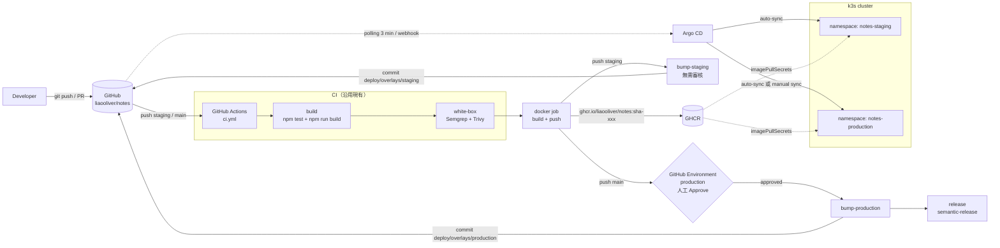
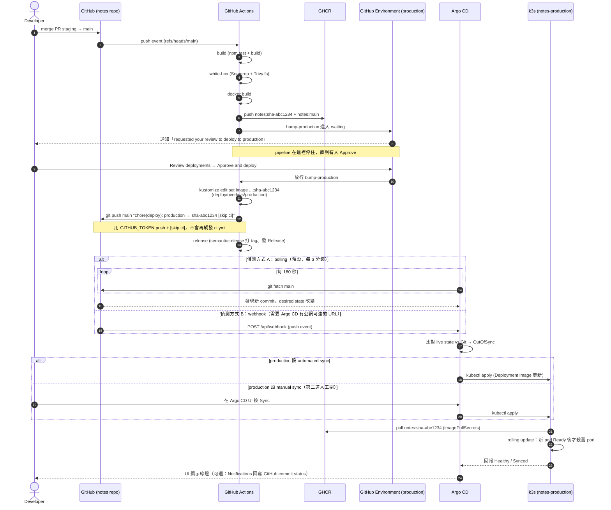

# GitOps Roadmap：從「加密產物 + 人工核准」延伸到「Docker image + Argo CD + k3s」

> **狀態：設計稿，尚未實作。** 本文描述如何把目前 `ci.yml` 的 5 個 job 延伸成下面這條完整的 GitOps 鏈路。
> 所有 YAML / shell 片段都是為了讓每個 Phase 可以直接開 PR 而寫的草案，實際落地時請依當時的 action 版本與環境調整。
> 互動版：[GitOps Roadmap Artifact](https://claude.ai/artifact/9EbPRiqXcJY8ZrqcJXputd)（可逐步播放的架構流程圖）

```
git commit / git push
  → GitHub Actions CI
  → test / build
  → Docker build
  → push image 到 GHCR
  → GitHub Environment Approval
  → 更新 k8s manifest image tag
  → Argo CD 偵測 Git 變更
  → sync 到 k3s
  → staging / production 流程
```

---

## 1. 現況對照：現有 5 個 job 在新架構裡的去向

| 現有 job（`ci.yml`） | 現在做的事 | 對應目標流程 | 處置 |
| --- | --- | --- | --- |
| `build` | `npm ci` → `npm test` → `npm run build` → 上傳 `dist/` artifact | **test / build** | **沿用**。`build` script 原本是 placeholder（只 echo 一個 `<h1>`），Phase 0 已修成複製 `src/`。 |
| `white-box` | Semgrep SAST + Trivy `fs` 掃描 | **CI 安全閘** | **沿用**。之後可加一個 Trivy `image` 掃描步驟，對剛 build 好的 image 再掃一次（Phase 7）。 |
| `encryption` | `tar` + `openssl aes-256-cbc` 加密 `dist/`，上傳 `dist.tar.gz.enc` | 無直接對應 | **重新定位或拿掉**。在 image 世界裡，「保護交付產物」的做法是 registry 權限控管 + image 簽章（cosign），不是把 tarball 加密。建議：Phase 2 加了 `docker` job 之後把 `encryption` 移除；想保留「產物完整性」這個學習點就改成 cosign keyless 簽章（Phase 7）。 |
| `ops-handoff` | `environment: production` 等人工核准 → `echo` 一句話 | **GitHub Environment Approval → 更新 manifest image tag** | **沿用審核機制、替換執行內容**。把 `echo` 換成 `kustomize edit set image` + commit 回 repo（Phase 4）。這就是「人按下 Approve」到「Argo CD 開始部署」之間唯一的橋。 |
| `release` | `semantic-release` 算版號、打 tag、發 GitHub Release | 版本號 / Release notes | **沿用**。順序調整為在 manifest bump 之後跑，讓 image 也能順便打上 `notes-vX.Y.Z` tag（Phase 7）。 |
| （無） | — | **Dockerfile / docker build / push GHCR** | **新增**（Phase 1、2） |
| （無） | — | **k8s manifest（kustomize base + overlays）** | **新增**（Phase 3） |
| （無） | — | **Argo CD + k3s** | **新增**（Phase 5、6） |

一句話總結：**CI 這一半（test / build / scan / approval）幾乎原封不動，CD 這一半從「加密 tarball 交給不存在的運維」變成「改 Git 裡的 manifest，讓 Argo CD 去部署」。**

---

## 2. 目標架構

### 2.1 元件關係圖



### 2.2 manifest 要放哪裡：同 repo `deploy/` vs 獨立 `notes-deploy` repo

| | 同 repo（`deploy/` 目錄） | 獨立 repo（`liaooliver/notes-deploy`） |
| --- | --- | --- |
| 上手難度 | 低：一個 repo、一組 secret、一條 PR 流程 | 中：要多管一個 repo，CI 要有跨 repo push 權限（PAT 或 GitHub App） |
| 循環觸發風險 | **有**：CI 改了 `deploy/` 再 push，會再觸發 `ci.yml`。要靠 `[skip ci]` 或 `paths-ignore` 擋 | 無：app repo 的 workflow 不會因 deploy repo 的 commit 觸發 |
| 權限分離 | 弱：能改程式碼的人就能改部署設定 | 強：可以只給運維 deploy repo 的 write 權限 |
| Argo CD 設定 | `repoURL` 指同一個 repo、`path: deploy/overlays/xxx` | `repoURL` 指 deploy repo |
| 審計 | 部署歷史跟程式碼歷史混在一起 | 部署歷史獨立乾淨（`git log` 全是 image bump） |
| 業界慣例 | 小專案 / 單人 / 學習用 | 多團隊、多服務、正式環境 |

**建議：先用同 repo `deploy/` 目錄。** 理由：

1. 這個專案是單人學習用，多一個 repo 只會增加「secret 跨 repo」這種跟 GitOps 本質無關的摩擦。
2. 循環觸發的問題有標準解法（見第 5 節），而且**親自踩一次這個坑正是學習的一部分**。
3. 之後要拆出去很容易：`git subtree split -P deploy` 就能把 `deploy/` 目錄連歷史一起搬到新 repo，Argo CD 只要改 `repoURL`。

### 2.3 完整時序：merge `staging → main` 到 production pod 換新



---

## 3. 分階段實作計畫

延續這個專案「一次一小片、一個 commit、一個 PR」的習慣。每個 Phase 都能獨立開 PR 到 `staging`、獨立驗證、獨立回退。**不要一次做完再開一張大 PR。**

### Phase 0：修 `package.json` 的 `build` script（已完成）

原本：

```json
"build": "mkdir -p dist && echo '<h1>Hello CI</h1>' > dist/index.html"
```

這是 CI 練習初期的 placeholder，`dist/` 裡沒有 `src/index.html` 也沒有 `src/app.js`。Docker image 會 `COPY dist/` 進去，所以這一步不先修，後面全部白做。

改成：

```json
"build": "rm -rf dist && mkdir -p dist && cp src/index.html src/app.js dist/"
```

驗證：`npm run build && ls dist/` 應該看到兩個檔案，`open dist/index.html` 能正常用表單新增 fix record。

（`app.js` 裡的 `module.exports` 守衛在瀏覽器裡因為 `typeof module === 'undefined'` 會跳過，不影響。）

### Phase 1：`Dockerfile` + `.dockerignore`

`Dockerfile`：

```dockerfile
# 純靜態站，不需要 Node runtime，直接用 nginx 出 dist/
FROM nginx:1.27-alpine

# 把 build 好的靜態檔放到 nginx 預設 docroot
COPY dist/ /usr/share/nginx/html/

# nginx:alpine 已經 EXPOSE 80 且有預設 CMD，不用再寫
```

`.dockerignore`：

```
node_modules
.git
.github
test
docs
*.md
```

刻意**不用 multi-stage build 在 Docker 裡跑 `npm run build`**：因為 `build` job 已經跑過 test + build 並上傳 `dist/` artifact，`docker` job 直接下載 artifact 再 `COPY`，避免同一份程式碼 build 兩次、也讓「進 image 的東西 = 通過測試的東西」這件事更明確。

本機驗證：

```bash
npm run build
docker build -t notes:local .
docker run --rm -p 8080:80 notes:local
# 開 http://localhost:8080 確認表單能用
```

### Phase 2：`ci.yml` 加 `docker` job，push 到 GHCR

在 `white-box` 之後、`ops-handoff` 之前插入。**只在 push 事件跑**（PR 不需要 push image，避免每個 PR 都塞一份 image 進 GHCR）。

```yaml
  # 3. Docker 階段：把通過測試 + 掃描的 dist/ 打包成 image 推到 GHCR
  docker:
    name: Build & Push Image
    needs: white-box
    runs-on: ubuntu-latest
    if: github.event_name == 'push'
    permissions:
      contents: read
      packages: write
    outputs:
      image_tag: ${{ steps.sha.outputs.tag }}
      image_digest: ${{ steps.push.outputs.digest }}
    steps:
      - name: Checkout Code
        uses: actions/checkout@v4

      # 自己算 sha-xxxxxxx，不要拿 metadata-action 的 version 輸出：
      # 那個輸出會依 tag 優先序回傳 "staging" / "main"，manifest 需要的是不可變的 sha tag
      - name: Compute Image Tag
        id: sha
        run: echo "tag=sha-$(git rev-parse --short=7 HEAD)" >> "$GITHUB_OUTPUT"

      - name: Download Build Artifact
        uses: actions/download-artifact@v4
        with:
          name: dist-files
          path: dist

      - name: Login to GHCR
        uses: docker/login-action@v3
        with:
          registry: ghcr.io
          username: ${{ github.actor }}
          password: ${{ secrets.GITHUB_TOKEN }}

      - name: Docker Metadata (tags & labels)
        id: meta
        uses: docker/metadata-action@v5
        with:
          images: ghcr.io/${{ github.repository }}
          tags: |
            type=sha,prefix=sha-,format=short
            type=ref,event=branch

      - name: Build and Push
        id: push
        uses: docker/build-push-action@v6
        with:
          context: .
          push: true
          tags: ${{ steps.meta.outputs.tags }}
          labels: ${{ steps.meta.outputs.labels }}
```

tag 策略（由 `metadata-action` 兩條規則產生）：

| 事件 | 產生的 tag |
| --- | --- |
| 任何 push | `sha-<7 碼 short sha>`（**manifest 永遠只用這個**，不可變、可追溯） |
| push `staging` | 額外打 `staging`（方便人工 `docker pull` 看最新） |
| push `main` | 額外打 `main` |

> `type=ref,event=branch` 會把 `/` 換成 `-`，所以功能分支若之後也要 push image 不會出錯；但目前 `on.push.branches` 只有 `main` / `staging`。

驗證：merge 進 `staging` 後到 repo 首頁右側「Packages」看到 `notes` package，且有 `sha-xxxxxxx` 跟 `staging` 兩個 tag。

### Phase 3：`deploy/` 目錄（kustomize base + overlays）

```
deploy/
├── base/
│   ├── kustomization.yaml
│   ├── deployment.yaml
│   ├── service.yaml
│   └── ingress.yaml
└── overlays/
    ├── staging/
    │   └── kustomization.yaml
    └── production/
        └── kustomization.yaml
```

`deploy/base/deployment.yaml`：

```yaml
apiVersion: apps/v1
kind: Deployment
metadata:
  name: notes
spec:
  replicas: 1
  selector:
    matchLabels:
      app: notes
  template:
    metadata:
      labels:
        app: notes
    spec:
      imagePullSecrets:
        - name: ghcr-pull
      containers:
        - name: notes
          image: ghcr.io/liaooliver/notes   # tag 由 overlay 的 images: 覆寫
          ports:
            - containerPort: 80
          readinessProbe:
            httpGet:
              path: /
              port: 80
          resources:
            requests: { cpu: 10m, memory: 16Mi }
            limits: { cpu: 100m, memory: 64Mi }
```

`deploy/base/service.yaml`：

```yaml
apiVersion: v1
kind: Service
metadata:
  name: notes
spec:
  selector:
    app: notes
  ports:
    - port: 80
      targetPort: 80
```

`deploy/base/ingress.yaml`（k3s 內建 Traefik，不用另外裝 ingress controller）：

```yaml
apiVersion: networking.k8s.io/v1
kind: Ingress
metadata:
  name: notes
spec:
  rules:
    - host: notes.local   # overlay 用 patch 換成 notes-staging.local / notes.local
      http:
        paths:
          - path: /
            pathType: Prefix
            backend:
              service:
                name: notes
                port:
                  number: 80
```

`deploy/base/kustomization.yaml`：

```yaml
apiVersion: kustomize.config.k8s.io/v1beta1
kind: Kustomization
resources:
  - deployment.yaml
  - service.yaml
  - ingress.yaml
```

`deploy/overlays/staging/kustomization.yaml`：

```yaml
apiVersion: kustomize.config.k8s.io/v1beta1
kind: Kustomization
namespace: notes-staging
resources:
  - ../../base
images:
  - name: ghcr.io/liaooliver/notes
    newTag: sha-0000000   # 由 CI 的 kustomize edit set image 覆寫
patches:
  - target:
      kind: Ingress
      name: notes
    patch: |
      - op: replace
        path: /spec/rules/0/host
        value: notes-staging.local
```

`deploy/overlays/production/kustomization.yaml` 同結構，`namespace: notes-production`、`host: notes.local`、可加 `replicas: 2` 的 patch。

驗證（不需要 cluster）：

```bash
kubectl kustomize deploy/overlays/staging
kubectl kustomize deploy/overlays/production
```

兩個都能吐出完整 YAML、image 欄位帶 `:sha-0000000`、namespace 正確，就可以 merge。

### Phase 4：把 `ops-handoff` 的 `echo` 換成真的 manifest bump

拆成兩個 job：`bump-staging`（push `staging` 觸發、不需審核）跟 `bump-production`（push `main` 觸發、綁 `environment: production`）。`encryption` job 移除。

```yaml
  # 4a. staging 自動 bump，不需人工審核
  bump-staging:
    name: Bump Staging Manifest
    needs: docker
    runs-on: ubuntu-latest
    if: github.event_name == 'push' && github.ref == 'refs/heads/staging'
    permissions:
      contents: write
    steps:
      - name: Checkout Code
        uses: actions/checkout@v4
        with:
          ref: staging

      - name: Set image tag in overlays/staging
        env:
          IMAGE_TAG: ${{ needs.docker.outputs.image_tag }}
        run: |
          cd deploy/overlays/staging
          kustomize edit set image "ghcr.io/liaooliver/notes=ghcr.io/liaooliver/notes:${IMAGE_TAG}"
          git diff

      - name: Commit and Push
        env:
          IMAGE_TAG: ${{ needs.docker.outputs.image_tag }}
        run: |
          git config user.name  "github-actions[bot]"
          git config user.email "41898282+github-actions[bot]@users.noreply.github.com"
          git add deploy/overlays/staging/kustomization.yaml
          git commit -m "chore(deploy): staging → ${IMAGE_TAG} [skip ci]"
          git push origin staging

  # 4b. production 要先過 environment 審核
  bump-production:
    name: Ops Handoff / Bump Production Manifest
    needs: docker
    runs-on: ubuntu-latest
    if: github.event_name == 'push' && github.ref == 'refs/heads/main'
    environment: production
    permissions:
      contents: write
    steps:
      - name: Checkout Code
        uses: actions/checkout@v4
        with:
          ref: main

      - name: Set image tag in overlays/production
        env:
          IMAGE_TAG: ${{ needs.docker.outputs.image_tag }}
        run: |
          cd deploy/overlays/production
          kustomize edit set image "ghcr.io/liaooliver/notes=ghcr.io/liaooliver/notes:${IMAGE_TAG}"
          git diff

      - name: Commit and Push
        env:
          IMAGE_TAG: ${{ needs.docker.outputs.image_tag }}
        run: |
          git config user.name  "github-actions[bot]"
          git config user.email "41898282+github-actions[bot]@users.noreply.github.com"
          git add deploy/overlays/production/kustomization.yaml
          git commit -m "chore(deploy): production → ${IMAGE_TAG} [skip ci]"
          git push origin main

  # 5. release 改成 needs: bump-production
  release:
    needs: bump-production
    # ...其餘不變
```

> `ubuntu-latest` runner image 目前內建 `kustomize`（跟 `kubectl`、`helm` 一起列在 runner 的 installed software 清單）。
> 若之後 runner image 拿掉了，加一步 `imranismail/setup-kustomize@v2` 即可；`kubectl kustomize` 只能 build 不能 `edit`，不能拿來替代。

**這一步會撞到 `main` 的 branch protection**：目前 `main` 要求「必須透過 PR 合併」，`github-actions[bot]` 用 `GITHUB_TOKEN` 直接 `git push origin main` 會被 403 擋掉。semantic-release 的 `@semantic-release/git` 在 run #32 就被同一條規則擋下（GH006），當時的決定是不寫回 `main`，見 [`release-automation.md`](./release-automation.md) 第五階段。manifest bump 沒辦法用同樣的方式迴避，一定要有能 push 的身分。解法二選一：

1. **Branch protection → 「Allow specified actors to bypass required pull requests」**：加 `github-actions[bot]`。最簡單，但等於 bot 可以繞過 PR 規則。
2. **改用 Fine-grained PAT**（`contents: write`，存成 `DEPLOY_PUSH_TOKEN` secret）並把該帳號加入 bypass 名單。多一個要輪替的 secret，但權限邊界清楚。

學習用建議選 1，並把 `staging` 的保護規則也比照設定（`bump-staging` 同樣要 push）。

驗證：merge 一個小改動進 `staging`，等 pipeline 跑完，`git log staging` 應該多一個 `chore(deploy): staging → sha-xxx [skip ci]` commit，且 Actions 頁面**沒有**因這個 commit 再多一個 run。

### Phase 5：本機 k3s + Argo CD

裝 k3s（Linux VM、或 Mac 上用 [Multipass](https://multipass.run/) / [OrbStack](https://orbstack.dev/) 開一台 Ubuntu）：

```bash
curl -sfL https://get.k3s.io | sh -
sudo cat /etc/rancher/k3s/k3s.yaml > ~/.kube/config   # 或 export KUBECONFIG
kubectl get nodes
```

裝 Argo CD：

```bash
kubectl create namespace argocd
kubectl apply -n argocd -f https://raw.githubusercontent.com/argoproj/argo-cd/stable/manifests/install.yaml
kubectl -n argocd rollout status deploy/argocd-server

# 取得初始密碼、port-forward 開 UI
kubectl -n argocd get secret argocd-initial-admin-secret -o jsonpath='{.data.password}' | base64 -d; echo
kubectl -n argocd port-forward svc/argocd-server 8443:443
# 開 https://localhost:8443，帳號 admin
```

建兩個 namespace：

```bash
kubectl create namespace notes-staging
kubectl create namespace notes-production
```

Argo CD `Application`（放在 `deploy/argocd/`，用 `kubectl apply -f` 一次建好；repo 若是 public 不需要 repo credential）：

`deploy/argocd/notes-staging.yaml`：

```yaml
apiVersion: argoproj.io/v1alpha1
kind: Application
metadata:
  name: notes-staging
  namespace: argocd
spec:
  project: default
  source:
    repoURL: https://github.com/liaooliver/notes.git
    targetRevision: staging          # 追 staging 分支
    path: deploy/overlays/staging
  destination:
    server: https://kubernetes.default.svc
    namespace: notes-staging
  syncPolicy:
    automated:
      prune: true      # Git 裡刪掉的資源，cluster 也跟著刪
      selfHeal: true   # 有人手動 kubectl edit 改壞了，Argo CD 自動改回 Git 的版本
    syncOptions:
      - CreateNamespace=true
```

`deploy/argocd/notes-production.yaml`：

```yaml
apiVersion: argoproj.io/v1alpha1
kind: Application
metadata:
  name: notes-production
  namespace: argocd
spec:
  project: default
  source:
    repoURL: https://github.com/liaooliver/notes.git
    targetRevision: main             # 追 main 分支
    path: deploy/overlays/production
  destination:
    server: https://kubernetes.default.svc
    namespace: notes-production
  syncPolicy:
    # 選項 A：跟 staging 一樣全自動（GitHub Environment Approve 就是唯一人工閘）
    automated:
      prune: true
      selfHeal: true
    # 選項 B：把 automated 整段拿掉 → 變成 manual sync，
    #         Argo CD 會顯示 OutOfSync，要人在 UI 按 Sync 才部署（第二道人工閘）
    syncOptions:
      - CreateNamespace=true
```

`syncPolicy` 三個開關的意義：

| 欄位 | 意思 | 沒開會怎樣 |
| --- | --- | --- |
| `automated` | Git 變了就自動 apply | 只會標 OutOfSync，等人按 Sync |
| `automated.prune` | Git 裡移除的資源，cluster 也刪 | 只增不減，孤兒資源留在 cluster |
| `automated.selfHeal` | cluster 被手動改動時自動還原成 Git 的版本 | 手動 `kubectl edit` 的漂移會一直留著，直到下次 Git 有變動 |

**production 要不要開 `automated`？** 兩種都合理：

- 開：人工閘只有一道（GitHub Environment Approve），Approve 之後全自動到 pod 換新。跟現在 `ops-handoff` 的語意最接近。
- 不開：兩道人工閘（GitHub Approve 決定「要不要改 manifest」、Argo CD Sync 決定「要不要真的部署」）。多一道保險，但也多一個容易忘記按的地方。

建議先開 `automated`，體驗完整自動鏈路；之後想練「Argo CD 手動 sync + rollback UI」再關掉。

驗證：`kubectl apply -f deploy/argocd/`，Argo CD UI 應該看到兩個 Application 從 Missing → Progressing → Healthy/Synced；`kubectl -n notes-staging get pods` 有 notes pod Running（前提是 Phase 6 的 pull secret 已建好）。

### Phase 6：GHCR pull 權限

GHCR 的 package 預設跟 repo 同可見性。`liaooliver/notes` 若是 public repo，package 也是 public，**k3s 可以直接 pull，不需要 secret**，可以先把 `imagePullSecrets` 那段拿掉。

若 repo 是 private（或想練 private registry），要在每個 namespace 建 `docker-registry` secret。先到 GitHub Settings → Developer settings → Personal access tokens 建一組 **classic PAT，只勾 `read:packages`**：

```bash
for ns in notes-staging notes-production; do
  kubectl -n "$ns" create secret docker-registry ghcr-pull \
    --docker-server=ghcr.io \
    --docker-username=liaooliver \
    --docker-password="$GHCR_READ_TOKEN" \
    --docker-email=noreply@example.com
done
```

驗證：`kubectl -n notes-staging describe pod <pod>`，Events 不再有 `ErrImagePull` / `ImagePullBackOff`。

### Phase 7（選配）：進階強化

| 項目 | 做什麼 | 補的洞 |
| --- | --- | --- |
| Trivy image scan | `docker` job 後加一步 `aquasecurity/trivy-action` `scan-type: image`、`image-ref: ghcr.io/...:sha-xxx` | 現在只掃 source（`fs`），沒掃 base image（nginx:alpine）裡的 CVE |
| cosign keyless 簽章 | `docker` job 加 `permissions: id-token: write` + `sigstore/cosign-installer@v3` + `cosign sign --yes ghcr.io/...@${digest}` | 取代 `encryption` job 的「產物完整性」學習點；用 GitHub OIDC 身分簽，不用管私鑰 |
| 驗簽 | k3s 裝 Kyverno，寫 `ClusterPolicy` `verifyImages` 要求 `ghcr.io/liaooliver/notes*` 必須有 cosign 簽章 | 沒簽章的 image 進不了 cluster，即使有人手動 `kubectl set image` |
| Argo CD Notifications | 裝 `argocd-notifications`，設 GitHub trigger，sync 成功 / 失敗時回寫 commit status | 現在 GitHub 那邊看不到「Argo CD 到底部署完了沒」，要自己開 Argo UI 看 |
| image 打版本 tag | `release` job 拿到 semantic-release 的 `nextRelease.version` 後 `docker buildx imagetools create -t ghcr.io/...:notes-v1.3.0 ghcr.io/...:sha-xxx` | 不重 build，只是加 tag，讓 GitHub Release 跟 image 一對一 |

---

## 4. staging / production 在新架構下的語意

| | staging | production |
| --- | --- | --- |
| 觸發 | PR merge 進 `staging`（push 事件） | PR merge `staging → main`（push 事件） |
| CI 閘 | build + white-box | build + white-box |
| image | `ghcr.io/liaooliver/notes:sha-xxx` + `:staging` | 同一個 `sha-xxx`（**不重 build**）+ `:main` |
| 人工 approval | 無 | GitHub Environment `production` |
| manifest bump | `deploy/overlays/staging`，CI 自動 commit | `deploy/overlays/production`，Approve 後 CI 自動 commit |
| Argo CD Application | `notes-staging`，追 `staging` 分支 | `notes-production`，追 `main` 分支 |
| Argo CD sync | automated + selfHeal + prune | automated（或 manual 當第二道閘） |
| 部署到 | namespace `notes-staging` | namespace `notes-production` |
| 版本號 | 無 | semantic-release 打 tag + Release |
| Rollback | `git revert <bump commit>` → push staging → Argo CD 自動換回舊 image | `git revert <bump commit>` → 開 PR 進 main（走 branch protection）→ Argo CD 自動換回舊 image |

**「merge 進 staging = 部署到 staging 環境」、「merge 進 main + Approve = 部署到 production 環境」** 這兩句話就是這個架構的全部。跟現在 [`branching-strategy.md`](./branching-strategy.md) 的兩層 gate 完全對得上，只是 gate 後面接的從「上傳加密檔」變成「改 manifest 讓 Argo CD 部署」。

### Rollback 是 GitOps 最大的賣點

傳統做法回滾要跑一次「反向部署」：找舊 image、`kubectl set image`、祈禱沒人改過別的東西。GitOps 下：

```bash
git revert <那個 "chore(deploy): production → sha-新的" commit>
git push
```

因為 **cluster 的 desired state 就是 Git 的內容**，revert 後 Argo CD 偵測到 manifest 的 image tag 變回舊值，自動 rolling update 回舊 pod。不需要記舊 image 叫什麼、不需要進 cluster 敲指令、而且這次回滾本身也是一個有 author / 時間 / 理由的 commit。`selfHeal` 開著的話，就算有人事後在 cluster 手動改回新版，Argo CD 也會再把它壓回 Git 的版本。

同樣的道理，**「production 現在跑哪個版本？」答案永遠是 `git show main:deploy/overlays/production/kustomization.yaml`**，不用問任何人。

---

## 5. 要注意的坑

- **`GITHUB_TOKEN` push 被 branch protection 擋（403）。** `main` / `staging` 都開了「Require a pull request before merging」，bot 直接 push 會失敗。Phase 4 的兩個 bump job 都會撞到。要在 branch protection 加 bypass actor，或改用 PAT。semantic-release 已經在 run #32 踩過一次（見 [`release-automation.md`](./release-automation.md) 第五階段），Phase 4 一定會再踩到。

- **CI 自己 push 會不會再觸發 `ci.yml`？** 兩層保險：(1) commit message 帶 `[skip ci]`，GitHub Actions 原生認得；(2) 用 `GITHUB_TOKEN` 產生的 push 本來就不會觸發新的 workflow run（GitHub 防無限迴圈的設計）。**但如果 Phase 4 改用 PAT，第 (2) 層保險就失效了，只剩 `[skip ci]`**，此時要再加第三層：`on.push.paths-ignore`。

- **manifest 跟程式碼放同 repo 的循環觸發風險。** 即使 `[skip ci]` 有效，之後若加了其他 workflow（例如 `commitlint.yml` 沒有 `[skip ci]` 豁免，或別人開 PR 順手動了 `deploy/`），還是可能循環。在 `ci.yml` 加：

  ```yaml
  on:
    push:
      branches: [ "main", "staging" ]
      paths-ignore:
        - 'deploy/**'
        - 'CHANGELOG.md'
  ```

  注意 `paths-ignore` 對 branch protection 的 required status check 有副作用：純 `deploy/` 改動的 PR 不會跑 `Build Application`，required check 永遠 pending 卡住 merge。解法是 required check 改用一個永遠會跑的輕量 job，或對 `deploy/**` 的 PR 另外開一個只跑 `kubectl kustomize` 驗證的 workflow。

- **`commitlint.yml` 也要放行 bot commit。** `chore(deploy): staging → sha-abc1234 [skip ci]` 符合 Conventional Commits，但 `→` 這種字元要確認 commitlint 的 `subject-case` 規則不會誤判；保險起見 commit message 用純 ASCII：`chore(deploy): bump staging image to sha-abc1234 [skip ci]`。

- **GHCR 免費層限制。** 個人帳號 public package 免費無限；private package 有 500 MB storage + 1 GB/月 transfer 的免費額度。每次 push 都產生新 `sha-xxx` tag，nginx:alpine 底層約 20 MB 但 layer 會共用，實際增量很小；不過長期還是要加 `actions/delete-package-versions@v5` 定期清舊 tag（保留最近 N 個 + 所有帶 `notes-v` 的）。

- **k3s 在本機、沒有公網 IP 時，Argo CD 收不到 GitHub webhook。** 只能靠預設每 3 分鐘 polling（可在 `argocd-cm` 的 `timeout.reconciliation` 調短，但太短會打爆 GitHub API rate limit）。想練 webhook 要用 `cloudflared tunnel` / `ngrok` 把 `argocd-server` 的 `/api/webhook` 暴露出去，並在 repo Settings → Webhooks 設定。學習階段 polling 就夠了，3 分鐘的延遲反而讓你看得到「OutOfSync → Syncing → Synced」的狀態轉換。

- **`docker` job 只在 push 跑，PR 上看不到 image build 是否會壞。** 若想 PR 階段就驗證 Dockerfile，可以在 PR 事件加一個 `push: false` 的 build-only job，或直接把 `docker` job 的 `push:` 改成 `${{ github.event_name == 'push' }}`。

- **Trivy 現在只掃 source，沒掃 image。** `nginx:alpine` 底層 CVE 不會被抓到。Phase 7 加 `scan-type: image` 補上，並記得 `exit-code: '1'` 一樣要開，否則掃了等於沒掃。

- **`readinessProbe` 一定要有。** 沒有的話 rolling update 會在新 pod 還沒真的能服務時就砍舊 pod，Argo CD 顯示 Healthy 但實際上有幾秒 502。上面的 Deployment 範例已經放了。

- **Argo CD 的 `targetRevision: staging` 跟 GitHub 的 `staging` 分支是同一個字串，但語意不同。** 前者是「Argo CD 從哪個 ref 讀 manifest」，後者是「CI 從哪個 ref build 程式碼」。這裡刻意讓它們一致（staging Application 追 staging 分支、production 追 main），但技術上可以分開（例如兩個 Application 都追 main、只是 path 不同）。同 repo 方案下讓它們一致最不容易搞混。

---

## 6. 與現有文件的關係

| 文件 | 內容 | 跟本文的關係 |
| --- | --- | --- |
| [`branching-strategy.md`](./branching-strategy.md) | `feature/* → staging → main` 的分支模型與兩層 gate | 本文完全沿用這個分支模型，只是把 gate 後面接的動作從「加密上傳」換成「bump manifest → Argo CD 部署」。第 4 節的表格是那份文件表格的延伸版。 |
| [`release-automation.md`](./release-automation.md) | commitlint + semantic-release 的演變過程與坑 | 本文 Phase 4 會踩到它預告的「`GITHUB_TOKEN` push 被 branch protection 擋」；Phase 7 讓 semantic-release 的版本 tag 也打到 image 上。 |
| [`use-cases.md`](./use-cases.md) | **現況**所有觸發情境的逐條說明與時序圖（開 PR、merge 進 staging、promotion 到 main、approve、LLM assist……） | 本文第 2.3 節的時序圖是那份文件「情境：staging → main promotion」在新架構下的未來版。實作完 Phase 4 之後，那份文件的 `ops-handoff` 段落要同步更新。 |
| [`llm-pr-assist.md`](./llm-pr-assist.md) | Gemini PR 助手 | 不受本文影響；`llm-pr-assist.yml` 跟 `ci.yml` 互相獨立。若 `deploy/` 的 bump commit 之後改成走 PR，LLM 會對它做摘要，可以考慮在 workflow 加 `paths-ignore: ['deploy/**']` 省額度。 |
