# 使用案例（Use Cases）：開發者做了什麼，整條流程會怎麼反應

> 互動版：[CI 情境圖鑑 Artifact](https://claude.ai/artifact/9q6a6Bs7uWDND4WBYasWLC)（可逐步播放的時序圖 + 程式碼對照）

這份文件用「情境 → 觸發 → 依序發生什麼 → 結果」的方式，逐條記錄本專案目前 CI/CD 與 GitOps 的每一種使用案例，
並為每個案例附上一張時序圖，方便對照「誰在什麼時候跟誰互動」。

分支模型是 `feature/* → staging → main`（詳見 [branching-strategy.md](./branching-strategy.md)）。
UC-01 ~ UC-14 講 GitHub 這一側（PR、檢查、審核、發版），UC-15 ~ UC-20 講程式碼離開 GitHub 之後
怎麼變成叢集裡正在跑的 pod（詳見 [gitops-roadmap.md](./gitops-roadmap.md)）。

**這條鏈路橫跨兩個 repo**：`liaooliver/notes` 裝程式碼，`liaooliver/notes-deploy` 裝部署設定。
CI 在前者跑、寫的卻是後者；Argo CD 只看後者，完全不知道前者的存在。

主要參與者固定用以下名稱：

| 名稱 | 指的是 |
| --- | --- |
| Developer | 寫 code、開 PR 的人 |
| Local (husky) | 本機 git hook（`.husky/commit-msg` → commitlint） |
| GitHub | repo 本身：branch protection、PR 狀態、environment 審核機制 |
| Actions | GitHub Actions runner，跑 `ci.yml` / `commitlint.yml` / `llm-pr-assist.yml` |
| Gemini | Google AI Studio 的 Gemini API |
| Reviewer | 在 `production` environment 按 Approve / Reject 的人 |
| semantic-release | `ci.yml` 最後一個 job 裡跑的 `npx semantic-release` |
| Config repo | 另一個 repo `liaooliver/notes-deploy`，只裝 k8s 部署設定；CI 用 deploy key 寫進去，不設 branch protection |
| GHCR | GitHub 的 container registry。這個專案有兩個 image：`ghcr.io/liaooliver/notes`（前端 nginx）與 `notes-api`（Express） |
| Argo CD | 跑在 VM 裡的程式，每 3 分鐘讀一次 Config repo，發現設定變了就叫 k3s 照著做 |
| k3s | 精簡版 Kubernetes，跑在 Mac 上的 Multipass VM 裡，負責照設定把 container 拉起來 |

## 總覽表

| 案例 | 開發者動作 | 觸發的 workflow / job | 結果 |
| --- | --- | --- | --- |
| UC-01 | 本機 commit，訊息不合 Conventional Commits | 只有本機 husky hook | commit 根本做不出來 |
| UC-02 | 從 `staging` 切 `feature/*`，push 到 GitHub | 無（push 只監聽 `main` / `staging`） | 什麼都不會跑 |
| UC-03 | 開 PR `feature/* → staging` | Commit Lint；CI 的 `build`、`white-box`；LLM PR Assist 三個 job | 三個必要檢查綠燈即可 merge |
| UC-04 | 在同一個 PR 上再 push 新 commit | 同 UC-03 全部重跑；LLM 舊 run 被取消 | 檢查結果以最新 commit 為準 |
| UC-05 | PR 的 test 掛掉或 Trivy 抓到 HIGH CVE | `build` 或 `white-box` 失敗 | branch protection 擋住 merge |
| UC-06 | PR 期間 Gemini 回 429 / 503 / model 汰換 | LLM job 走 fallback | 留言變成提示文字，PR 不受影響 |
| UC-07 | merge PR 進 `staging` | Commit Lint + CI 全套（`build` → `white-box` → `docker` → `bump-staging`） | staging 環境真的換版（往下接 UC-15） |
| UC-08 | 開 PR `staging → main` | 同 UC-03（目標分支換成 `main`） | 輕量檢查，仍不發版 |
| UC-09 | merge `staging → main` | CI 一路跑到 `bump-production`，卡在審核 | run 停在 Waiting |
| UC-10 | Reviewer 在 production environment 按 Approve | `bump-production` → `release` | production manifest 換 image tag、打 tag 開 Release |
| UC-11 | Reviewer 按 Reject 或放著不管 | `bump-production` 不放行 | 不換版也不發版；放著最多等 30 天後 run 失敗 |
| UC-12 | 不開 PR，直接 push `main` / `staging` | branch protection 拒絕 push | 本機收到 `protected branch` 錯誤 |
| UC-13 | hotfix：從 `staging` 切 `fix/*` | UC-03 → UC-07 → UC-08 → UC-09 → UC-10 | 走一樣的路，只是 commit type 是 `fix:` |
| UC-14 | 只改 `docs/` 的 PR | 跟 UC-03 一模一樣 | 目前沒有 `paths-ignore`，照跑全部 |
| UC-15 | merge 進 `staging` 之後，等 GitOps 把新版送上叢集 | `docker` → `bump-staging` → Argo CD sync | k3s 的 pod 換成新 image，全程沒人敲 `kubectl` |
| UC-16 | Argo CD 顯示 `Synced`，畫面卻還是舊的 | 無（Argo CD 還沒重讀 Git） | 看 `.status.sync.revision`，用 hard refresh 逼它重讀 |
| UC-17 | 兩個 repo 的 commit 順序搞反 | Argo CD 照舊 sync | pod 卡 `ImagePullBackOff`，`rollout restart` 沒有用 |
| UC-18 | Service 的 label selector 對不到 pod | 無 | Traefik 回 `no available server`，`get endpoints` 是空的 |
| UC-19 | 要把 production 退回上一版 | 在 Config repo `git revert` 那個 bump commit | Argo CD 自動把 pod 換回舊 image |
| UC-20 | commit message 裡出現 skip-ci 標記 | GitHub 根本不建立 run | required checks 不存在，PR 永遠 merge 不了 |

---

## UC-01：本機 commit 訊息不合 Conventional Commits

**情境**：開發者改完 code，隨手 `git commit -m "update stuff"`。

**觸發**：本機 `.husky/commit-msg` hook（`npx --no -- commitlint --edit $1`）。

**依序發生什麼**：

1. git 準備寫入 commit 之前先跑 `commit-msg` hook。
2. commitlint 套用 `@commitlint/config-conventional`，發現沒有 `type:` 前綴（`feat:` / `fix:` / `chore:` …）。
3. hook 以非 0 結束，git 中止 commit。

**結果**：commit 從來沒有存在過，GitHub 完全不知道這件事。這是整條鏈最早、也最便宜的一道關卡；
`commitlint.yml` 在 CI 端再檢一次只是為了防 `--no-verify`。

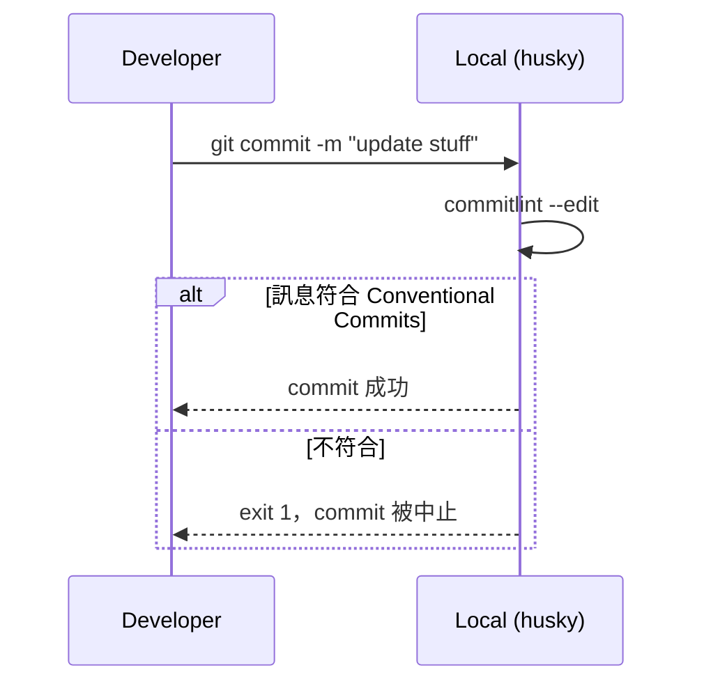
```mermaid
sequenceDiagram
    participant D as Developer
    participant L as Local (husky)
    D->>L: git commit -m "update stuff"
    L->>L: commitlint --edit
    alt 訊息符合 Conventional Commits
        L-->>D: commit 成功
    else 不符合
        L-->>D: exit 1，commit 被中止
    end
```

---

## UC-02：切功能分支並 push，但還沒開 PR

**情境**：開發者 `git checkout -b feature/fix-record-tests staging`，做了幾個 commit，`git push -u origin feature/fix-record-tests`。

**觸發**：無。

**依序發生什麼**：

1. commit 通過本機 husky（同 UC-01）。
2. push 到 GitHub 成功，分支出現在 remote。
3. `ci.yml` 與 `commitlint.yml` 的 `push` 事件都只監聽 `main` / `staging`；`llm-pr-assist.yml` 只監聽 `pull_request`。
   三個 workflow 都不符合條件。

**結果**：Actions 頁面一個 run 都不會多。功能分支上可以盡情 push，成本是零；檢查全部延後到「開 PR」那一刻。

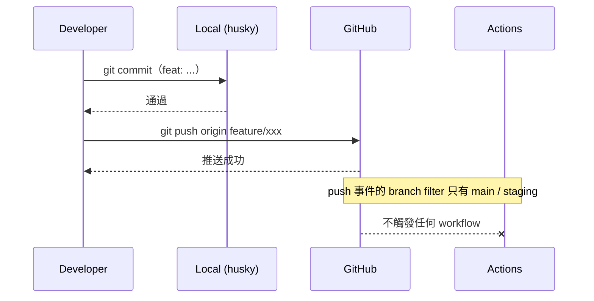
```mermaid
sequenceDiagram
    participant D as Developer
    participant L as Local (husky)
    participant G as GitHub
    participant A as Actions
    D->>L: git commit（feat: ...）
    L-->>D: 通過
    D->>G: git push origin feature/xxx
    G-->>D: 推送成功
    Note over G,A: push 事件的 branch filter 只有 main / staging
    G--xA: 不觸發任何 workflow
```

---

## UC-03：開 PR `feature/* → staging`

**情境**：開發者在 GitHub 開 PR，base 選 `staging`。這是日常最常見的路徑。

**觸發**：`pull_request` 事件（`opened`）。三個 workflow 同時收到：

- `commitlint.yml`：`pull_request` 沒有 branch 限制 → 觸發。
- `ci.yml`：`pull_request.branches` 包含 `staging` → 觸發。
- `llm-pr-assist.yml`：`types: [opened, synchronize, reopened]` → 觸發。

**依序發生什麼**：

1. **Commit Lint**（job 名 `Validate Commit Messages`）：用 `wagoid/commitlint-github-action` 檢查 PR 內每一個 commit。
2. **Enterprise CI/CD Pipeline**：
   - `build`（`Build Application`）：Node 22 → `npm ci` → `npm test` → `npm run build` → 上傳 `frontend/dist/` 成 `dist-files` artifact。
     這個 repo 是 npm workspaces（`frontend` + `api`），一次 `npm ci` 裝完兩個子專案，一次 `npm test` 跑完兩邊的測試。
   - `white-box`（`White-box Security Scan`，`needs: build`）：Semgrep `p/ci` 規則 + Trivy 檔案系統掃描，CRITICAL/HIGH 直接 `exit-code: 1`。
   - `docker` / `bump-staging` / `bump-production` / `release`：四個 job 的 `if` 都要求 `github.event_name == 'push'`。
     在 PR 事件下條件不成立，**這些 job 根本不會出現在 run 的 job 清單裡**（實際在 GitHub UI 驗證過，不是顯示成 skipped，而是不存在）。
3. **LLM PR Assist** 三個 job 平行跑，互不依賴：
   - `commit-message-suggestion`：`gh pr view --json commits` 收集標題 → 組 prompt → 呼叫 Gemini → 貼「🤖 Commit Message 建議 (Gemini)」留言。
   - `pr-diff-summary`：`git diff origin/staging...HEAD`（排除 `package-lock.json`）→ 截前 20000 bytes → Gemini → 貼「🤖 PR 摘要 (Gemini)」。
   - `code-review-comment`：同樣的 diff → 另一組 prompt → Gemini → 貼「🤖 Code Review (Gemini)」。
4. GitHub 依 branch protection 設定，把 `Build Application`、`White-box Security Scan`、`Validate Commit Messages` 標成 required checks。
   LLM 三個 job 不是 required，貼不貼留言都不影響能否 merge。

**結果**：三個 required checks 綠燈後，Merge 按鈕才會亮。因為這個 repo 是單人維護，branch protection 特意**不要求**
review approval（GitHub 不算 PR 作者自己的 approve，勾了會鎖死）。

**實際發生過的例證**：PR #11（`feature/fix-record-tests`）就是走這條路；Gemini 的 code review 留言指出表單送出後沒有清空欄位，
是一個真的可改進點。


```mermaid
sequenceDiagram
    participant D as Developer
    participant G as GitHub
    participant A as Actions
    participant M as Gemini
    D->>G: 開 PR feature/* → staging
    G->>A: pull_request (opened)
    par Commit Lint
        A->>A: Validate Commit Messages
        A-->>G: check: Validate Commit Messages ✅
    and Enterprise CI/CD Pipeline
        A->>A: Build Application（npm ci → npm test → npm run build）
        A-->>G: check: Build Application ✅
        A->>A: White-box Security Scan（needs: build）
        A-->>G: check: White-box Security Scan ✅
        Note over A: docker / bump-* / release 的 if 要求 push 事件，不在此 run 內
    and LLM PR Assist（非 required）
        A->>M: commit-message-suggestion prompt
        M-->>A: 建議文字
        A->>G: 留言「🤖 Commit Message 建議」
        A->>M: pr-diff-summary prompt
        M-->>A: 摘要
        A->>G: 留言「🤖 PR 摘要」
        A->>M: code-review-comment prompt
        M-->>A: review
        A->>G: 留言「🤖 Code Review」
    end
    G-->>D: 3 個 required checks 綠燈，Merge 按鈕可用
```

---

## UC-04：PR 開著，再 push 新 commit

**情境**：Reviewer（或 Gemini 留言）提了建議，開發者在同一條分支再補一個 commit 並 push。

**觸發**：`pull_request` 事件（`synchronize`）。

**依序發生什麼**：

1. 三個 workflow 全部重新觸發，行為跟 UC-03 一樣。
2. `llm-pr-assist.yml` 有 `concurrency: group: llm-pr-assist-<PR number>`、`cancel-in-progress: true`：
   如果上一次的 LLM run 還在跑，會被直接取消，避免對同一個 PR 重複燒 Gemini 免費額度。
3. `ci.yml` 與 `commitlint.yml` 沒有設 concurrency，舊 run 會跑完，但 GitHub 的 required check 只看**最新 commit** 的結果。
4. PR 上會再多三則 Gemini 留言（每次 push 各一輪，舊留言不會被刪）。

**結果**：Merge 資格重新計算，以最新 commit 的 checks 為準。

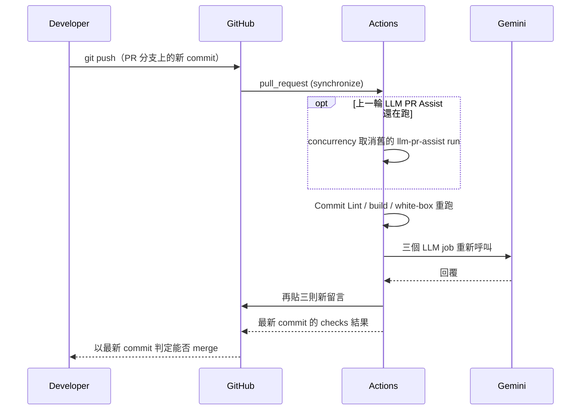
```mermaid
sequenceDiagram
    participant D as Developer
    participant G as GitHub
    participant A as Actions
    participant M as Gemini
    D->>G: git push（PR 分支上的新 commit）
    G->>A: pull_request (synchronize)
    opt 上一輪 LLM PR Assist 還在跑
        A->>A: concurrency 取消舊的 llm-pr-assist run
    end
    A->>A: Commit Lint / build / white-box 重跑
    A->>M: 三個 LLM job 重新呼叫
    M-->>A: 回覆
    A->>G: 再貼三則新留言
    A-->>G: 最新 commit 的 checks 結果
    G-->>D: 以最新 commit 判定能否 merge
```

---

## UC-05：CI 失敗，branch protection 擋住 merge

**情境**：開發者的 PR 有一個測試掛了，或 Trivy 掃到 HIGH 等級 CVE。

**觸發**：同 UC-03，但某個 required job 以非 0 結束。

**依序發生什麼**：

1. `build` job 的 `npm test` 失敗 → job 紅燈 → `white-box` 因 `needs: build` 直接 skipped。
   或者 `build` 綠燈但 `white-box` 的 Trivy 因 `exit-code: '1'` 而失敗。
2. GitHub 收到 required check 失敗的狀態。
3. branch protection 的「Require status checks to pass before merging」把 Merge 按鈕變灰，顯示 required check 未通過。
4. LLM 三個 job 照常跑、照常留言，但它們不是 required，跟能否 merge 無關。

**結果**：開發者必須修好再 push（回到 UC-04）。

**實際發生過的例證**：session 一開始每個 PR 的 `Build Application` 都在 `npm ci` 就掛，錯誤是
`EUSAGE ... lock file's conventional-commits-filter@5.0.0 does not satisfy conventional-commits-filter@6.0.1`，
原因是 `package-lock.json` 跟 `package.json` 不同步。用獨立的 `fix/package-lock-sync` 分支（PR #8）重新 `npm install` 後才解掉，
其他功能分支還得把這個 fix merge forward 進來才能重新變綠。

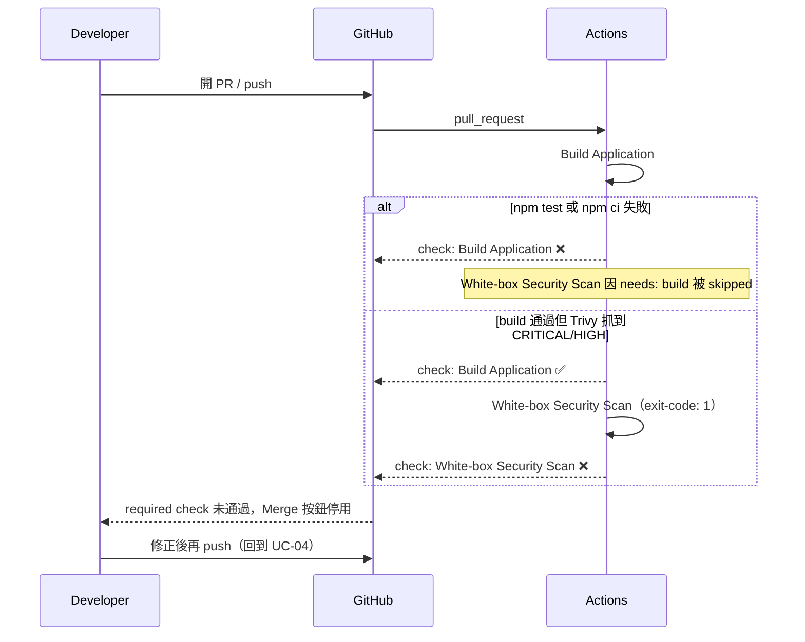
```mermaid
sequenceDiagram
    participant D as Developer
    participant G as GitHub
    participant A as Actions
    D->>G: 開 PR / push
    G->>A: pull_request
    A->>A: Build Application
    alt npm test 或 npm ci 失敗
        A-->>G: check: Build Application ❌
        Note over A: White-box Security Scan 因 needs: build 被 skipped
    else build 通過但 Trivy 抓到 CRITICAL/HIGH
        A-->>G: check: Build Application ✅
        A->>A: White-box Security Scan（exit-code: 1）
        A-->>G: check: White-box Security Scan ❌
    end
    G-->>D: required check 未通過，Merge 按鈕停用
    D->>G: 修正後再 push（回到 UC-04）
```

---

## UC-06：Gemini 失靈（429 / 503 / model 被汰換）

**情境**：PR 開著，但 Gemini 免費額度用完（HTTP 429）、model 過載（HTTP 503），或 Google 把預設 model 下架了。

**觸發**：同 UC-03，差別在 `scripts/llm/call-gemini.mjs` 收到的回應。

**依序發生什麼**：

1. `call-gemini.mjs` 打 `generateContent`，收到 429 或 503。
2. 這兩個狀態碼在 `TRANSIENT_STATUSES` 裡：等 5 秒，重試一次。
3. 還是失敗 → 依狀態碼回傳對應的 fallback 文字（`RATE_LIMIT_FALLBACK` / `OVERLOADED_FALLBACK`），process 仍以 0 結束。
4. 其他非預期錯誤（例如 model 被汰換回 404）→ `main()` 統一捕捉，印 `GENERIC_FALLBACK`。
5. 呼叫 Gemini 與貼留言兩個 step 都有 `continue-on-error: true`，job 維持綠燈。
6. PR 上出現的留言內容變成「LLM 建議暫時不可用：…」之類的提示。

**結果**：PR 的 merge 資格完全不受影響。這是刻意的設計：輔助功能掛了不該擋住主流程。

**實際發生過的例證**：同一個 session 內先遇到
`This model models/gemini-2.0-flash is no longer available. Please update your code to use models/gemini-3.6-flash`
（改預設 model 修掉），緊接著又遇到 503 `This model is currently experiencing high demand`，
原本重試邏輯只認 429，才把 503 一起納入 `TRANSIENT_STATUSES`。

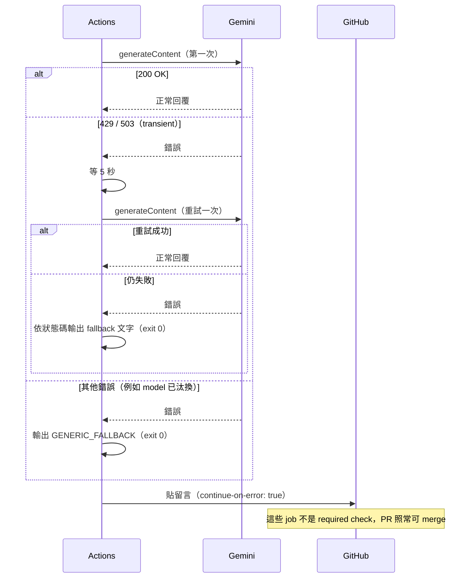
```mermaid
sequenceDiagram
    participant A as Actions
    participant M as Gemini
    participant G as GitHub
    A->>M: generateContent（第一次）
    alt 200 OK
        M-->>A: 正常回覆
    else 429 / 503（transient）
        M-->>A: 錯誤
        A->>A: 等 5 秒
        A->>M: generateContent（重試一次）
        alt 重試成功
            M-->>A: 正常回覆
        else 仍失敗
            M-->>A: 錯誤
            A->>A: 依狀態碼輸出 fallback 文字（exit 0）
        end
    else 其他錯誤（例如 model 已汰換）
        M-->>A: 錯誤
        A->>A: 輸出 GENERIC_FALLBACK（exit 0）
    end
    A->>G: 貼留言（continue-on-error: true）
    Note over G: 這些 job 不是 required check，PR 照常可 merge
```

---

## UC-07：merge PR 進 `staging`

**情境**：UC-03 的 PR 三個 required checks 綠燈，開發者按下 Merge。

**觸發**：`push` 事件到 `staging`（merge commit）。

**依序發生什麼**：

1. `commitlint.yml`：`push.branches` 包含 `staging` → 再檢一次 commit 訊息。
2. `ci.yml`：`push.branches` 是 `main` + `staging`，整份觸發：
   - `build` + `white-box` 重跑一次（PR 階段跑過，多花約 1 分鐘）。
   - `docker`（`if: github.event_name == 'push'`）：matrix 兩個分身，把 web 與 api 各自打包成 image 推上 GHCR。
   - `bump-staging`（`needs: docker`）：去 Config repo 改 `overlays/staging` 的 image tag。
   - `bump-production` / `release` 的 `if` 要求 `refs/heads/main`，在這個 run 裡不出現。
3. `llm-pr-assist.yml` 只聽 `pull_request` → 不觸發。PR 已關閉，也不會再有留言。

**結果**：merge 進 `staging` 不再是「只付一次 commit lint 的成本」。**image 必須從合併後的程式碼 build 出來**，
所以 `staging` 一定要有 push 觸發 —— 這等於把 PR #14（`ci: skip pipeline re-run on push to staging`）的決定改回來。
代價是 `build` + `white-box` 重跑一次，換到的是 staging 環境真的會換版。往後到 k3s 的完整路徑見 UC-15。

沒有版號變動：發版只在 `main` 做。

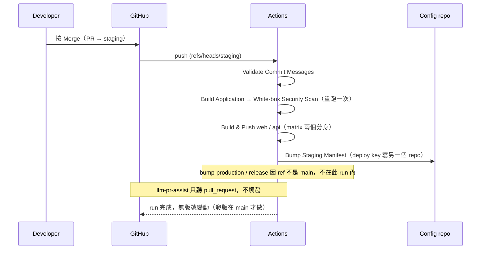
```mermaid
sequenceDiagram
    participant D as Developer
    participant G as GitHub
    participant A as Actions
    participant C as Config repo
    D->>G: 按 Merge（PR → staging）
    G->>A: push (refs/heads/staging)
    A->>A: Validate Commit Messages
    A->>A: Build Application → White-box Security Scan（重跑一次）
    A->>A: Build & Push web / api（matrix 兩個分身）
    A->>C: Bump Staging Manifest（deploy key 寫另一個 repo）
    Note over A: bump-production / release 因 ref 不是 main，不在此 run 內
    Note over G,A: llm-pr-assist 只聽 pull_request，不觸發
    A-->>G: run 完成，無版號變動（發版在 main 才做）
```

---

## UC-08：開 PR `staging → main`（準備發版）

**情境**：`staging` 累積到一個可以發版的節點，開發者開 PR，base 選 `main`、compare 選 `staging`。

**觸發**：`pull_request` 事件，目標分支 `main`。

**依序發生什麼**：

跟 UC-03 完全一樣：Commit Lint、`build`、`white-box`、LLM 三個 job。
`docker` / `bump-staging` / `bump-production` / `release` 的條件要求 `event_name == 'push'`，PR 事件不符合 → 仍然不出現。
也就是說 **PR 階段不會 build image**，Dockerfile 壞掉要等到 merge 之後才會知道。

**結果**：這張 PR 只是「最後一次確認」，通過了也還不會發版。真正的重頭戲在 merge 之後（UC-09）。
Gemini 的 PR 摘要在這裡特別有用：它會把 `staging` 上累積的所有變更一次列出來。

**實際發生過的例證**：PR #13 就是這種 PR；Gemini 的 review 在這裡指出 `package.json` 的 `build` script 只是 placeholder，
根本沒把靜態檔複製進 `dist/`（之後由 `fix(build)` 修正，對應 gitops-roadmap 的 Phase 0）。
那是專案還放一份手寫靜態頁的年代，現在 `build` 是 `frontend` workspace 的 `vite build`。

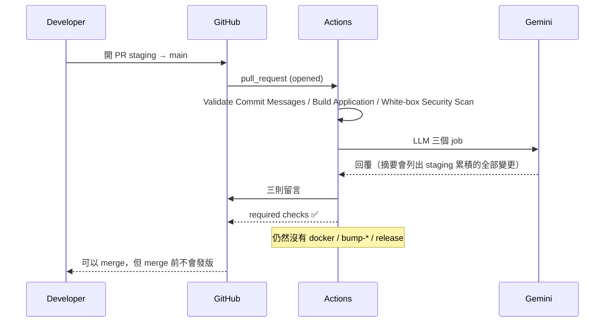
```mermaid
sequenceDiagram
    participant D as Developer
    participant G as GitHub
    participant A as Actions
    participant M as Gemini
    D->>G: 開 PR staging → main
    G->>A: pull_request (opened)
    A->>A: Validate Commit Messages / Build Application / White-box Security Scan
    A->>M: LLM 三個 job
    M-->>A: 回覆（摘要會列出 staging 累積的全部變更）
    A->>G: 三則留言
    A-->>G: required checks ✅
    Note over A: 仍然沒有 docker / bump-* / release
    G-->>D: 可以 merge，但 merge 前不會發版
```

---

## UC-09：merge `staging → main`，pipeline 卡在人工審核

**情境**：UC-08 的 PR 綠燈，開發者按 Merge。這是唯一會讓 `bump-production` 與 `release` 出場的動作。

**觸發**：`push` 事件到 `main`（merge commit）。`event_name == 'push' && ref == 'refs/heads/main'` 條件成立。

**依序發生什麼**：

1. `commitlint.yml` 再檢一次。
2. `ci.yml`：
   - `build`：Node 22、`npm ci`、`npm test`、`npm run build`，上傳 `frontend/dist/` 成 `dist-files` artifact。
   - `white-box`（`needs: build`）：Semgrep + Trivy。
   - `docker`（`needs: white-box`，matrix 兩個分身）：buildx 出 `linux/amd64` + `linux/arm64`，
     推 `ghcr.io/liaooliver/notes` 與 `ghcr.io/liaooliver/notes-api`，兩個 image 的 tag 都是 `sha-<40 碼 commit SHA>`。
   - `bump-staging`：`if` 要求 `refs/heads/staging`，在這個 run 裡不出現。
   - `bump-production`（`needs: docker`，`environment: production`）：GitHub 看到這個 job 綁了有 required reviewers 的 environment，
     **在 job 開始前就暫停**，run 狀態變成 Waiting，並發通知「liaooliver requested your review to deploy to production」。
   - `release`（`needs: bump-production`）：連排隊都還沒排，灰色。
3. `llm-pr-assist.yml` 不觸發（不是 PR 事件）。

**結果**：run 停在 `Ops Handoff / Bump Production Manifest`。image 已經躺在 GHCR 上了，
但 production 的 manifest 沒被改到 —— 所以**叢集還跑著舊版，也沒有任何版本被發布**。
「合併」跟「發布」被 environment 審核硬生生切成兩件事。

**實際發生過的例證**：run #32（PR #13 的 merge commit `49263b9`）曾停在這裡。
當時的 pipeline 還是舊的五個 job（中間那個把 `dist/` 用 `openssl` 加密上傳的 job 後來整個移除；
審核那個 job 以前叫 `ops-handoff`，現在叫 `bump-production`），但「停在人工審核」這件事跟現在一模一樣：
`Build Application` 12s ✅ → `White-box Security Scan` 36s ✅ → 審核閘 ⏸️ waiting → `Semantic Release` ⬜。
當時刻意留著不 approve，用來觀察真正的人工把關長什麼樣子；approve 之後的結果見 UC-10。

`production` environment 的 Deployment branches 限定 `main`：就算之後 `if` 條件被改壞，其他分支的 run 也進不了這個 environment。

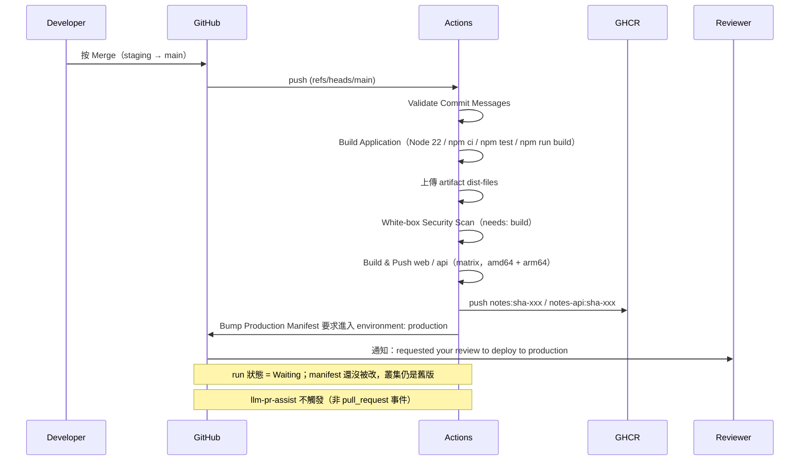
```mermaid
sequenceDiagram
    participant D as Developer
    participant G as GitHub
    participant A as Actions
    participant H as GHCR
    participant R as Reviewer
    D->>G: 按 Merge（staging → main）
    G->>A: push (refs/heads/main)
    A->>A: Validate Commit Messages
    A->>A: Build Application（Node 22 / npm ci / npm test / npm run build）
    A->>A: 上傳 artifact dist-files
    A->>A: White-box Security Scan（needs: build）
    A->>A: Build & Push web / api（matrix，amd64 + arm64）
    A->>H: push notes:sha-xxx / notes-api:sha-xxx
    A->>G: Bump Production Manifest 要求進入 environment: production
    G->>R: 通知：requested your review to deploy to production
    Note over A,G: run 狀態 = Waiting；manifest 還沒被改，叢集仍是舊版
    Note over G,A: llm-pr-assist 不觸發（非 pull_request 事件）
```

---

## UC-10：Reviewer 按 Approve，semantic-release 發版

**情境**：Reviewer 打開 run 頁面 → Review deployments → 勾 `production` → Approve and deploy。

**觸發**：environment 審核通過，`bump-production` job 從 Waiting 轉為執行。

**依序發生什麼**：

1. `bump-production` 第一件事是確認自己還算數：`git fetch origin main`，比對 `origin/main` 是否仍等於觸發這個 run 的 `GITHUB_SHA`。
   不相等就中止。這道檢查在 production 特別重要 —— Approve 可能已經等了好幾個小時，期間 `main` 可能又前進了，
   照舊寫下去等於把舊 image 部署上 production。
2. 用 `DEPLOY_REPO_SSH_KEY`（deploy key）checkout Config repo，在 `overlays/production` 跑兩次 `kustomize edit set image`
   （web 與 api 各一次），commit 成 `chore(deploy): bump production image to sha-...`，push 到 Config repo 的 `main`。
   之後就是 Argo CD 的事，路徑跟 UC-15 一樣，只是換成 `notes-production` 那個 Application 與 namespace。
3. `release`（`needs: bump-production`，job 層級 `permissions: contents: write`）：
   - `actions/checkout` 用 `fetch-depth: 0` 抓完整歷史（semantic-release 要看 tag）。
   - Node 22、`npm ci`。
   - `npx semantic-release`，依 `.releaserc.json` 的 plugin 順序：
     1. `commit-analyzer`：從上一個 tag（例如 `notes-v1.2.1`）之後的 commit 決定要跳 major / minor / patch。`feat:` → minor，`fix:` → patch，`BREAKING CHANGE:` → major。
        只有 `chore:` / `docs:` 之類的話就**不發版**，job 仍是綠燈。
     2. `release-notes-generator`：產生 release notes。
     3. `github`：在當下的 commit 打 tag `notes-vX.Y.Z`，建立 GitHub Release（notes 放在 Release 上）。
4. **不 commit 回 `main`**：`main` 要求所有變更經過 PR，`GITHUB_TOKEN` 直接 push 會被拒絕（見下方例證）。
   所以 `CHANGELOG.md` 與 `package.json` 的 `version` 停在 1.2.1，版本資訊以 tag 與 GitHub Releases 為準。
   tag 不受 branch protection 管，push tag 不會被擋，也不會觸發新的 workflow run（`ci.yml` 只聽 branch push）。

**結果**：Config repo 的 `overlays/production` 指向新的 image tag，Argo CD 把 `notes-production` namespace 的 pod 換掉；
同時 `main` 多一個 tag、GitHub Releases 頁面多一筆。`notes` 這個 repo 裡的檔案一個字都沒變。

**實際發生過的例證**：PR #10 那次是第一次真的走到人工 approve 之後，`Semantic Release` 直接失敗：
`[semantic-release]: node version ^22.14.0 || >= 24.10.0 is required. Found v20.20.2.`
因為 `ci.yml` 的 `build` 和 `release` job 都還寫 `node-version: 20`。這個 bug 光讀 yml 看不出來，一定要整條跑到最後一步才會炸。
PR #12 把兩個 job 都升到 Node 22，PR #13 再走一次 `staging → main` 來驗證，也就是 run #32。

run #32 approve 之後，Node 版本沒問題了，卻在 `@semantic-release/git` 的 prepare 步驟失敗：

```
git push --tags https://github.com/liaooliver/notes.git HEAD:main
remote: error: GH006: Protected branch update failed for refs/heads/main.
remote: - Changes must be made through a pull request.
```

失敗發生在打 tag 之前，所以沒有留下半套的版本。修法是把 `git` / `changelog` / `npm` 三個 plugin 拿掉，改成只打 tag + 發 Release。

run #39（PR #18 把 `staging` 累積的 4 個 PR promote 到 `main`）是這個修法第一次真的跑完：所有 job 全綠，
`Run semantic-release` 42s 正常結束，打出 `notes-v1.3.0` 與對應的 GitHub Release，`main` 的 tip 仍是那個 merge commit。
上面 semantic-release 那一段是照著 run #39 的實際結果寫的，不再是推測。

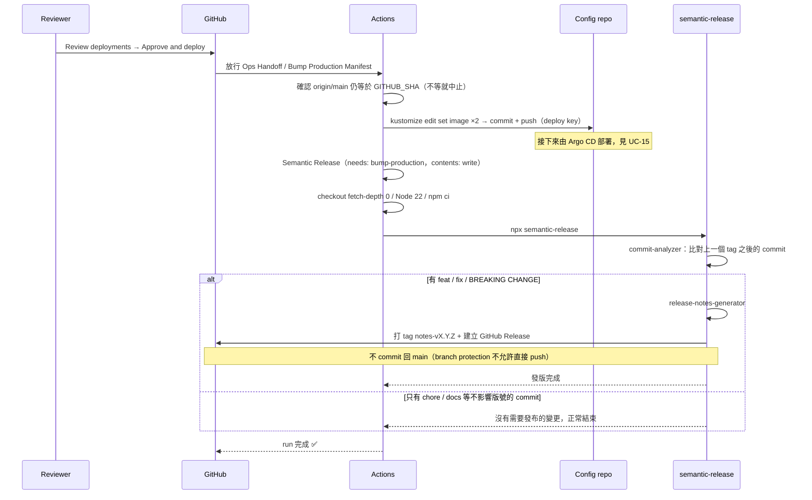
```mermaid
sequenceDiagram
    participant R as Reviewer
    participant G as GitHub
    participant A as Actions
    participant C as Config repo
    participant S as semantic-release
    R->>G: Review deployments → Approve and deploy
    G->>A: 放行 Ops Handoff / Bump Production Manifest
    A->>A: 確認 origin/main 仍等於 GITHUB_SHA（不等就中止）
    A->>C: kustomize edit set image ×2 → commit + push（deploy key）
    Note over C: 接下來由 Argo CD 部署，見 UC-15
    A->>A: Semantic Release（needs: bump-production，contents: write）
    A->>A: checkout fetch-depth 0 / Node 22 / npm ci
    A->>S: npx semantic-release
    S->>S: commit-analyzer：比對上一個 tag 之後的 commit
    alt 有 feat / fix / BREAKING CHANGE
        S->>S: release-notes-generator
        S->>G: 打 tag notes-vX.Y.Z + 建立 GitHub Release
        Note over G,S: 不 commit 回 main（branch protection 不允許直接 push）
        S-->>A: 發版完成
    else 只有 chore / docs 等不影響版號的 commit
        S-->>A: 沒有需要發布的變更，正常結束
    end
    A-->>G: run 完成 ✅
```

---

## UC-11：Reviewer 按 Reject，或乾脆放著不管

**情境**：Reviewer 看了 diff 覺得還不能上，按 Reject；或者根本沒人去按。

**觸發**：environment 審核未通過 / 沒有動作。

**依序發生什麼**：

- **Reject**：`bump-production` job 標成失敗，`release` 因 `needs` 連帶 skipped，run 整體紅燈。
- **放著不管**：run 停在 Waiting。GitHub environment 的 wait timeout 預設 30 天，超過之後 run 自動失敗。
  期間如果 `main` 又有新的 push（另一個 `staging → main` merge），會開出一個新的 run，兩個 run 各自獨立等審核。

**結果**：`main` 上的程式碼已經是新的了，image 也已經在 GHCR 上，但 production 的 manifest 沒被改到 ——
叢集繼續跑舊版，版本號、tag、Release 也都不動。要重新觸發，必須再有一個新的 push 到 `main`
（例如下一次 promotion），或在 run 頁面按 Re-run 從頭跑。

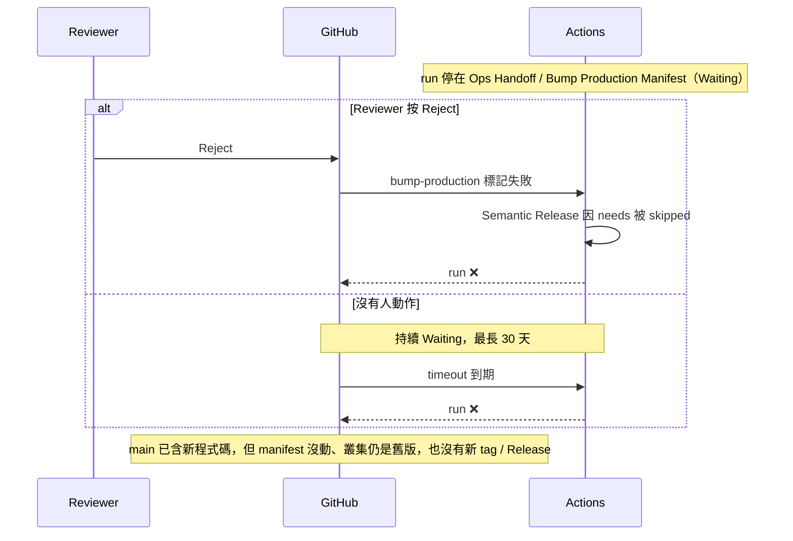
```mermaid
sequenceDiagram
    participant R as Reviewer
    participant G as GitHub
    participant A as Actions
    Note over A: run 停在 Ops Handoff / Bump Production Manifest（Waiting）
    alt Reviewer 按 Reject
        R->>G: Reject
        G->>A: bump-production 標記失敗
        A->>A: Semantic Release 因 needs 被 skipped
        A-->>G: run ❌
    else 沒有人動作
        Note over G,A: 持續 Waiting，最長 30 天
        G->>A: timeout 到期
        A-->>G: run ❌
    end
    Note over G: main 已含新程式碼，但 manifest 沒動、叢集仍是舊版，也沒有新 tag / Release
```

---

## UC-12：不開 PR，直接 push 到 `main` 或 `staging`

**情境**：開發者在本機 `git checkout main`，改完直接 `git push origin main`。

**觸發**：GitHub 端 branch protection 的「Require a pull request before merging」。

**依序發生什麼**：

1. 本機 husky 照樣檢查 commit 訊息（通過）。
2. push 到達 GitHub，branch protection 檢查 `main` / `staging` 是否允許直接 push → 不允許。
3. GitHub 拒絕，本機看到類似 `remote: error: GH006: Protected branch update failed` / `Changes must be made through a pull request`。

**結果**：什麼 workflow 都不會跑，因為 commit 根本沒進 remote。

**CI 自己也受這條規則管**：原本 semantic-release 的 `@semantic-release/git` 在 UC-10 也是「直接 push 到 `main`」（用 `GITHUB_TOKEN`），
run #32 就是被同一條規則擋下（GH006）。現在的設定不再寫回 `main`，只打 tag，見 UC-10 與 [release-automation.md](./release-automation.md)。

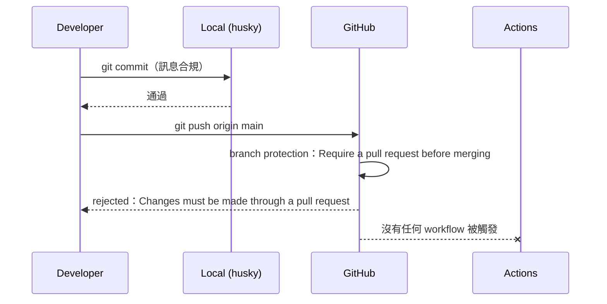
```mermaid
sequenceDiagram
    participant D as Developer
    participant L as Local (husky)
    participant G as GitHub
    participant A as Actions
    D->>L: git commit（訊息合規）
    L-->>D: 通過
    D->>G: git push origin main
    G->>G: branch protection：Require a pull request before merging
    G-->>D: rejected：Changes must be made through a pull request
    G--xA: 沒有任何 workflow 被觸發
```

---

## UC-13：hotfix 流程

**情境**：production 出了 bug，需要快速修。

**觸發**：跟一般功能一樣，只是分支叫 `fix/*`、commit type 用 `fix:`。

**依序發生什麼**：

1. 從 `staging` 切 `fix/xxx`（不是從 `main`；`staging` 已經包含 `main` 的所有內容，這樣才不會產生分叉）。
2. commit 用 `fix: ...`（husky 檢查，UC-01）。
3. 開 PR `fix/xxx → staging`（UC-03），merge（UC-07）。
4. 開 PR `staging → main`（UC-08），merge（UC-09）。
5. Reviewer approve（UC-10），semantic-release 看到 `fix:` → patch 版號（例如 `1.2.1 → 1.2.2`）。

**結果**：hotfix 跟一般功能走一樣的路，沒有繞過任何 gate；差別只在版號跳的是 patch。
代價是如果 `staging` 上剛好還有尚未準備好發版的功能，它們會被一起帶進 `main`。
目前的模型接受這個取捨（單人專案、`staging` 應隨時保持可發版狀態）。

**實際發生過的例證**：`fix/semantic-release-node-version`（PR #12）與 `fix/package-lock-sync`（PR #8）都是這條路。

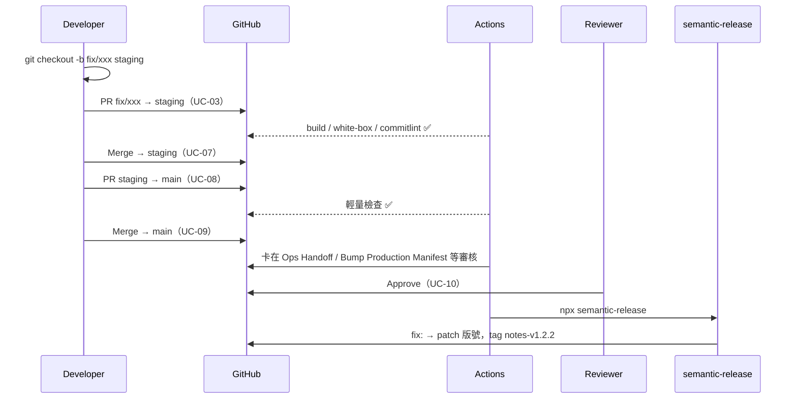
```mermaid
sequenceDiagram
    participant D as Developer
    participant G as GitHub
    participant A as Actions
    participant R as Reviewer
    participant S as semantic-release
    D->>D: git checkout -b fix/xxx staging
    D->>G: PR fix/xxx → staging（UC-03）
    A-->>G: build / white-box / commitlint ✅
    D->>G: Merge → staging（UC-07）
    D->>G: PR staging → main（UC-08）
    A-->>G: 輕量檢查 ✅
    D->>G: Merge → main（UC-09）
    A->>G: 卡在 Ops Handoff / Bump Production Manifest 等審核
    R->>G: Approve（UC-10）
    A->>S: npx semantic-release
    S->>G: fix: → patch 版號，tag notes-v1.2.2
```

---

## UC-14：只改 `docs/` 的 PR

**情境**：開發者只改了 markdown 文件，開 PR 到 `staging`。

**觸發**：同 UC-03。

**依序發生什麼**：

三個 workflow 都沒有設定 `paths` / `paths-ignore`，所以 build、測試、Semgrep、Trivy、三次 Gemini 呼叫全部照跑，
即使 diff 裡一行程式碼都沒有。

**結果**：功能上沒問題，只是浪費 runner 時間與 Gemini 額度。
而且 merge 進 `staging` 之後的 push 事件還會再跑一次 `build` + `white-box`，外加兩個 image 的 multi-arch build 與一次 manifest bump ——
image 的內容物跟上一版一模一樣，只有 tag 不同，Argo CD 照樣讓 pod 滾一次。
再 promote 到 `main` 時，
semantic-release 的 `commit-analyzer` 對 `docs:` type 不會跳版號，所以不會產生空的 release（前提是 commit type 有正確用 `docs:`）。

**未來優化點**：在 `ci.yml` 的 `pull_request` / `push` 加 `paths-ignore: ['docs/**', '*.md']`。
但要注意 branch protection 的 required checks 會因為 workflow 根本沒跑而永遠 pending，把 PR 鎖死。
比較穩的做法是不要用 workflow 層級的 `paths-ignore`，改在 job 層級用 `dorny/paths-filter` 之類的 action 判斷變更路徑，
再用 `if:` 跳過重的 step：job 本身仍會回報（狀態是 skipped 或 success），GitHub 把 skipped 的 required check 視為通過，PR 不會被卡住。

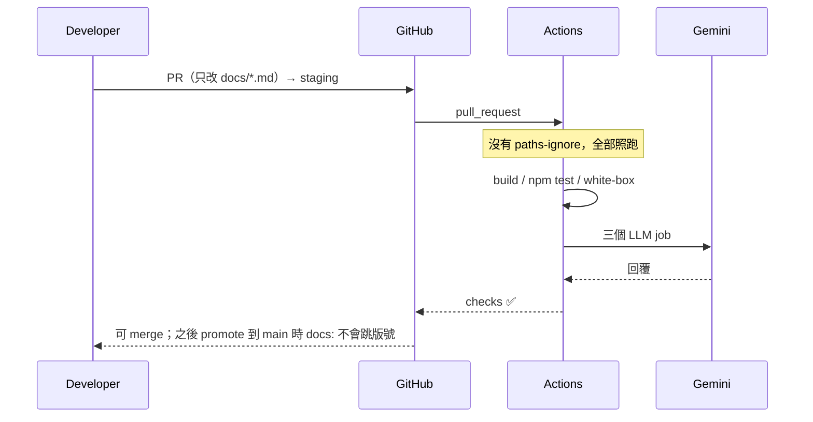
```mermaid
sequenceDiagram
    participant D as Developer
    participant G as GitHub
    participant A as Actions
    participant M as Gemini
    D->>G: PR（只改 docs/*.md）→ staging
    G->>A: pull_request
    Note over A: 沒有 paths-ignore，全部照跑
    A->>A: build / npm test / white-box
    A->>M: 三個 LLM job
    M-->>A: 回覆
    A-->>G: checks ✅
    G-->>D: 可 merge；之後 promote 到 main 時 docs: 不會跳版號
```

---

## UC-15：merge 進 `staging`，一路跑到 k3s 換版

**情境**：UC-07 的 merge 做完了，接下來想看清楚「程式碼到底怎麼變成叢集裡正在跑的那個 container」。

先把四個名詞講白（第一次看到夠用的程度）：

| 名詞 | 白話 |
| --- | --- |
| image | 把程式連同執行環境打包成的一個唯讀檔案；跑起來的實體叫 container |
| GHCR | GitHub 的 image 倉庫。這個專案有兩個：`ghcr.io/liaooliver/notes`（前端 nginx）與 `notes-api`（Express） |
| k3s | 精簡版的 Kubernetes，跑在 Mac 上的 Multipass VM 裡；它負責「照著設定檔把 container 拉起來、維持在那個狀態」 |
| Argo CD | 也在那台 VM 裡。它每 3 分鐘讀一次 Config repo，發現設定檔變了就叫 k3s 照著做 |

**最關鍵的分工**：CI 從頭到尾不碰叢集，它只是去 Config repo 改一行文字（image tag）。
Argo CD 不看 GHCR，它只看 Git。所以「image 推上去了」跟「叢集換版了」是兩件事，中間靠那一個 commit 連起來。

**依序發生什麼**：

1. `docker`（matrix 兩個分身）用 buildx 出 `linux/amd64` + `linux/arm64` 兩種架構，推上 GHCR，tag 是 `sha-<40 碼 commit SHA>`。
   兩個 image 共用同一個 tag，因為它們來自同一個 commit。多架構是必要的：runner 是 amd64，Apple Silicon 上的 VM 是 arm64。
2. `bump-staging` 先 `git fetch origin staging`，確認 HEAD 還等於觸發這個 run 的 SHA；不等就直接中止。
   這道檢查是為了擋「兩次 push 靠太近，跑比較慢的那個舊 run 把舊 image 寫回 manifest」。
3. 用 deploy key checkout Config repo，在 `overlays/staging` 跑兩次 `kustomize edit set image`，
   commit 成 `chore(deploy): bump staging image to sha-...`，push 到 Config repo 的 `main`。
4. push 撞車（`bump-production` 可能同時在寫同一條 `main`）就 `git pull --rebase` 重試一次；還失敗就讓 job 紅掉，不靜默吞掉。
5. Argo CD 的 `notes-staging` Application 每 3 分鐘 polling 一次（本機叢集沒有公網 IP，收不到 GitHub webhook）。
   讀到新 commit → 狀態變 `OutOfSync` → 自動 `kubectl apply`。
6. k3s 去 GHCR 拉新 tag 的 image（自動挑 arm64 那一份），做 rolling update：新 pod 通過 `readinessProbe` 之後才殺舊 pod。

**結果**：`http://notes-staging.local` 換成新版，全程沒有人敲過一次 `kubectl`。延遲主要來自那 3 分鐘的 polling。

**`notes` 這個 repo 不會被再次觸發**：bump commit 落在另一個 repo，`ci.yml` 根本看不到它。
這是把 manifest 拆成獨立 repo 換來的，不是靠 skip-ci 標記擋掉的（那個東西的坑見 UC-20）。

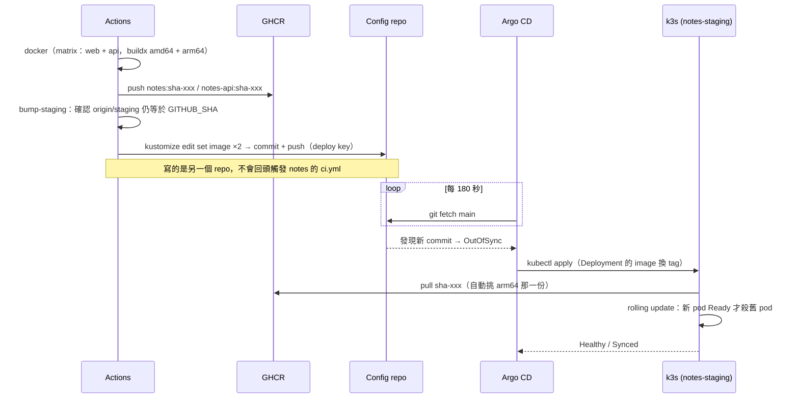
```mermaid
sequenceDiagram
    participant A as Actions
    participant H as GHCR
    participant C as Config repo
    participant AR as Argo CD
    participant K as k3s (notes-staging)
    A->>A: docker（matrix：web + api，buildx amd64 + arm64）
    A->>H: push notes:sha-xxx / notes-api:sha-xxx
    A->>A: bump-staging：確認 origin/staging 仍等於 GITHUB_SHA
    A->>C: kustomize edit set image ×2 → commit + push（deploy key）
    Note over A,C: 寫的是另一個 repo，不會回頭觸發 notes 的 ci.yml
    loop 每 180 秒
        AR->>C: git fetch main
    end
    C-->>AR: 發現新 commit → OutOfSync
    AR->>K: kubectl apply（Deployment 的 image 換 tag）
    K->>H: pull sha-xxx（自動挑 arm64 那一份）
    K->>K: rolling update：新 pod Ready 才殺舊 pod
    K-->>AR: Healthy / Synced
```

---

## UC-16：Argo CD 顯示 `Synced`，但跑的不是最新的 commit

**情境**：CI 全綠、Config repo 上看得到 bump commit，Argo CD UI 卻一片綠字 `Synced`，瀏覽器打開還是舊畫面。

**為什麼**：`Synced` 的意思是「叢集現在的樣子 = **我所知道的那個 commit**」，不是「= GitHub 上最新的 commit」。
Argo CD 手上那份可能是三分鐘前抓的，甚至更舊。兩個判斷被塞進同一個綠燈裡，這是最容易誤判的地方。

**要看的是 revision，不是那兩個字**：

```bash
kubectl -n argocd get app notes-staging \
  -o jsonpath='{.status.sync.status} {.status.sync.revision}'
```

印出來的 SHA 跟 Config repo `git log` 的第一筆對不上，就代表 Argo CD 還沒讀到。

**逼它立刻重讀**：

```bash
kubectl -n argocd annotate app notes-staging \
  argocd.argoproj.io/refresh=hard --overwrite
```

`annotate` 就是在那個物件上貼一張便利貼；Argo CD 看到 `refresh=hard` 這張便利貼，就會丟掉快取重新 `git fetch`。
`--overwrite` 是因為上次貼過的那張可能還在，不加會說已經存在。

**結果**：revision 前進到最新的 commit，該 sync 的東西才會被 sync。
平常不必手動做這件事，polling 會處理；需要它的時機是「等不了那 3 分鐘」或「懷疑 Argo CD 的認知落後了」。

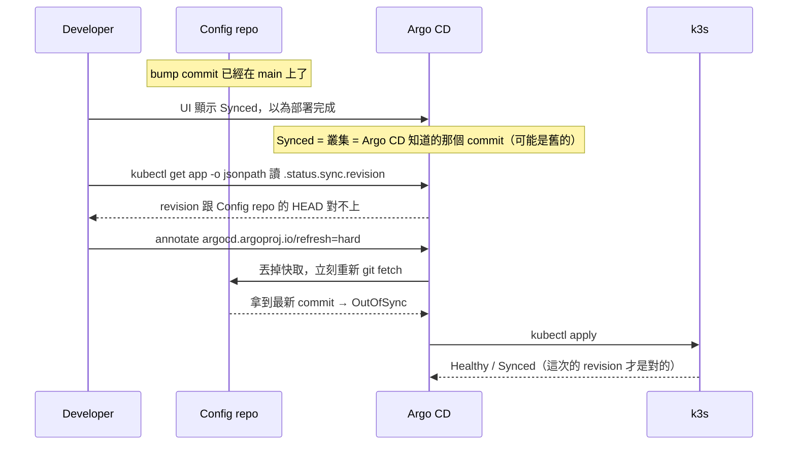
```mermaid
sequenceDiagram
    participant D as Developer
    participant C as Config repo
    participant AR as Argo CD
    participant K as k3s
    Note over C: bump commit 已經在 main 上了
    D->>AR: UI 顯示 Synced，以為部署完成
    Note over AR: Synced = 叢集 = Argo CD 知道的那個 commit（可能是舊的）
    D->>AR: kubectl get app -o jsonpath 讀 .status.sync.revision
    AR-->>D: revision 跟 Config repo 的 HEAD 對不上
    D->>AR: annotate argocd.argoproj.io/refresh=hard
    AR->>C: 丟掉快取，立刻重新 git fetch
    C-->>AR: 拿到最新 commit → OutOfSync
    AR->>K: kubectl apply
    K-->>AR: Healthy / Synced（這次的 revision 才是對的）
```

---

## UC-17：pod 卡在 `ImagePullBackOff`，`kubectl rollout restart` 沒有用

**情境**：加 Express API 上線那天（gitops-roadmap 的 Phase 9），`notes-api` 的 pod 起不來，狀態是 `ImagePullBackOff`。

先解釋狀態名稱：k8s 去 registry 拉 image 失敗，而且已經重試到開始拉長間隔（back off）。
多半不是叢集壞掉，是「要拉的那個 image 根本不存在」。

**根因是兩個 repo 的 commit 順序反了**：

```
正確：① notes 合進 staging → CI build 出 notes-api image，bump commit 幫 overlay 寫上 tag
     ② 才 push Config repo 的結構 commit（新增 api 的 Deployment / Service）

當天：反過來
```

順序反過來時，Argo CD 會先 sync 到一個中間狀態：`api-deployment.yaml` 已經存在，但 overlay 還沒有對應的 tag。
沒有 tag 的 image 等於 `:latest`，而 GHCR 上沒有這個 tag —— 拉不到，`ImagePullBackOff`。

**為什麼 `kubectl rollout restart` 沒用**：那個指令的作用是「把這個 Deployment 的 pod 全部重建一次」，
前提是 spec 裡有東西不一樣。這裡 spec 一個字都沒變，重建幾次都是拿同一個不存在的 image 去拉。
**要動的是 Argo CD 的認知，不是 pod。**

**解法**：讓 Argo CD 讀到後面那個 bump commit —— 就是 UC-16 的 hard refresh，或直接重跑一次 CI 補一個 bump。
image tag 一進 manifest，Argo CD apply 下去，spec 變了，pod 自然重建。

**另一個會造成同樣狀態的原因**：GHCR 上的 package 是 private。第一次推 `notes-api` 時要記得去 Packages 頁面改成 public，
否則 web 起得來、畫面也正常，只有 api 單獨卡住 —— 症狀是「打 API 才 500」，很容易先去翻 Express 的程式碼繞一大圈。

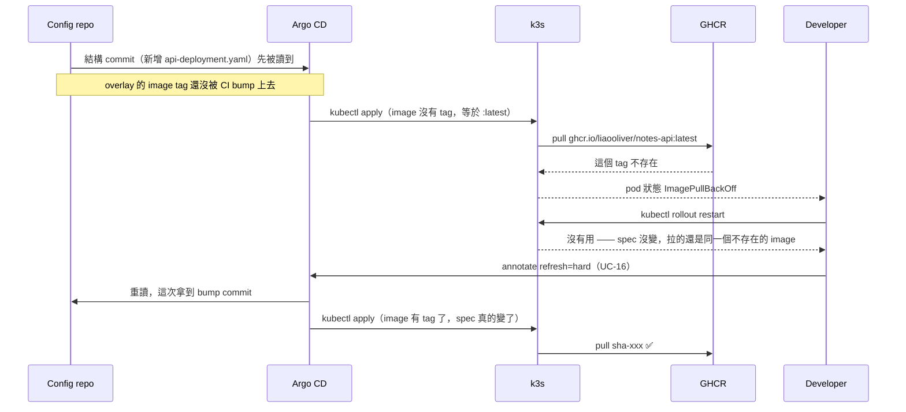
```mermaid
sequenceDiagram
    participant C as Config repo
    participant AR as Argo CD
    participant K as k3s
    participant H as GHCR
    participant D as Developer
    C->>AR: 結構 commit（新增 api-deployment.yaml）先被讀到
    Note over C,AR: overlay 的 image tag 還沒被 CI bump 上去
    AR->>K: kubectl apply（image 沒有 tag，等於 :latest）
    K->>H: pull ghcr.io/liaooliver/notes-api:latest
    H-->>K: 這個 tag 不存在
    K-->>D: pod 狀態 ImagePullBackOff
    D->>K: kubectl rollout restart
    K-->>D: 沒有用 —— spec 沒變，拉的還是同一個不存在的 image
    D->>AR: annotate refresh=hard（UC-16）
    AR->>C: 重讀，這次拿到 bump commit
    AR->>K: kubectl apply（image 有 tag 了，spec 真的變了）
    K->>H: pull sha-xxx ✅
```

---

## UC-18：Traefik 回 `no available server`

**情境**：首頁打得開，`/api/records` 回 `no available server`；或首頁時好時壞、間歇 404。

兩個名詞：**Traefik** 是 k3s 內建的 Ingress controller，站在叢集門口，看網址決定把請求轉給哪個 Service。
**Service** 是一個固定的入口名稱，它靠 **label selector**（一組 key=value）去挑「要把流量送給哪些 pod」。

**三層之間沒有任何自動關聯，全靠字串對上**：Deployment 用 `selector.matchLabels` 認自己的 pod、
Service 用 `selector` 認要導流量的 pod、Ingress 用 Service **名稱**。
少寫一個 label 或拼錯一個字，什麼錯誤都不會報，Service 就只是後面空空如也。

`no available server` 就是 Traefik 在說：「這條路由後面沒有健康的 pod。」

**唯一能看出來的地方**：

```bash
kubectl -n notes-staging get endpoints notes-api
# 要有一筆 <pod IP>:3000。是空的 → selector 對不到 pod，或 pod 還沒通過 readinessProbe
```

`endpoints` 是 Service 實際接到的 pod IP 清單。`get service` 只會給你一個永遠存在的 ClusterIP，看不出後面有沒有東西；
`get pods` 看到的 pod 也是好端端的 Running。只有 endpoints 會誠實地是空的。

**反方向的變形：selector 寫太寬。** `notes-web` 的 Service 若只寫 `app: notes` 而漏了 `component: web`，
它會連 Express 的 pod 一起選進來，流量隨機打到 3000 port 上，症狀是「首頁有時正常、有時 404」這種最難查的間歇性錯誤。
endpoints 列出的 IP 數量應該剛好等於 web 的 pod 數量。

**修法一樣是改 Git**：Service 的 manifest 在 Config repo 裡，改完 push，Argo CD 自己會 sync（同 UC-15）。

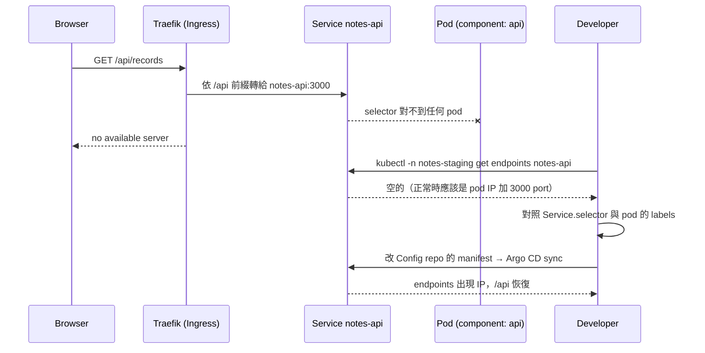
```mermaid
sequenceDiagram
    participant B as Browser
    participant T as Traefik (Ingress)
    participant S as Service notes-api
    participant P as Pod (component: api)
    participant D as Developer
    B->>T: GET /api/records
    T->>S: 依 /api 前綴轉給 notes-api:3000
    S--xP: selector 對不到任何 pod
    T-->>B: no available server
    D->>S: kubectl -n notes-staging get endpoints notes-api
    S-->>D: 空的（正常時應該是 pod IP 加 3000 port）
    D->>D: 對照 Service.selector 與 pod 的 labels
    D->>S: 改 Config repo 的 manifest → Argo CD sync
    S-->>D: endpoints 出現 IP，/api 恢復
```

---

## UC-19：要把 production 退回上一版（GitOps 的 rollback）

**情境**：production 換版之後發現有問題，要退回去。

**關鍵觀念**：叢集該長什麼樣子，定義在 Config repo 的 Git 內容裡。
所以 rollback 不是「進叢集把它改回來」，而是**在 Git 上把那次改動 revert 掉**，剩下的交給 Argo CD。

**依序發生什麼**：

1. 在 Config repo 找到那筆 `chore(deploy): bump production image to sha-...`。
2. `git revert <那個 commit>` → `git push`。Config repo 不設 branch protection，不必開 PR ——
   這是拆 repo 的附帶好處：出事時 rollback 不會卡在 review。
3. Argo CD polling 讀到新 commit，manifest 的 image tag 變回舊值 → `OutOfSync`。
4. 自動 apply → k3s 拉舊 tag 的 image → rolling update 回舊 pod。
   web 與 api 兩個 image 共用同一個 SHA tag，所以是一起退回同一版，不會出現「前端新、後端舊」的組合。

**跟傳統做法的差別**：不用記舊 image 叫什麼、不用進叢集敲 `kubectl set image`，
而且這次回滾本身就是一個有 author、時間、理由的 commit。
Application 的 `selfHeal` 開著的話，就算有人事後在叢集手動改回新版，Argo CD 也會再把它壓回 Git 的版本。

**附帶好處**：「production 現在跑的是哪一版？」答案永遠是
`git show main:overlays/production/kustomization.yaml`，不用問任何人。

**注意**：`notes` 那邊的程式碼沒有被 revert。這次 rollback 只是把叢集換回舊 image，
程式碼上的修正要另外走 UC-13 的 hotfix 流程。

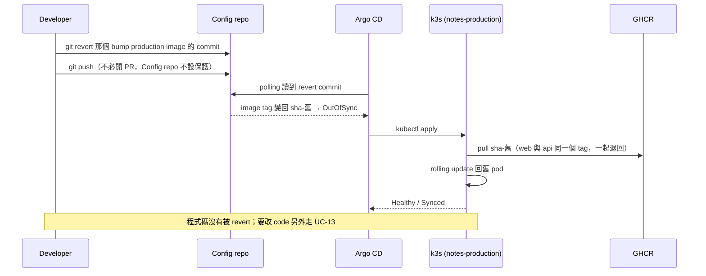
```mermaid
sequenceDiagram
    participant D as Developer
    participant C as Config repo
    participant AR as Argo CD
    participant K as k3s (notes-production)
    participant H as GHCR
    D->>C: git revert 那個 bump production image 的 commit
    D->>C: git push（不必開 PR，Config repo 不設保護）
    AR->>C: polling 讀到 revert commit
    C-->>AR: image tag 變回 sha-舊 → OutOfSync
    AR->>K: kubectl apply
    K->>H: pull sha-舊（web 與 api 同一個 tag，一起退回）
    K->>K: rolling update 回舊 pod
    K-->>AR: Healthy / Synced
    Note over D,K: 程式碼沒有被 revert；要改 code 另外走 UC-13
```

---

## UC-20：commit message 裡出現 skip-ci 標記，PR 變成永遠不能 merge

**情境**：開一個純文件 PR，commit message 裡為了描述「那個會讓 CI 不觸發的標記」，字面上把它寫了出來。

> 本文件一律寫成「skip-ci 標記」，不寫那個真正的字串 —— 這個 repo 已經因此踩坑兩次。

**觸發**：GitHub 在建立 workflow run 之前就先看 commit message。看到那個標記 → **根本不建立 run**。
不是失敗、不是被取消，是連一個可以按 re-run 的東西都沒有。

**依序發生什麼**：

1. push 到 PR 分支，Actions 頁面一片空白。
2. PR 的三個 required status check —— `Build Application` / `White-box Security Scan` / `Validate Commit Messages` ——
   不是紅的，是**不存在**。
3. branch protection 要求它們通過，而它們永遠不會出現。`gh pr merge` 只回一句 `the base branch policy prohibits the merge`。
4. `gh pr checks` 回的是 `no checks reported`，而不是任何失敗訊息 —— 這是最容易誤判的一點，看起來像 GitHub 還沒開始跑。

**解法**：

```bash
git commit --amend            # 把訊息裡那個字串拆開寫
git push --force-with-lease
```

check 立刻就跑出來。**`workflow_dispatch` 在這裡救不了** —— 手動觸發的 run 不會回填成 PR 的 required check。

**squash merge 讓它更難防**：squash 會把 PR 裡每一個 commit 訊息串成一整條，那個標記出現在任何一行都算數，
包括「在文件裡講解它」的那一行。PR #27 就是這樣合進 `main` 之後完全沒有 run，
事後只能靠 `ci.yml` 開頭那行 `workflow_dispatch:` 手動指定分支補跑。PR #33 則是卡在 merge 不進去那一版。

**預防**：commit message、PR 標題、PR 內文，談到這個標記一律拆開寫。

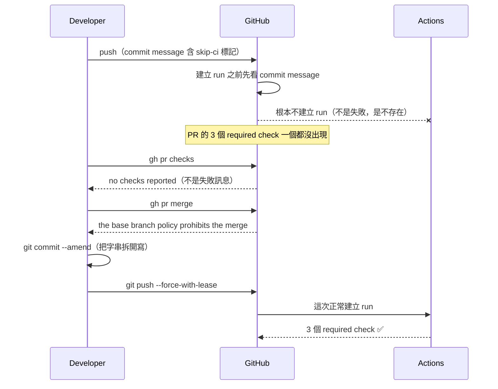
```mermaid
sequenceDiagram
    participant D as Developer
    participant G as GitHub
    participant A as Actions
    D->>G: push（commit message 含 skip-ci 標記）
    G->>G: 建立 run 之前先看 commit message
    G--xA: 根本不建立 run（不是失敗，是不存在）
    Note over G: PR 的 3 個 required check 一個都沒出現
    D->>G: gh pr checks
    G-->>D: no checks reported（不是失敗訊息）
    D->>G: gh pr merge
    G-->>D: the base branch policy prohibits the merge
    D->>D: git commit --amend（把字串拆開寫）
    D->>G: git push --force-with-lease
    G->>A: 這次正常建立 run
    A-->>G: 3 個 required check ✅
```

---

## 已知問題與未來優化點

以下是由 Gemini review 或實際運行觀察到、但尚未處理的項目：

- `scripts/llm/call-gemini.mjs`：`response.json()` 在檢查 `response.ok` 之前呼叫，非 JSON 的錯誤頁（502 / 504）會在 `error.status` 設好之前就丟 `SyntaxError`，讓重試邏輯失效。
- `scripts/llm/call-gemini.mjs`：`parseArgs` 沒有檢查 `--prompt` / `--prompt-file` 是否為最後一個參數。
- `llm-pr-assist.yml`：`pr-diff-summary` 與 `code-review-comment` 收集 diff 的步驟完全重複；`head -c 20000` 以 byte 截斷可能切到多位元組的中文字。
- 沒有機制阻止開發者直接開 PR `feature/* → main` 繞過 `staging`（branch protection 只管 required checks，不管來源分支）。
- UC-14 提到的 `paths-ignore`，以及「純文件的 PR 也會 build 兩個 image」這件事。
- `docker` job 只在 push 事件跑，**PR 階段驗不到 Dockerfile 會不會壞**（UC-08）。要補的話是加一個 `push: false` 的 build-only job。
- Trivy 只掃 source（`scan-type: fs`），沒掃 image —— `nginx:1.30-alpine` 底層的 CVE 抓不到。
- Argo CD 只能靠每 3 分鐘 polling：本機叢集沒有公網 IP，收不到 GitHub webhook。所以 UC-15 的最後一段一定有延遲。
- production 跑的不是 staging 驗過的那個二進位，只是同一份原始碼的另一次 build（`main` 的 merge commit SHA 必然不同）。
  要改成 promote 模式（直接複製 staging 現在的 tag）才會成立。
- API 的資料只放在 Express 的記憶體裡，pod 一重建就全沒了。這是刻意的（UC-17 的 pod 重建會順便讓資料消失），不是待修的 bug。

## 這份文件對應的檔案

| 檔案 | 角色 |
| --- | --- |
| `.github/workflows/ci.yml` | `build` → `white-box` → `docker`（matrix：web + api）→ `bump-staging` / `bump-production` → `release`；開頭的 `workflow_dispatch:` 是手動補跑的逃生門（UC-20） |
| `.github/workflows/commitlint.yml` | CI 端的 commit 訊息檢查（`Validate Commit Messages`） |
| `.github/workflows/llm-pr-assist.yml` | 三個 Gemini 輔助 job |
| `.husky/commit-msg` | 本機 commit 訊息檢查 |
| `commitlint.config.js` | commitlint 規則（`@commitlint/config-conventional`；`subject-case` 已關掉，`type-enum` 多一個 `release`） |
| `.releaserc.json` | semantic-release 的 plugin 與 tag 格式 |
| `scripts/llm/call-gemini.mjs` | Gemini API 呼叫、重試與 fallback |
| `package.json` | npm workspaces 的根：`workspaces: ["frontend", "api"]`，`test` / `build` 都轉派給子專案 |
| `frontend/` | Vue 3 + Vite 的前端；`npm run build` 產出 `frontend/dist/`，`nginx.conf` 提供 SPA fallback |
| `api/` | Express 後端（`server.js`）與它自己的 `Dockerfile`（`node:22-alpine`） |
| `Dockerfile` | 前端 image：單層 `nginx:1.30-alpine`，直接 COPY `build` job 產出的 `dist/` |
| `liaooliver/notes-deploy`（另一個 repo） | k8s manifest：`base/` + `overlays/staging` + `overlays/production`，以及 Argo CD 的兩個 `Application`。CI 寫這裡，Argo CD 讀這裡 |

延伸閱讀：

- [branching-strategy.md](./branching-strategy.md)：為什麼是 `feature/* → staging → main`，兩層 gate 的設計。
- [release-automation.md](./release-automation.md)：從 release-please 換到 semantic-release 的過程與已知的坑。
- [llm-pr-assist.md](./llm-pr-assist.md)：Gemini API key 設定、額度用完時的處理。
- [gitops-roadmap.md](./gitops-roadmap.md)：UC-15 ~ UC-19 那半邊是怎麼一步步搭起來的，以及每個 Phase 的取捨與坑。
