# 使用案例（Use Cases）：開發者做了什麼，整條流程會怎麼反應

這份文件用「情境 → 觸發 → 依序發生什麼 → 結果」的方式，逐條記錄本專案目前 CI/CD 的每一種使用案例，
並為每個案例附上一張時序圖，方便對照「誰在什麼時候跟誰互動」。

分支模型是 `feature/* → staging → main`（詳見 [branching-strategy.md](./branching-strategy.md)），
主要參與者固定用以下名稱：

| 名稱 | 指的是 |
| --- | --- |
| Developer | 寫 code、開 PR 的人 |
| Local (husky) | 本機 git hook（`.husky/commit-msg` → commitlint） |
| GitHub | repo 本身：branch protection、PR 狀態、environment 審核機制 |
| Actions | GitHub Actions runner，跑 `ci.yml` / `commitlint.yml` / `llm-pr-assist.yml` |
| Gemini | Google AI Studio 的 Gemini API |
| Reviewer | 在 `production` environment 按 Approve / Reject 的人 |
| semantic-release | `ci.yml` 最後一個 job 裡跑的 `npx semantic-release` |

## 總覽表

| 案例 | 開發者動作 | 觸發的 workflow / job | 結果 |
| --- | --- | --- | --- |
| UC-01 | 本機 commit，訊息不合 Conventional Commits | 只有本機 husky hook | commit 根本做不出來 |
| UC-02 | 從 `staging` 切 `feature/*`，push 到 GitHub | 無（push 只監聽 `main` / `staging`） | 什麼都不會跑 |
| UC-03 | 開 PR `feature/* → staging` | Commit Lint；CI 的 `build`、`white-box`；LLM PR Assist 三個 job | 三個必要檢查綠燈即可 merge |
| UC-04 | 在同一個 PR 上再 push 新 commit | 同 UC-03 全部重跑；LLM 舊 run 被取消 | 檢查結果以最新 commit 為準 |
| UC-05 | PR 的 test 掛掉或 Trivy 抓到 HIGH CVE | `build` 或 `white-box` 失敗 | branch protection 擋住 merge |
| UC-06 | PR 期間 Gemini 回 429 / 503 / model 汰換 | LLM job 走 fallback | 留言變成提示文字，PR 不受影響 |
| UC-07 | merge PR 進 `staging` | 只有 Commit Lint | CI 不重跑（PR 階段已跑過 `build`、`white-box`） |
| UC-08 | 開 PR `staging → main` | 同 UC-03（目標分支換成 `main`） | 輕量檢查，仍不發版 |
| UC-09 | merge `staging → main` | CI 五個 job 全開，卡在 `ops-handoff` 等審核 | run 停在 Waiting |
| UC-10 | Reviewer 在 production environment 按 Approve | `ops-handoff` → `release` | 算版號、打 tag、開 Release（不寫回 repo） |
| UC-11 | Reviewer 按 Reject 或放著不管 | `ops-handoff` 不放行 | 不發版；放著最多等 30 天後 run 失敗 |
| UC-12 | 不開 PR，直接 push `main` / `staging` | branch protection 拒絕 push | 本機收到 `protected branch` 錯誤 |
| UC-13 | hotfix：從 `staging` 切 `fix/*` | UC-03 → UC-07 → UC-08 → UC-09 → UC-10 | 走一樣的路，只是 commit type 是 `fix:` |
| UC-14 | 只改 `docs/` 的 PR | 跟 UC-03 一模一樣 | 目前沒有 `paths-ignore`，照跑全部 |

---

## UC-01：本機 commit 訊息不合 Conventional Commits

**情境**：開發者改完 code，隨手 `git commit -m "update stuff"`。

**觸發**：本機 `.husky/commit-msg` hook（`npx --no -- commitlint --edit $1`）。

**依序發生什麼**：

1. git 準備寫入 commit 之前先跑 `commit-msg` hook。
2. commitlint 套用 `@commitlint/config-conventional`，發現沒有 `type:` 前綴（`feat:` / `fix:` / `chore:` …）。
3. hook 以非 0 結束，git 中止 commit。

**結果**：commit 從來沒有存在過，GitHub 完全不知道這件事。這是整條鏈最早、也最便宜的一道關卡；
`commitlint.yml` 在 CI 端再檢一次只是為了防 `--no-verify`。

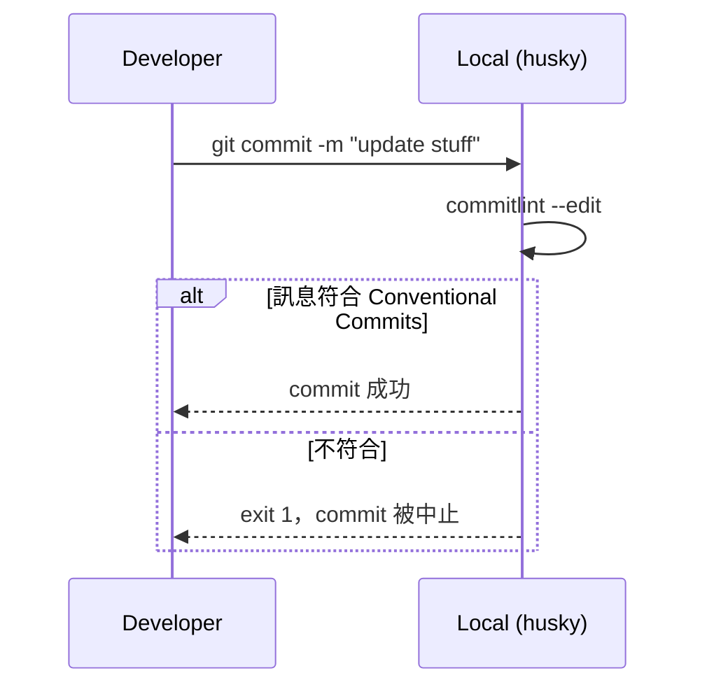

---

## UC-02：切功能分支並 push，但還沒開 PR

**情境**：開發者 `git checkout -b feature/fix-record-tests staging`，做了幾個 commit，`git push -u origin feature/fix-record-tests`。

**觸發**：無。

**依序發生什麼**：

1. commit 通過本機 husky（同 UC-01）。
2. push 到 GitHub 成功，分支出現在 remote。
3. `ci.yml` 的 `push` 事件只監聽 `main`，`commitlint.yml` 的 `push` 只監聽 `main` / `staging`；`llm-pr-assist.yml` 只監聽 `pull_request`。
   三個 workflow 都不符合條件。

**結果**：Actions 頁面一個 run 都不會多。功能分支上可以盡情 push，成本是零；檢查全部延後到「開 PR」那一刻。

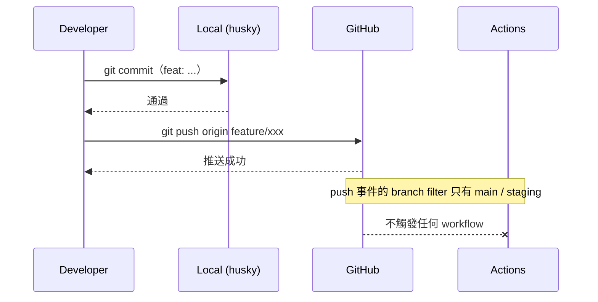

---

## UC-03：開 PR `feature/* → staging`

**情境**：開發者在 GitHub 開 PR，base 選 `staging`。這是日常最常見的路徑。

**觸發**：`pull_request` 事件（`opened`）。三個 workflow 同時收到：

- `commitlint.yml`：`pull_request` 沒有 branch 限制 → 觸發。
- `ci.yml`：`pull_request.branches` 包含 `staging` → 觸發。
- `llm-pr-assist.yml`：`types: [opened, synchronize, reopened]` → 觸發。

**依序發生什麼**：

1. **Commit Lint**（job 名 `Validate Commit Messages`）：用 `wagoid/commitlint-github-action` 檢查 PR 內每一個 commit。
2. **Enterprise CI/CD Pipeline**：
   - `build`（`Build Application`）：Node 22 → `npm ci` → `npm test`（`node --test`，跑 `test/app.test.js`）→ `npm run build` → 上傳 `dist/` artifact。
   - `white-box`（`White-box Security Scan`，`needs: build`）：Semgrep `p/ci` 規則 + Trivy 檔案系統掃描，CRITICAL/HIGH 直接 `exit-code: 1`。
   - `encryption` / `ops-handoff` / `release`：三個 job 都掛了 `if: github.event_name == 'push' && github.ref == 'refs/heads/main'`。
     在 PR 事件下條件不成立，**這三個 job 根本不會出現在 run 的 job 清單裡**（實際在 GitHub UI 驗證過，不是顯示成 skipped，而是不存在）。
3. **LLM PR Assist** 三個 job 平行跑，互不依賴：
   - `commit-message-suggestion`：`gh pr view --json commits` 收集標題 → 組 prompt → 呼叫 Gemini → 貼「🤖 Commit Message 建議 (Gemini)」留言。
   - `pr-diff-summary`：`git diff origin/staging...HEAD`（排除 `package-lock.json`）→ 截前 20000 bytes → Gemini → 貼「🤖 PR 摘要 (Gemini)」。
   - `code-review-comment`：同樣的 diff → 另一組 prompt → Gemini → 貼「🤖 Code Review (Gemini)」。
4. GitHub 依 branch protection 設定，把 `Build Application`、`White-box Security Scan`、`Validate Commit Messages` 標成 required checks。
   LLM 三個 job 不是 required，貼不貼留言都不影響能否 merge。

**結果**：三個 required checks 綠燈後，Merge 按鈕才會亮。因為這個 repo 是單人維護，branch protection 特意**不要求**
review approval（GitHub 不算 PR 作者自己的 approve，勾了會鎖死）。

**實際發生過的例證**：PR #11（`feature/fix-record-tests`）就是走這條路；Gemini 的 code review 留言指出表單送出後沒有清空欄位，
是一個真的可改進點。

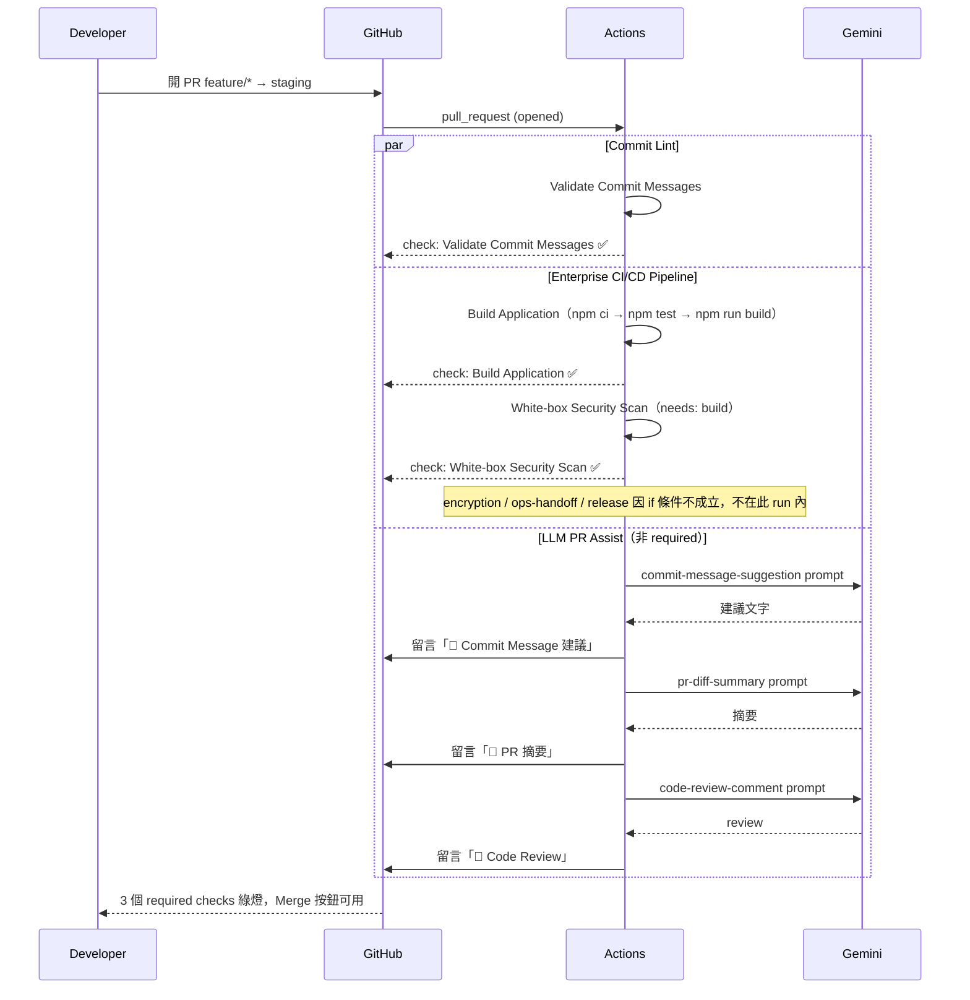

---

## UC-04：PR 開著，再 push 新 commit

**情境**：Reviewer（或 Gemini 留言）提了建議，開發者在同一條分支再補一個 commit 並 push。

**觸發**：`pull_request` 事件（`synchronize`）。

**依序發生什麼**：

1. 三個 workflow 全部重新觸發，行為跟 UC-03 一樣。
2. `llm-pr-assist.yml` 有 `concurrency: group: llm-pr-assist-<PR number>`、`cancel-in-progress: true`：
   如果上一次的 LLM run 還在跑，會被直接取消，避免對同一個 PR 重複燒 Gemini 免費額度。
3. `ci.yml` 與 `commitlint.yml` 沒有設 concurrency，舊 run 會跑完，但 GitHub 的 required check 只看**最新 commit** 的結果。
4. PR 上會再多三則 Gemini 留言（每次 push 各一輪，舊留言不會被刪）。

**結果**：Merge 資格重新計算，以最新 commit 的 checks 為準。

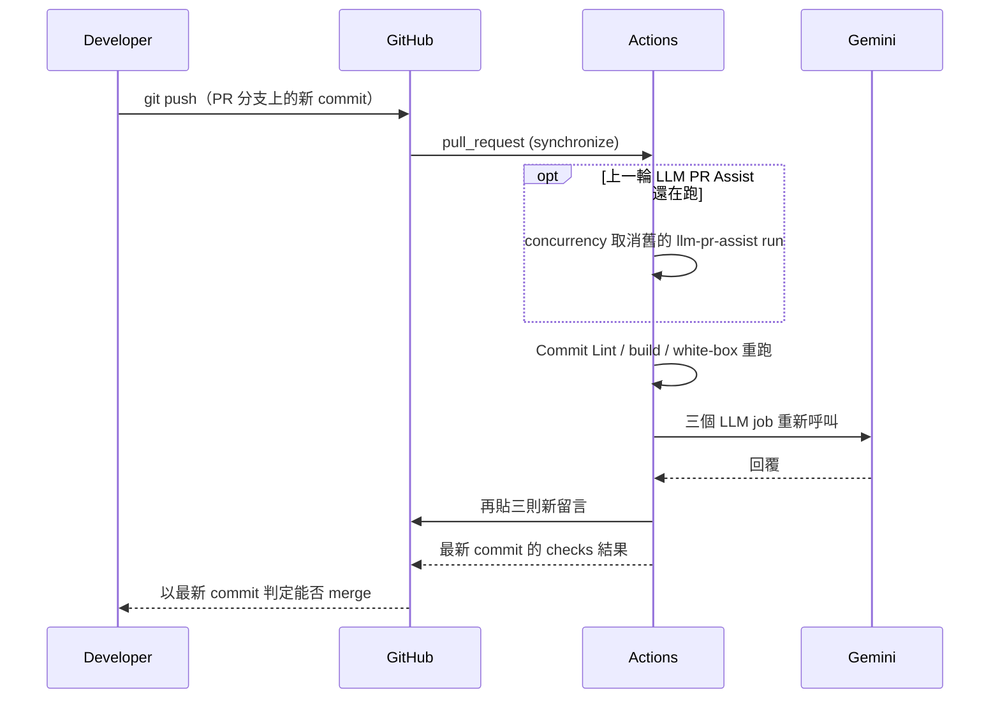

---

## UC-05：CI 失敗，branch protection 擋住 merge

**情境**：開發者的 PR 有一個測試掛了，或 Trivy 掃到 HIGH 等級 CVE。

**觸發**：同 UC-03，但某個 required job 以非 0 結束。

**依序發生什麼**：

1. `build` job 的 `npm test` 失敗 → job 紅燈 → `white-box` 因 `needs: build` 直接 skipped。
   或者 `build` 綠燈但 `white-box` 的 Trivy 因 `exit-code: '1'` 而失敗。
2. GitHub 收到 required check 失敗的狀態。
3. branch protection 的「Require status checks to pass before merging」把 Merge 按鈕變灰，顯示 required check 未通過。
4. LLM 三個 job 照常跑、照常留言，但它們不是 required，跟能否 merge 無關。

**結果**：開發者必須修好再 push（回到 UC-04）。

**實際發生過的例證**：session 一開始每個 PR 的 `Build Application` 都在 `npm ci` 就掛，錯誤是
`EUSAGE ... lock file's conventional-commits-filter@5.0.0 does not satisfy conventional-commits-filter@6.0.1`，
原因是 `package-lock.json` 跟 `package.json` 不同步。用獨立的 `fix/package-lock-sync` 分支（PR #8）重新 `npm install` 後才解掉，
其他功能分支還得把這個 fix merge forward 進來才能重新變綠。

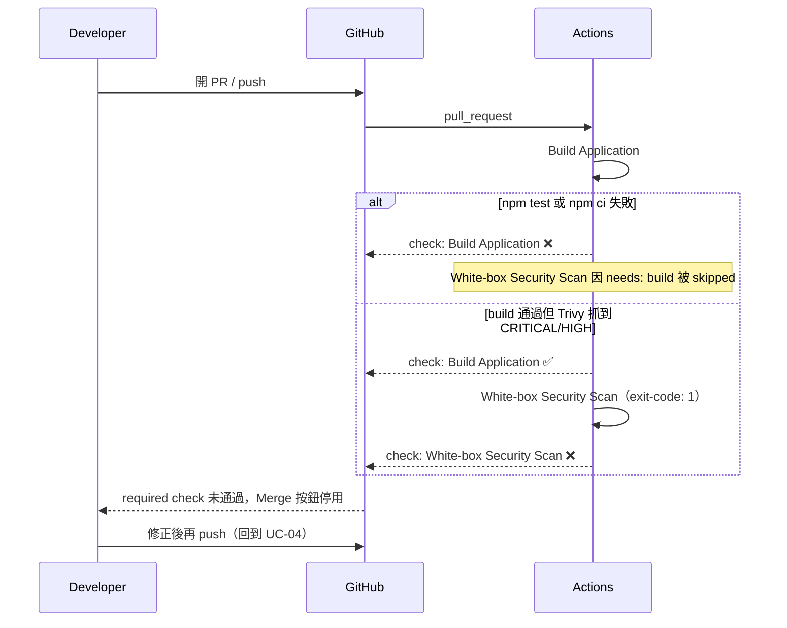

---

## UC-06：Gemini 失靈（429 / 503 / model 被汰換）

**情境**：PR 開著，但 Gemini 免費額度用完（HTTP 429）、model 過載（HTTP 503），或 Google 把預設 model 下架了。

**觸發**：同 UC-03，差別在 `scripts/llm/call-gemini.mjs` 收到的回應。

**依序發生什麼**：

1. `call-gemini.mjs` 打 `generateContent`，收到 429 或 503。
2. 這兩個狀態碼在 `TRANSIENT_STATUSES` 裡：等 5 秒，重試一次。
3. 還是失敗 → 依狀態碼回傳對應的 fallback 文字（`RATE_LIMIT_FALLBACK` / `OVERLOADED_FALLBACK`），process 仍以 0 結束。
4. 其他非預期錯誤（例如 model 被汰換回 404）→ `main()` 統一捕捉，印 `GENERIC_FALLBACK`。
5. 呼叫 Gemini 與貼留言兩個 step 都有 `continue-on-error: true`，job 維持綠燈。
6. PR 上出現的留言內容變成「LLM 建議暫時不可用：…」之類的提示。

**結果**：PR 的 merge 資格完全不受影響。這是刻意的設計：輔助功能掛了不該擋住主流程。

**實際發生過的例證**：同一個 session 內先遇到
`This model models/gemini-2.0-flash is no longer available. Please update your code to use models/gemini-3.6-flash`
（改預設 model 修掉），緊接著又遇到 503 `This model is currently experiencing high demand`，
原本重試邏輯只認 429，才把 503 一起納入 `TRANSIENT_STATUSES`。

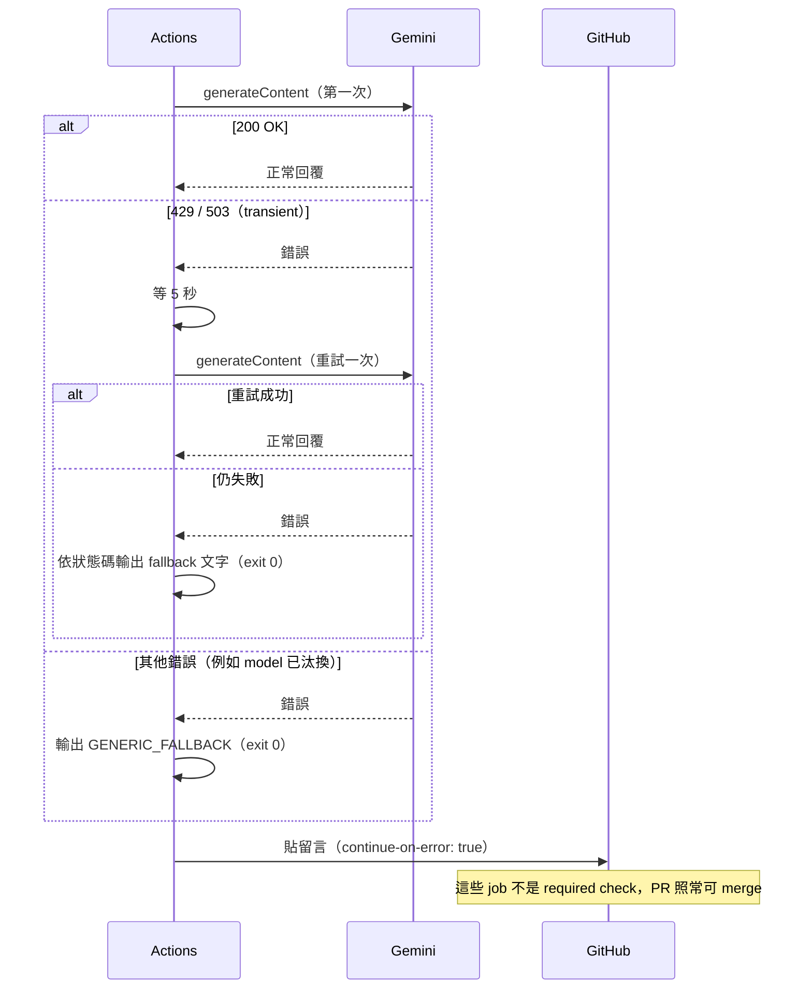

---

## UC-07：merge PR 進 `staging`

**情境**：UC-03 的 PR 三個 required checks 綠燈，開發者按下 Merge。

**觸發**：`push` 事件到 `staging`（merge commit）。

**依序發生什麼**：

1. `commitlint.yml`：`push.branches` 包含 `staging` → 再檢一次 commit 訊息。
2. `ci.yml`：`push.branches` 只有 `main` → 整份不觸發。`build` + `white-box` 已經在 PR 階段（UC-03）跑過，merge 後不再重跑。
3. `encryption` / `ops-handoff` / `release` 自然也不會出現。
4. `llm-pr-assist.yml` 只聽 `pull_request` → 不觸發。PR 已關閉，也不會再有留言。

**結果**：`staging` 累積了新功能，但沒有加密、沒有審核、沒有版號變動。可以連續 merge 很多個 PR 進 `staging`，
merge 本身只付 commit lint 的成本。

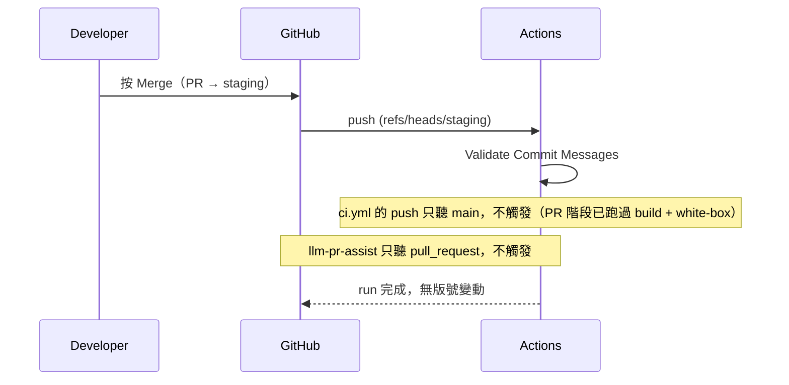

---

## UC-08：開 PR `staging → main`（準備發版）

**情境**：`staging` 累積到一個可以發版的節點，開發者開 PR，base 選 `main`、compare 選 `staging`。

**觸發**：`pull_request` 事件，目標分支 `main`。

**依序發生什麼**：

跟 UC-03 完全一樣：Commit Lint、`build`、`white-box`、LLM 三個 job。
`encryption` / `ops-handoff` / `release` 的條件要求 `event_name == 'push'`，PR 事件不符合 → 仍然不出現。

**結果**：這張 PR 只是「最後一次確認」，通過了也還不會發版。真正的重頭戲在 merge 之後（UC-09）。
Gemini 的 PR 摘要在這裡特別有用：它會把 `staging` 上累積的所有變更一次列出來。

**實際發生過的例證**：PR #13 就是這種 PR；Gemini 的 review 在這裡指出 `package.json` 的 `build` script 只是 placeholder，
根本沒把 `src/` 複製進 `dist/`（之後由 `fix(build)` 修正，對應 gitops-roadmap 的 Phase 0）。

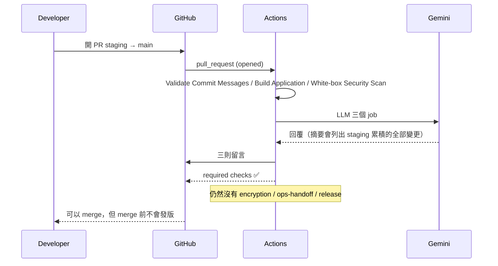

---

## UC-09：merge `staging → main`，pipeline 卡在人工審核

**情境**：UC-08 的 PR 綠燈，開發者按 Merge。這是唯一會讓五個 job 全部出場的動作。

**觸發**：`push` 事件到 `main`（merge commit）。`event_name == 'push' && ref == 'refs/heads/main'` 條件成立。

**依序發生什麼**：

1. `commitlint.yml` 再檢一次。
2. `ci.yml`：
   - `build`：Node 22、`npm ci`、`npm test`、`npm run build`，上傳 `dist-files` artifact。
   - `white-box`（`needs: build`）：Semgrep + Trivy。
   - `encryption`（`needs: white-box`）：下載 `dist-files`，`tar` 起來後用 `openssl enc -aes-256-cbc` 搭 `DEPLOY_ENCRYPTION_KEY` secret 加密，上傳 `encrypted-dist`（保留 7 天）。
   - `ops-handoff`（`needs: encryption`，`environment: production`）：GitHub 看到這個 job 綁了有 required reviewers 的 environment，
     **在 job 開始前就暫停**，run 狀態變成 Waiting，並發通知「liaooliver requested your review to deploy to production」。
   - `release`（`needs: ops-handoff`）：連排隊都還沒排，灰色。
3. `llm-pr-assist.yml` 不觸發（不是 PR 事件）。

**結果**：run 停在 `Ops Handoff / Production Release`。程式碼已經在 `main` 上了，但**沒有任何版本被發布**。
「合併」跟「發布」被 environment 審核硬生生切成兩件事。

**實際發生過的例證**：run #32（PR #13 的 merge commit `49263b9`）曾停在這裡：
`Build Application` 12s ✅ → `White-box Security Scan` 36s ✅ → `Encrypt Artifacts` 5s ✅ → `Ops Handoff / Production Release` ⏸️ waiting → `Semantic Release` ⬜。
當時刻意留著不 approve，用來觀察真正的人工把關長什麼樣子；approve 之後的結果見 UC-10。

`production` environment 的 Deployment branches 限定 `main`：就算之後 `if` 條件被改壞，其他分支的 run 也進不了這個 environment。

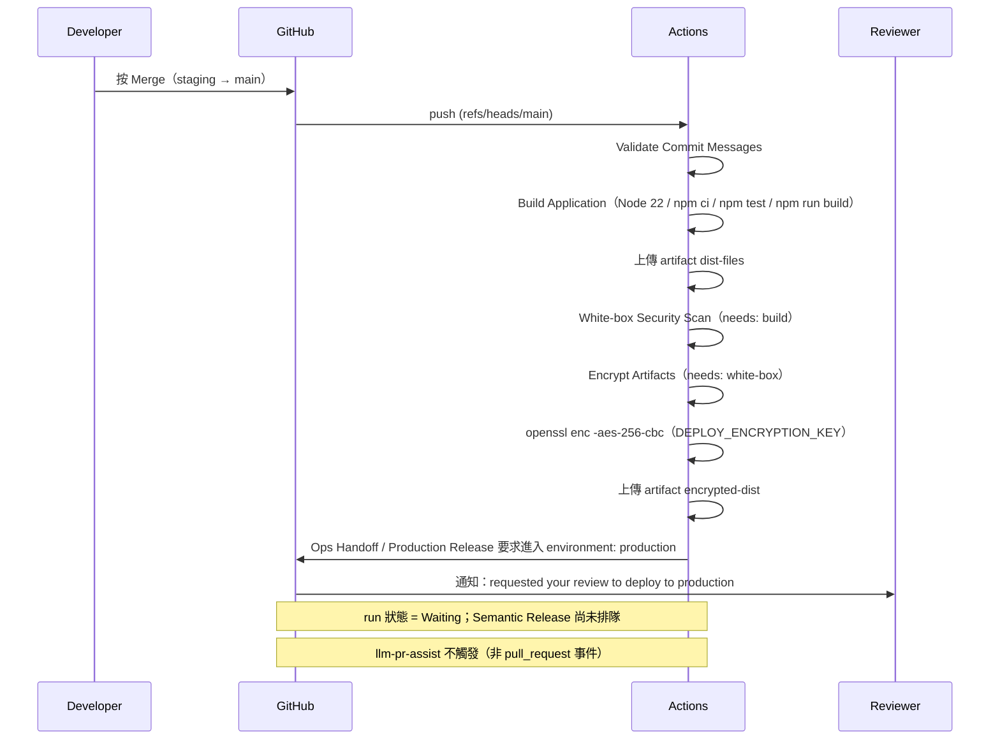

---

## UC-10：Reviewer 按 Approve，semantic-release 發版

**情境**：Reviewer 打開 run 頁面 → Review deployments → 勾 `production` → Approve and deploy。

**觸發**：environment 審核通過，`ops-handoff` job 從 Waiting 轉為執行。

**依序發生什麼**：

1. `ops-handoff`：下載 `encrypted-dist`，執行 `Execute Deployment` step（目前只是 `echo`，模擬發布動作）。
2. `release`（`needs: ops-handoff`，job 層級 `permissions: contents: write`）：
   - `actions/checkout` 用 `fetch-depth: 0` 抓完整歷史（semantic-release 要看 tag）。
   - Node 22、`npm ci`。
   - `npx semantic-release`，依 `.releaserc.json` 的 plugin 順序：
     1. `commit-analyzer`：從上一個 tag（例如 `notes-v1.2.1`）之後的 commit 決定要跳 major / minor / patch。`feat:` → minor，`fix:` → patch，`BREAKING CHANGE:` → major。
        只有 `chore:` / `docs:` 之類的話就**不發版**，job 仍是綠燈。
     2. `release-notes-generator`：產生 release notes。
     3. `github`：在當下的 commit 打 tag `notes-vX.Y.Z`，建立 GitHub Release（notes 放在 Release 上）。
3. **不 commit 回 `main`**：`main` 要求所有變更經過 PR，`GITHUB_TOKEN` 直接 push 會被拒絕（見下方例證）。
   所以 `CHANGELOG.md` 與 `package.json` 的 `version` 停在 1.2.1，版本資訊以 tag 與 GitHub Releases 為準。
   tag 不受 branch protection 管，push tag 不會被擋，也不會觸發新的 workflow run（`ci.yml` 只聽 branch push）。

**結果**：`main` 多一個 tag，GitHub Releases 頁面多一筆；repo 裡的檔案不變。

**實際發生過的例證**：PR #10 那次是第一次真的走到這裡，`ops-handoff` 人工 approve 之後，`Semantic Release` 直接失敗：
`[semantic-release]: node version ^22.14.0 || >= 24.10.0 is required. Found v20.20.2.`
因為 `ci.yml` 的 `build` 和 `release` job 都還寫 `node-version: 20`。這個 bug 光讀 yml 看不出來，一定要整條跑到最後一步才會炸。
PR #12 把兩個 job 都升到 Node 22，PR #13 再走一次 `staging → main` 來驗證，也就是 run #32。

run #32 approve 之後，Node 版本沒問題了，卻在 `@semantic-release/git` 的 prepare 步驟失敗：

```
git push --tags https://github.com/liaooliver/notes.git HEAD:main
remote: error: GH006: Protected branch update failed for refs/heads/main.
remote: - Changes must be made through a pull request.
```

失敗發生在打 tag 之前，所以沒有留下半套的版本。修法是把 `git` / `changelog` / `npm` 三個 plugin 拿掉，改成只打 tag + 發 Release。

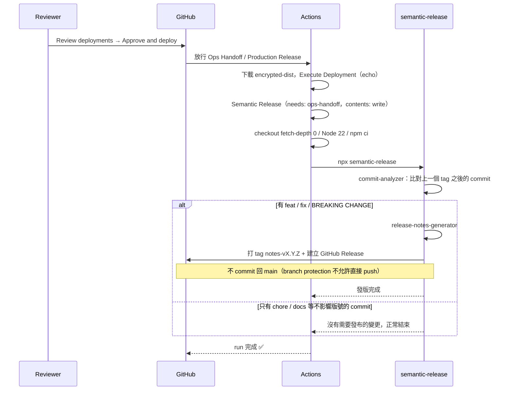

---

## UC-11：Reviewer 按 Reject，或乾脆放著不管

**情境**：Reviewer 看了 diff 覺得還不能上，按 Reject；或者根本沒人去按。

**觸發**：environment 審核未通過 / 沒有動作。

**依序發生什麼**：

- **Reject**：`ops-handoff` job 標成失敗，`release` 因 `needs` 連帶 skipped，run 整體紅燈。
- **放著不管**：run 停在 Waiting。GitHub environment 的 wait timeout 預設 30 天，超過之後 run 自動失敗。
  期間如果 `main` 又有新的 push（另一個 `staging → main` merge），會開出一個新的 run，兩個 run 各自獨立等審核。

**結果**：`main` 上的程式碼已經是新的了，但版本號、tag、Release 都不動。要重新觸發發版，
必須再有一個新的 push 到 `main`（例如下一次 promotion），或在 run 頁面按 Re-run 從頭跑。

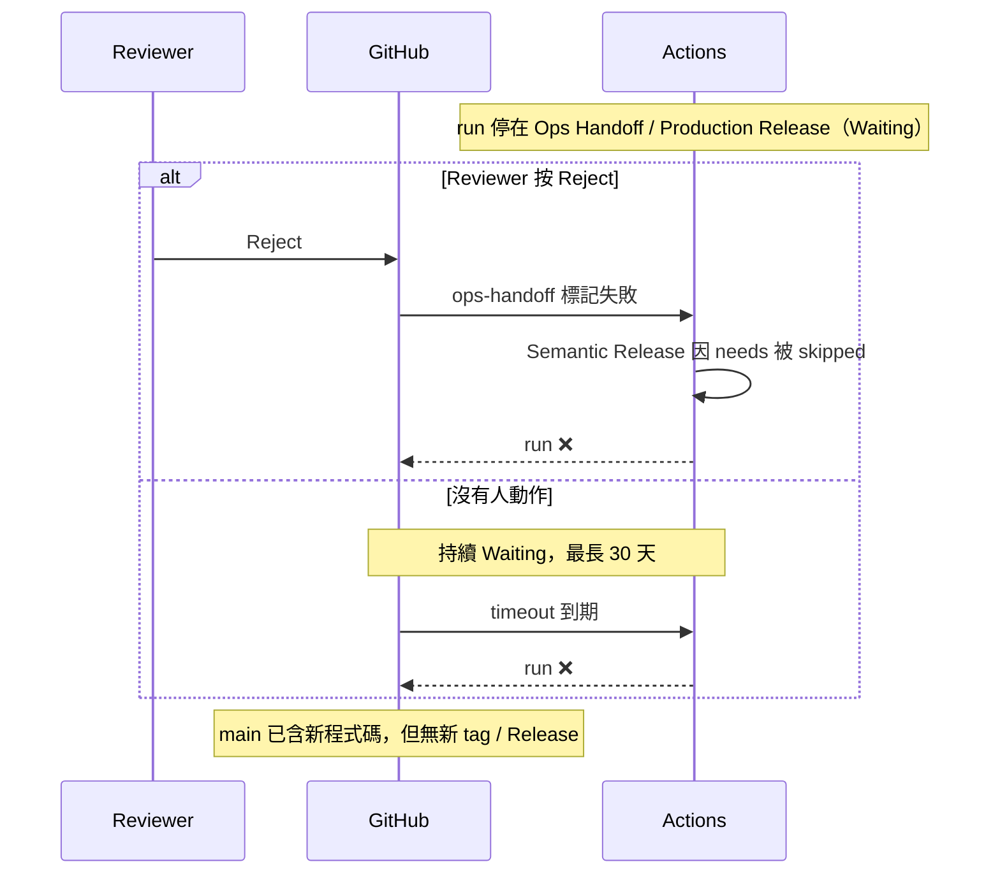

---

## UC-12：不開 PR，直接 push 到 `main` 或 `staging`

**情境**：開發者在本機 `git checkout main`，改完直接 `git push origin main`。

**觸發**：GitHub 端 branch protection 的「Require a pull request before merging」。

**依序發生什麼**：

1. 本機 husky 照樣檢查 commit 訊息（通過）。
2. push 到達 GitHub，branch protection 檢查 `main` / `staging` 是否允許直接 push → 不允許。
3. GitHub 拒絕，本機看到類似 `remote: error: GH006: Protected branch update failed` / `Changes must be made through a pull request`。

**結果**：什麼 workflow 都不會跑，因為 commit 根本沒進 remote。

**CI 自己也受這條規則管**：原本 semantic-release 的 `@semantic-release/git` 在 UC-10 也是「直接 push 到 `main`」（用 `GITHUB_TOKEN`），
run #32 就是被同一條規則擋下（GH006）。現在的設定不再寫回 `main`，只打 tag，見 UC-10 與 [release-automation.md](./release-automation.md)。

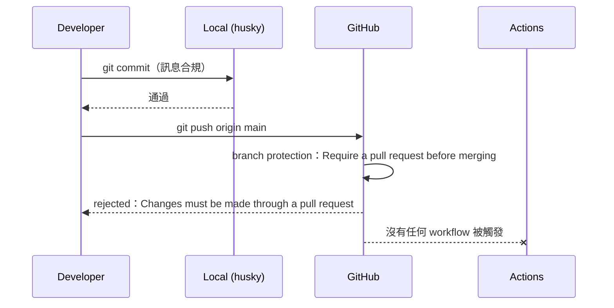

---

## UC-13：hotfix 流程

**情境**：production 出了 bug，需要快速修。

**觸發**：跟一般功能一樣，只是分支叫 `fix/*`、commit type 用 `fix:`。

**依序發生什麼**：

1. 從 `staging` 切 `fix/xxx`（不是從 `main`；`staging` 已經包含 `main` 的所有內容，這樣才不會產生分叉）。
2. commit 用 `fix: ...`（husky 檢查，UC-01）。
3. 開 PR `fix/xxx → staging`（UC-03），merge（UC-07）。
4. 開 PR `staging → main`（UC-08），merge（UC-09）。
5. Reviewer approve（UC-10），semantic-release 看到 `fix:` → patch 版號（例如 `1.2.1 → 1.2.2`）。

**結果**：hotfix 跟一般功能走一樣的路，沒有繞過任何 gate；差別只在版號跳的是 patch。
代價是如果 `staging` 上剛好還有尚未準備好發版的功能，它們會被一起帶進 `main`。
目前的模型接受這個取捨（單人專案、`staging` 應隨時保持可發版狀態）。

**實際發生過的例證**：`fix/semantic-release-node-version`（PR #12）與 `fix/package-lock-sync`（PR #8）都是這條路。

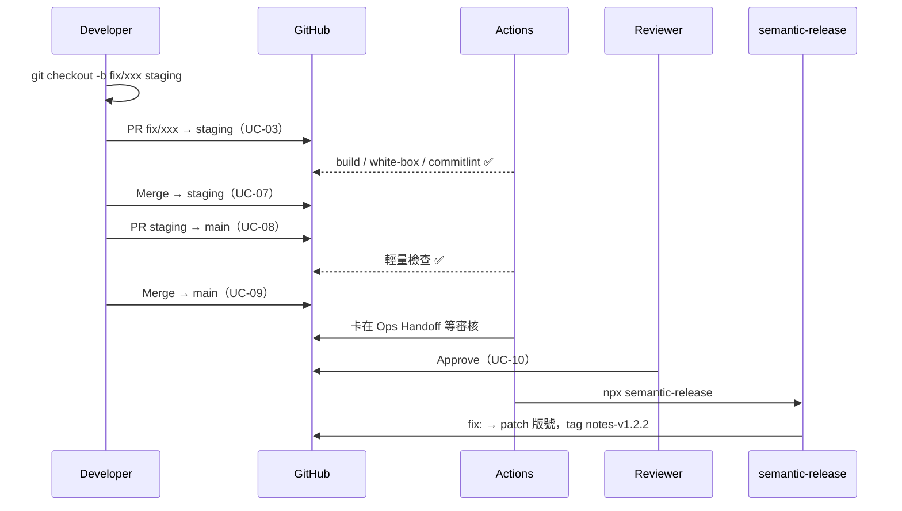

---

## UC-14：只改 `docs/` 的 PR

**情境**：開發者只改了 markdown 文件，開 PR 到 `staging`。

**觸發**：同 UC-03。

**依序發生什麼**：

三個 workflow 都沒有設定 `paths` / `paths-ignore`，所以 build、測試、Semgrep、Trivy、三次 Gemini 呼叫全部照跑，
即使 diff 裡一行程式碼都沒有。

**結果**：功能上沒問題，只是浪費 runner 時間與 Gemini 額度。merge 進 `staging` 後、再 promote 到 `main` 時，
semantic-release 的 `commit-analyzer` 對 `docs:` type 不會跳版號，所以不會產生空的 release（前提是 commit type 有正確用 `docs:`）。

**未來優化點**：在 `ci.yml` 的 `pull_request` / `push` 加 `paths-ignore: ['docs/**', '*.md']`。
但要注意 branch protection 的 required checks 會因為 workflow 根本沒跑而永遠 pending，把 PR 鎖死。
比較穩的做法是不要用 workflow 層級的 `paths-ignore`，改在 job 層級用 `dorny/paths-filter` 之類的 action 判斷變更路徑，
再用 `if:` 跳過重的 step：job 本身仍會回報（狀態是 skipped 或 success），GitHub 把 skipped 的 required check 視為通過，PR 不會被卡住。

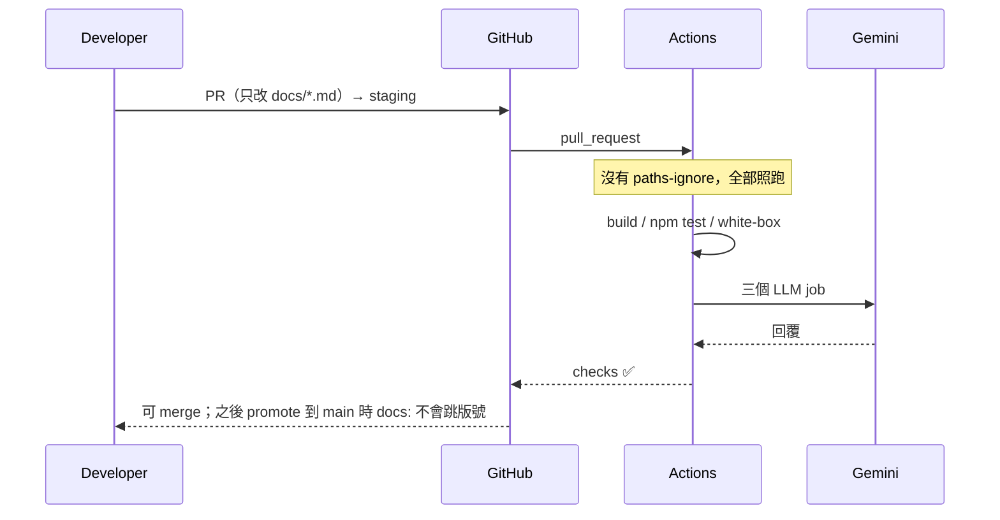

---

## 已知問題與未來優化點

以下是本 session 中由 Gemini review 或實際運行觀察到、但尚未處理的項目：

- `scripts/llm/call-gemini.mjs`：`response.json()` 在檢查 `response.ok` 之前呼叫，非 JSON 的錯誤頁（502 / 504）會在 `error.status` 設好之前就丟 `SyntaxError`，讓重試邏輯失效。
- `scripts/llm/call-gemini.mjs`：`parseArgs` 沒有檢查 `--prompt` / `--prompt-file` 是否為最後一個參數。
- `llm-pr-assist.yml`：`pr-diff-summary` 與 `code-review-comment` 收集 diff 的步驟完全重複；`head -c 20000` 以 byte 截斷可能切到多位元組的中文字。
- `src/index.html`：表單送出後沒有 `reset()` 清空欄位。
- 沒有機制阻止開發者直接開 PR `feature/* → main` 繞過 `staging`（branch protection 只管 required checks，不管來源分支）。
- UC-14 提到的 `paths-ignore`。

## 這份文件對應的檔案

| 檔案 | 角色 |
| --- | --- |
| `.github/workflows/ci.yml` | 五個 job：`build` → `white-box` → `encryption` → `ops-handoff` → `release` |
| `.github/workflows/commitlint.yml` | CI 端的 commit 訊息檢查（`Validate Commit Messages`） |
| `.github/workflows/llm-pr-assist.yml` | 三個 Gemini 輔助 job |
| `.husky/commit-msg` | 本機 commit 訊息檢查 |
| `commitlint.config.js` | commitlint 規則（`@commitlint/config-conventional`） |
| `.releaserc.json` | semantic-release 的 plugin 與 tag 格式 |
| `scripts/llm/call-gemini.mjs` | Gemini API 呼叫、重試與 fallback |

延伸閱讀：

- [branching-strategy.md](./branching-strategy.md)：為什麼是 `feature/* → staging → main`，兩層 gate 的設計。
- [release-automation.md](./release-automation.md)：從 release-please 換到 semantic-release 的過程與已知的坑。
- [llm-pr-assist.md](./llm-pr-assist.md)：Gemini API key 設定、額度用完時的處理。
